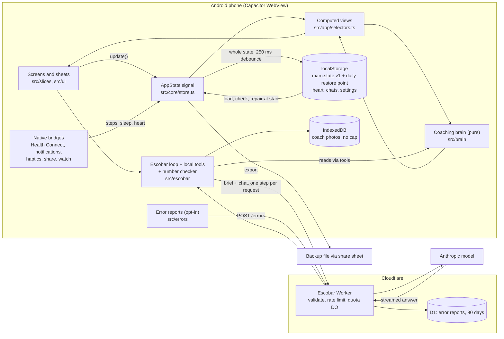

# M/ARC architecture review (ARCH-1)

Studied: a clean copy of main at commit fba3f37, 2026-09-29. This is research only. Nothing was built or changed.
Evidence: every claim below points to a file and line that a reviewer read. Numbers come from measurements made for this review or from cited sources. Anything we could not check is marked **not verified**.
Review process: one draft, then seven area fact-checks (about 290 claims checked) and one critic pass. Every correction they found is applied here. Words in *italics* on first use are explained in section 9.

---

## 1. Summary

**What "perfect" means for M/ARC.** In practice it means five things:
- A logged set is never lost, even years later.
- Every tap shows its result fast, even with years of history. Proposed target: under 100 ms from tap to the next frame for 3 taps out of 4, on a named low-end reference phone (Decision 20), measured by a gate probe.
- The coach reads the same rules and numbers on every screen.
- The AI coach cannot run up a surprise bill, and a user can report a bad answer.
- The app can pass Google Play review on the first try.

**Where the app stands.** The foundations are strong:
- The coaching "brain" is pure logic, exercised by about 900 tests in 55+ test files.
- Start-up repairs damaged saves instead of wiping them.
- The AI coach sends only a short summary plus what each answer needs, keeps nothing on the server, and checks the personal numbers in each answer against a list of known facts (small counts and numbers you typed are exempt).
- CI checks the built APK and pins the signing key.
- 1,700 unit tests pass in about 23 seconds.

The weak spots are the ones that only show up with time and scale:
- All history sits in one browser storage slot. With regular training, the restore point is silently lost after about 1.7 to 3 years, and saves start failing a few years after that.
- The app slows down as history grows: about 2.3 s to start and 1.1 to 1.45 s to open History with one year of data, on a simulated slow phone (one measurement, not re-run).
- The release pipeline cannot produce the file Google Play accepts.
- The AI coach has no "report this answer" button, which Play requires.
- The AI spending caps do not count the input side of the bill.

**The 5 changes that matter most:**
1. **Play release lane.** Build the *App Bundle (AAB)* Play requires, and settle which key Play signs with (R1).
2. **AI coach, Play-ready.** Add "Report this answer", a "not medical advice" line, and a consent screen that matches the privacy policy (R2).
3. **Stop silent data loss.** Warn before storage fills. Stop losing the restore point quietly. Make restore and crash-rescue honest. Stop CI test builds from forcing an uninstall (R3, R4).
4. **Bound AI spending.** Charge input tokens, and refuse turns when the counter cannot be reached (R5).
5. **Fast for loyal users.** Stop recomputing the whole coach on every save and every minute, and make per-exercise history linear, not squared (R6, R7).

**What the owner needs to decide** (section 7):
- the Play signing key and upload key;
- who pays for the AI, and the budget numbers;
- what a "report" sends;
- how saved data is versioned, and approval to change its layout;
- the Android backup choice;
- whether error reports carry the phone model;
- the launch-animation length;
- the Play account type, the reference phone, and the store identity.

---

## 2. How the app is built today

**In plain words:**
- **The screen layer** is a web app (Preact) running inside Android's *WebView*, wrapped by Capacitor. index.html paints the saved theme first (index.html:15-41), installs a crash screen (index.html:42-100) and shows a launch overlay (index.html:24-34, 103-188). src/main.tsx then loads saved data, starts the native listeners and draws the app inside one error boundary (src/main.tsx:24-34).
- **Memory and saving.** All user data is one object, AppState (src/core/models.ts:488-531), held in memory as one *signal* (src/core/store.ts:216).
  - It is saved as one JSON string in the WebView's *localStorage* under marc.state.v1 (src/core/store.ts:17). Every change saves the whole thing again 250 ms later (src/core/store.ts:348-357).
  - Once a day the previous good copy is kept as a *restore point* in the same storage (src/core/store.ts:319-326).
  - Heart series (60 sessions, src/core/heartStore.ts:8) and coach chats (1 MB, src/escobar/store.ts:12-17) have their own keys and budgets. Coach photos sit in *IndexedDB* (src/escobar/images.ts) with no size cap, and photos from conversations trimmed by the budget are never deleted (src/escobar/store.ts:115-141).
- **The brain** (src/brain, 29 files, 6,205 lines) is pure logic. It reads sessions, check-ins, health days and profile, plus an explicit "today", and returns recovery, readiness, next targets, lighter-week offers and coach notes.
  - Most screens read it through computed views in src/app/selectors.ts, and also read the store signal directly (for example Train.tsx, History.tsx, App.tsx:83). The live workout screen calls the brain directly (Train.tsx:678-684).
  - The AI coach's tools call the same functions, except one older next-set path (see R12).
- **Escobar, the AI coach**, has two halves:
  - **On the phone:** a loop builds a short "situation brief", sends the chat to the Worker, runs any tool the model asks for locally, and checks the personal numbers in the answer against a "fact ledger" (src/escobar/loop.ts, src/escobar/context/brief.ts, src/escobar/verify.ts:116-140).
  - **The Cloudflare Worker** (escobar-worker/) is a thin relay that keeps no conversation content. It validates the request, applies rate limits and daily quotas (a *Durable Object*), adds the fixed policy and tool list, and streams one model step from Anthropic (escobar-worker/src/handler.ts, quotaDO.ts, anthropic.ts). It stores only daily counters keyed by device id and IP, deleted after 3 days (quotaDO.ts:100-133), and logs token counts and API error text (handler.ts:176, 180).
- **Native Android parts:**
  - stock plugins (notifications, files, share, haptics, app);
  - three custom Java plugins: Health Connect reader, haptics and keep-awake, and the watch bridge (native/watch/, the Bluetooth heart-rate code; this is not the watch agent's area, see R15a).
  - The Android project is re-created from Capacitor's template on every CI build (scripts/prepare-android.sh, native/patch_manifest.py).
- **Quality system:**
  - Vitest unit tests, all run in Node with no page (vite.config.ts:28), so UI flows are covered only by the gate;
  - a 5,701-line screenshot "*gate*" that drives the real UI;
  - CI that runs both, then builds and checks a signed debug APK (.github/workflows/build-apk.yml);
  - opt-in anonymous error reports sent to the Worker (src/errors).

In plain words, the diagram below says: the screens change one saved object on the phone; the brain turns that object into advice; and only the AI coach and opt-in error reports talk to the internet, through the owner's Cloudflare Worker.

---

## 3. Scorecard

Grade scale: **A** = Play-ready, and nothing lost or slow with 5 years of history. **B** = sound, with known gaps that do not hurt users today. **C** = works today, but a gap will hurt users as history grows or at launch. **D** = blocks the Play launch.

| Area | Today | Why, in one line | Target | Gap |
|---|---|---|---|---|
| Data | **C** | Careful repair and rescue, but all history sits in one storage slot that will fill, the restore point is dropped silently, and the first version bump would make installed builds treat data as unreadable (src/core/store.ts:17, 28, 312-318; src/core/models.ts:489) | A | Warn before storage fills, then move to a store with no ceiling, with versioned migrations |
| Coaching brain | **B** | Pure, explained and well tested, but per-lift history costs grow with the square of history, and the cache that hides this is defeated for the lighter-week offer (always) and for coach notes (after any lighter week); some rules disagree (src/brain/history.ts:133-134; src/brain/deload.ts:89; src/brain/recovery.ts:156-164 vs src/brain/readiness.ts:199-236) | A | Linear-time history, shared constants, one reading of heart and sleep data |
| UI | **C** | Good design system (tokens in src/ui/styles.css:21-28; src/theme/themes.ts mirrored in index.html:16-23 and held equal by tests/theme.test.ts) and live-workout speed, but start-up and first tab visits grow with history (2.3 s boot, 1.1-1.45 s History at 6x slowdown with 365 sessions) | A | Narrow the computed views, paint first, split the code, per-area crash containment |
| AI coach | **C** | Careful data minimising and number checking, but no report button, no disclaimer, input tokens not counted, caps fail open, no model-behaviour evals (src/escobar/ui/Message.tsx; escobar-worker/src/quotaDO.ts:8-10; quota.ts:47) | A | Play-required controls, a bounded bill, model-behaviour evals |
| Platform and release | **D** | Strong CI checks on the APK, but no AAB for Play, debug builds that force an uninstall after a release install, and generic notification icons (.github/workflows/release-apk.yml:173) | A | An AAB lane, one version-code rule, native polish, Play paperwork ready |
| Quality system | **B** | 1,700 fast tests and a behaviour-level gate, but the gate is a ~13-minute serial file, and crash reports can't be traced to code (vite.config.ts:21) | A | A sharded gate with a per-block table, readable crash reports |
| Docs and delivery | **C** | Clear rulebook and key guard, but the main architecture map is stale, the decision log is scrambled, and the guard checks file ownership only for branch names it knows, claude/* and codex/* (docs/ARCHITECTURE.md:72; .github/scripts/agent-guard.sh:36-47) | A | A true map with a drift test, a decision log split by topic, a stronger guard |
| Premium feel | **not graded** | First-run onboarding, empty states, error and offline copy, haptics and animation smoothness were not reviewed, and nothing measures dropped frames today | A | A polish review with a frame metric (see "Small items" in section 5) |

---

## 4. What to keep (do not undo these)

- **Repair, don't wipe.** Start-up tries the saved copy, then the restore point, then the old app's data, then a fresh start. Each is checked and repaired (src/core/store.ts:195-214, 46-95). Unreadable data is set aside and can be saved as a rescue file (src/core/store.ts:233-262).
- **One repair path for start-up and restore** (src/slices/settings/backup.ts:7, 38).
- **Immediate saves at the moments that matter:** workout start, finish, discard, a logged past session and a time fix (src/slices/workout/session.ts:84, 572, 635, 627, 602), and app hidden (src/main.tsx:56, 63). After the error card's reset, no final save can write the crashing state back (src/core/store.ts:376-383; src/app/ErrorBoundary.tsx:24).
- **Caps on most growing lists** (check-ins 180, health days 180, weigh-ins 400, profile history 500, heart series 60, chats 1 MB; src/escobar/apply.ts:148, health.ts:22, profile.ts:53, profile.ts:13, heartStore.ts:8, escobar/store.ts:12-17). Sessions, body measurements (Body.tsx:469), custom exercises (splits.ts:82) and coach photos are uncapped. Only sessions grow fast.
- **A pure brain with time passed in.** Brain files import only from ./, ../, @/brain, @/core and @/data (grep of src/brain). Constants are quoted by the AI coach rather than copied (src/escobar/knowledge/methods.ts:7-27).
- **Safety-first load rules:**
  - no increase on a back-off day: the live flag is set at src/brain/progression.ts:296-298, and the next target is held or cut at progression.ts:442-455, 506;
  - increases take at most one step, capped at 10% of the load from 10 kg up before rounding and the equipment rung, with reps re-solved for the rung (src/brain/progression.ts:509-510; decision D-A2);
  - "reduce" needs a check-in or two agreeing inputs (src/brain/readiness.ts:291-294).
- **The live-workout screen stays fast:** only tiny clock pieces re-draw each second (ticker src/app/clock.ts:53-76; readers Train.tsx:538-553, 1228-1253). A keystroke took 29-44 ms at 6x slowdown with 365 sessions.
- **The AI coach minimises what leaves the phone:**
  - The Worker keeps no conversation content (see section 2 for the counters and logs it does keep).
  - Tools run locally.
  - Personal numbers are checked against a fact list, with one automatic repair round; anything still unmatched is shown as unverified (src/escobar/verify.ts:116-140; loop.ts:529-546).
  - Changes to training and the plan are proposals that need a tap and can be undone for 8 seconds (src/escobar/apply.ts:28, 241-246). Memory and insight snoozes apply at once with an Undo toast (src/escobar/session.ts:152-173).
  - Sharing switches also clean past messages (src/escobar/loop.ts:106-246).
- **Fixed, app-owned copy for crisis and medical cards**, working offline (src/escobar/ui/Escalation.tsx:11-16; verify.ts:153-165; loop.ts:436-439; session.ts:210). Pain and eating cards need the model, so they are online only.
- **Privacy-first error reports:** an allow-list, the same scrubbing on phone and server, off by default, and tests that plant personal data and check none leaves (src/errors/scrub.ts:118-137; tests/errors.test.ts:524-592).
- **CI checks the built APK's** embedded web bytes, native classes and signing fingerprint (build-apk.yml:187-246), and the generated project's plugins and SDK 36 (build-apk.yml:134-165). The agent guard checks that the signing step's name and the pinned fingerprint are still in both workflows, and that no keystore or key file is committed (.github/scripts/agent-guard.sh:13-30); the build's own fingerprint check does the real verification.
- **Time-zone discipline:** unit tests run in three zones and the gate in two (package.json:22; build-apk.yml:72-90).
- **Permission prompts appear only after a user action** (a Settings switch, a Save or Connect tap, or the first rest timer, src/native/notifications.ts:82-85), never on launch or resume (src/main.tsx:55-67 passes no prompt).
- **Performance budgets scaled to machine speed** (tests/perf-budget.ts).

---

## 5. Recommendations

Ranked by value to users and the owner; the number is the rank. Each has an **Owner** line split three ways: **Decide** (a choice only the owner makes), **Approve** (a rule says the owner signs off), **Phone check** (something only a real phone can show). Each proof is marked *[auto]* (runs in CI) or *[phone]* (needs a real phone).

### R1. Play release lane: App Bundle, signing choice, health paperwork
- **Problem:**
  - Releases build only an APK (.github/workflows/release-apk.yml:173 `assembleRelease`), and there is no `bundleRelease` anywhere. Play requires an AAB for new apps (developer.android.com/guide/app-bundle).
  - Play App Signing gives new apps a Google-generated key unless you upload your own (support.google.com/googleplay/android-developer/answer/9842756). The key's fingerprint is registered with Huawei (App ID 119100049, build-apk.yml:206; agent-guard.sh:13) for the planned Wear Engine companion, which is still awaiting approval (docs/WATCH-ARCHITECTURE.md:19). Today's Bluetooth watch link does not depend on the key.
  - The Health Connect privacy screen has no privacy-policy link (native/PermissionsRationaleActivity.java:31), and Settings has none either (grep of src/slices/settings).
  - The release workflow can run from any branch (release-apk.yml:3-13).
  - CI only checks that four expected permissions are present in the generated source manifest (build-apk.yml:162-165). It never checks for unexpected ones, and never reads the final merged manifest in the APK. A plugin update can add a permission unseen.
  - Two Play Console declarations are not prepared: the *foreground service* type connectedDevice, which needs a description and a demo video for apps targeting Android 14+ (native/patch_manifest.py:46-47, 88; support.google.com/googleplay/android-developer/answer/13392821), and the health permissions declaration for the five Health Connect reads (patch_manifest.py:25-29).
- **Change:**
  - A second, owner-approved release output: an AAB, fingerprint-checked with `keytool -printcert -jarfile` against the fingerprint the owner chooses in Decision 1 (the apksigner check at release-apk.yml:200-228 cannot read an AAB).
  - A one-page signing decision note.
  - The privacy link on the Health Connect screen and in Settings.
  - Releases only from main or a version tag.
  - A CI check that lists the final APK's permissions against an approved list.
  - Drafts for the owner of both Play Console declarations: the connectedDevice foreground service (description, user impact, demo video) and Health Connect permissions (one reason per data type, matching PermissionsRationaleActivity).
- **Benefit:** the first Play upload can be accepted. Direct-APK users and Play users stay on one signature. Plugin updates cannot add a permission unseen.
- **Effort:** M.
- **Risk:** the signing steps are owner-only, and the Play signing choice cannot be undone. Mitigation: the owner decides first (Decision 1). The builder adds a step and never edits the existing signing steps, EXPECTED_SHA256 or keystore handling.
- **Depends on:** Decisions 1, 2 and 18; the hosted privacy-policy URL (owner).
- **Owner:** Decide: signing and upload key. Approve: the release output, the declarations. Phone check: none.
- **Proof:** the release run produces an AAB whose certificate fingerprint matches the chosen key *[auto]*. The permission-list check fails when a test permission is added *[auto]*. An internal-track upload is accepted, both declarations pass review, and Play's free pre-launch report comes back (Play Console, owner).

### R2. AI coach, Play-ready: report button, disclaimer, honest consent
- **Problem:**
  - No control lets a user report an AI answer: a grep of src/escobar finds none, and src/escobar/ui/Message.tsx:185-233 has no such action. Play requires in-app reporting for AI chat apps "without needing to exit the app" (support.google.com/googleplay/android-developer/answer/13985936), and chatbot-centred apps are in scope (answer/14094294).
  - No "not medical advice / can be wrong" line exists (grep of src). It is listed as required in docs/RELEASE-READINESS.md:15.
  - The consent explainer understates what is sent (src/escobar/ui/EscobarSheet.tsx:73-79). The brief also sends the current screen (src/escobar/context/brief.ts:76), goal, training age, planned days, sex and age (brief.ts:105-114), gym (brief.ts:118-125) and memory notes (brief.ts:127-128). The Settings hint says "nothing else leaves the phone" (src/escobar/ui/SettingsSection.tsx:35).
  - Google's 15 July 2026 clarification says user-data rules cover third-party AI (answer/17134731).
  - A user cannot ask for server-side data to be deleted. "Delete everything" in Settings gives a fresh error-report install id and clears the local queue (src/slices/settings/Settings.tsx:69-77; src/errors/index.ts:81-84) and resets the state that holds the coach device id (src/core/models.ts:449). Rows already on the server simply age out: error reports after 90 days (escobar-worker/src/errorsStore.ts:10), quota counters after 3 days. Whether a legacy coach id can survive the reset (src/escobar/session.ts:77) is **not verified**.
- **Change:**
  - "Report this answer" on every coach turn: a reason picker, an optional note, and the answer hidden locally. It goes to a new Worker endpoint stored like error reports (D1, rate-limited, 90-day retention).
  - Keep the Worker's *requestId* on each answer (escobar-worker/src/handler.ts:156 sends it; src/escobar/loop.ts:394-421 drops it). The report itself carries the requestId, model and usage of that answer, so it does not depend on log retention. Linking to server logs also needs Workers Logs switched on (not configured in wrangler.toml; owner item).
  - A permanent disclaimer line in the sheet and in onboarding (RELEASE-READINESS.md:15).
  - Explainer text rewritten to match docs/PRIVACY-POLICY.md:21-28, naming Anthropic.
  - Update docs/PRIVACY-POLICY.md and the Data safety draft to cover reports (content, 90-day retention) and to say how server rows are deleted.
- **Benefit:** removes a likely Play rejection, gives the owner a signal on bad answers, and makes consent honest.
- **Effort:** M.
- **Risk:** the report contains answer text that may hold personal numbers. Mitigation: say so on the report sheet, apply 90-day retention, and reuse the error-store limits.
- **Depends on:** Decision 3. The Worker part is a separate PR that the owner merges (it deploys). Keeping requestId adds a field to the saved chat shape (assistant meta in src/escobar/types.ts:74, stored in marc.escobar.v1), so Decision 6's versioning approach comes first.
- **Owner:** Decide: what a report sends. Approve: new sent data, the saved-shape field, the Worker deploy. Phone check: none.
- **Proof:** unit tests for the report payload (allow-listed fields only) and the Worker validation *[auto]*. A gate probe shows the report control on every turn and the disclaimer *[auto]*. A privacy contract test ties the explainer list and the report payload fields to the policy *[auto]*.

### R3. Stop silent data loss now (storage honesty, restore, rescue)
- **Problem:**
  - Storage fills with time. Measured on synthetic sessions (6 exercises × 4 sets): 3,785 characters per plain session, about 6,840 with watch data. At four sessions a week (208 a year) that is about 0.79 million characters a year (plain) or 1.42 million (watch). The measuring script was not saved with this review, so it cannot be rerun yet; it should become a repo fixture before thresholds are set.
  - The limit: Chromium's localStorage quota is 10 MiB of UTF-16 per storage area, about 5.24 million characters per app across all marc.* keys (Chromium dom_storage_constants.h kPerStorageAreaQuota; blink storage_area_map.cc counts key plus value at 2 bytes per character). Not verified on a phone's WebView build.
  - The app keeps two copies of the state (src/core/store.ts:310, 323), and chats may use up to 1 MB, about 0.5 million characters (src/escobar/store.ts:12-15). The sum: (5.24 M − 0.5 M) ÷ (2 × 6,840) ≈ 350 sessions with a watch, and ÷ (2 × 3,785) ≈ 630 plain. At 208 a year that is about 1.7 to 3 years. Heart series and the capped lists also take room, so in practice it comes somewhat sooner. At that point the restore point is dropped (store.ts:312-313).
  - Main saves fail only when the single main copy alone no longer fits: 4.74 M ÷ 6,840 ≈ 690 sessions (about 3.3 years) with a watch, 4.74 M ÷ 3,785 ≈ 1,250 (about 6 years) plain.
  - When full, the restore point is deleted with no warning (src/core/store.ts:312-318). It is then retried on every save and fails silently while storage stays full (store.ts:322-326). The later message "Free some storage space" cannot help, because phone storage does not raise the WebView's limit (store.ts:315).
  - Restore always says "Restored" even if saving failed: replaceState ignores the save result (src/core/store.ts:359-362) and the toast is unconditional (src/slices/settings/Settings.tsx:135). Its Undo lives only in memory (Settings.tsx:38, 128). The daily restore point already holds the pre-restore state when none was written that day (store.ts:322-325), but nothing in the UI can reach it.
  - The start-up crash screen's "Save a copy" uses a browser download (index.html:60-66). Capacitor 8.5 Android has no download handler (no setDownloadListener in @capacitor/android 8.5.0), so on a phone it most likely does nothing (**not verified** on a device). A silent no-op download does not throw, so the clipboard fallback never runs. The in-app error card already uses the share sheet (src/app/ErrorBoundary.tsx:14-17), so only the pre-boot screen is affected. The Reset button next to it wipes everything (index.html:91).
  - A rescue file cannot be restored (src/slices/settings/backup.ts:35-37 vs src/core/rescue.ts:8-15).
  - A damaged backup with `{}` in two lists crashes Today on every start (cause store.ts:177, 183, which repair does not array-check, store.ts:71-78; crash at src/brain/coach/rules.ts:671 via src/app/selectors.ts:66). Deload is also unchecked (store.ts:182).
- **Change:**
  - A storage meter over all marc.* keys, built on the existing budget in src/escobar/store.ts:14-17 (one shared constant and byte-count rule, reset to the Chromium limit of about 5.24 M characters), with warnings at about 60% and 80% and a "Save a backup now" action.
  - A hidden diagnostics row that measures the phone's real storage limit and shows it as a number, so the owner's phone check is just reading it.
  - Tell the user when the restore point had to go, replace the wrong message, and stop retrying the restore-point write once it has failed for space.
  - Restore reports failure honestly. On restore, always put the pre-restore data into the existing daily restore-point slot and offer Undo from it, which survives a restart. No extra copy (Decision 7).
  - Restore accepts rescue files.
  - Add the missing list checks (profileHistory, insightFeedback, deload).
  - The crash screen saves through the native share sheet when available.
  - Treat a share-sheet cancel as a cancel, not an error (Settings.tsx:102).
  - Delete old export files from the cache (src/native/share.ts:9).
  - Delete a conversation's photos when the chat budget drops it.
- **Benefit:** users hear about the problem months before it bites. Restore and rescue can no longer cost data.
- **Effort:** S to M (several small pieces).
- **Risk:** the real limit may differ on some phones, so thresholds start cautious. Mitigation: the diagnostics row gives the real number.
- **Depends on:** Decision 7.
- **Owner:** Decide: Decision 7. Approve: none (the restore slot already exists). Phone check: read the diagnostics row; the crash screen's "Save a copy".
- **Proof:**
  - Unit tests with a fake storage that throws "full": the warning is shown, the restore-point loss is reported once and not retried, and a failed restore says so *[auto]*.
  - A test that a rescue file restores, and that Undo after restore survives a reload *[auto]*.
  - A crash-loop test with `{}` lists *[auto]*.
  - A 5-year fixture test: save, reload, restore and rescue, with zero sets lost *[auto]*.
  - The crash screen's "Save a copy" opens the share sheet *[phone]*.

### R4. One version-code rule so a CI test build never forces an uninstall
- **Problem:** CI debug APKs keep the template's versionCode 1 (Capacitor template app/build.gradle:10-11; there is no version step in build-apk.yml). Release APKs default to package major × 1,000,000 plus the release workflow's run number, today 37,000,000+ (release-apk.yml:43; package.json:3), unless a version_code is typed in at dispatch (release-apk.yml:10-13). Both use the same app ID and key. Once a release is installed, every later debug APK is refused as a downgrade. Uninstalling wipes all on-phone data, except what the user saved as a backup file or what Android Auto Backup restores on reinstall (not verified for WebView storage). The owner installs a CI APK after every merge. Settings shows the version name only, not the versionCode (Settings.tsx:243).
- **Change:** one numbering rule for both workflows that always goes up, and a CI check that it is above the last release. As a first step, add the versionCode to the Settings version line (the installed App plugin's getInfo reports the build number; check the field when building), so the owner can read it.
- **Benefit:** removes a real, owner-facing path to total data loss.
- **Effort:** S.
- **Risk:** the shared code must (1) start above every release code already on a phone (37,000,000 + the highest release run), (2) rise with time across both workflows, because the run numbers of the two workflows are separate counters, and (3) stay under Play's 2,100,000,000 ceiling. For example: 40,000,000 + minutes since a fixed date. Mitigation: read the owner's installed versionCode first.
- **Depends on:** that phone check. This is a supervisor workflow change and does not touch the signing steps.
- **Owner:** Decide: none. Approve: none (the owner is told). Phone check: read the versionCode in Settings.
- **Proof:** a CI assertion that the debug code is greater than the latest release code, including a typed-in one *[auto]*. The owner installs the next debug APK over a release APK *[phone]*.

### R5. Bound the AI bill
- **Problem:**
  - Daily quotas count output tokens, steps and turns, but never input tokens (escobar-worker/src/quotaDO.ts:8-10; handler.ts:187-188). Input is bounded only indirectly, by the global step cap times the per-request text cap.
  - The Worker accepts 400 KB of text per request (validate.ts:10), while the app trims its history to about 60k tokens (≈240 KB, src/escobar/loop.ts:25, 254-285), before the manifest (≤40 KB) and photos. The text cap can come down only to about 300 KB without refusing real long chats; the real control is counting input tokens.
  - A rough worst case at the app's own price table ($5 per million input tokens, src/escobar/state.ts:57; **not verified** against live pricing) is about $10,000-13,000 a day: 20,000 global steps × about 100k tokens (quota.ts:11), at 4 characters per token. Unique abusive payloads pay cache-write rates (state.ts:53-54, 89; anthropic.ts:135-141), so caching does not lower this. The output cap alone implies $75 a day.
  - If the quota service throws, the request is allowed (escobar-worker/src/quota.ts:47). With no quota binding at all, there is no quota (quota.ts:49). Rate-limiter errors also allow requests (handler.ts:119, 125).
  - Check and record are separate calls: a step is checked before it runs (handler.ts:129) and recorded after (handler.ts:183-189), and aborted steps report no usage (handler.ts:179-187; quotaDO.ts:105-129). So parallel bursts and aborted steps slip past post-hoc counting.
  - The Worker has no client check: any dev_ id is accepted (handler.ts:13, 102-103), a request with no Origin is allowed (handler.ts:28, 95), and system text up to 48 KB is accepted (validate.ts:16, 134-143). The URL is in a public repo (src/escobar/state.ts:11).
  - Shared-IP users on carrier networks see "That's today's coaching limit" for a limit they did not use (quota.ts:25, 46).
  - Cloudflare says its rate-limit binding is "not an accurate accounting system" and warns against IP keys for mobile users (developers.cloudflare.com/workers/runtime-apis/bindings/rate-limit/).
- **Change:**
  - Charge an input estimate from the request's byte count at check time (known at handler.ts:111), in one atomic Durable Object call that checks and reserves, at device, IP and global level. Correct it with the real usage when the step ends. This also covers aborted steps and parallel bursts.
  - Lower the text cap to about 300 KB, and cap each system message at about 8 KB (the brief is capped at 3,000 characters, brief.ts:21). A shape check is not needed; if kept, it must also accept the repair message (loop.ts:539) and the diff form (brief.ts:155).
  - When the quota counter cannot be reached (quota.ts:47), or no quota binding exists in production (quota.ts:49), refuse all turns with the existing "resting" message.
  - Give the shared-IP case its own honest message.
  - Post a daily cost total to Relay, reusing the alert idea in RELEASE-READINESS.md:14.
  - As a hard backstop, the owner sets a monthly spend limit on the Anthropic workspace (RELEASE-READINESS.md, owner item 3). Optional later: Play Integrity *attestation* (Decision 13).
- **Benefit:** the owner's worst-case bill becomes bounded and known. A determined scripted client can still use up the shared daily budget and pause the coach for everyone until midnight UTC; attestation (Decision 13) is what would close that.
- **Effort:** S.
- **Risk:** caps set too low refuse real long chats. Mitigation: boundary tests against the app's own window (loop.ts:25, 254-285).
- **Depends on:** Decisions 4, 5 and 17. A Worker PR that the owner merges.
- **Owner:** Decide: budget numbers and the outage-versus-bill trade. Approve: the Worker deploy. Phone check: none.
- **Proof:** Worker unit tests: input is charged at check time, parallel requests cannot pass one remaining slot, oversize requests are refused, and an unreachable counter refuses all turns *[auto]*. Metric: total daily cost from the Worker log line (handler.ts:180), once the owner enables Workers Logs (not configured in wrangler.toml). Per-device cost comes from the QuotaCounter's per-device rows (quotaDO.ts:119-120), not from the log. Adding a device hash to the log is new logged data and needs the owner's approval.

### R6. Speed, part 1: stop redoing work (brain and computed views)
- **Problem:**
  - Per-lift history grows with the square of the history in two places: history.ts:133 takes the best of every earlier row on each row (plausibilityRef, history.ts:155-158), and history.ts:134 rebuilds "all later sets" for every row. Bench-press history built from scratch took 8 ms at 600 sessions, 43 ms at 1,500 and 183 ms at 3,000, about 4x per doubling.
  - Its cache is keyed by list identity (history.ts:105-115). The lighter-week offer (deloadOffer → deload.ts:89) builds a new filtered list on every call for every user, so its per-lift histories are always rebuilt from scratch: about 1.1 s at 3,000 sessions (77-92 ms at 600, 323-334 ms at 1,500), no lighter week needed, and a second call is no faster. The coach notes do the same once a lighter week has been saved, because AppState.deload stays saved after the week ends (src/brain/coach/rules.ts:765-768). Every user who ever took one pays this forever.
  - Coach notes, measured twice on the synthetic fixture from tests/perf/budgets.test.ts:16-23 (desktop CPU): cold 123-148 ms at 600 sessions and 506-515 ms at 1,500; with a saved lighter week 277-321 ms and 1,467-1,490 ms. The warm cache is 45 ms at 600 and 121 ms at 1,500.
  - Several screen-level views read the whole store (src/app/selectors.ts:54-67, 72, 74). While Today, Coach or Escobar's Hall is on screen (Today.tsx:34-35, 55; Coach.tsx:35, 37, 271, 294; escobar/ui/Hall.tsx:38), any save re-runs all coach rules, the lighter-week check and the weekly scan. Views compute lazily, so Train does not trigger them.
  - coachContext also depends on minuteNow (selectors.ts:58), which the clock refreshes every minute (src/app/clock.ts:38-48). So the rules and the lighter-week check also re-run every minute while Today or Coach is shown (about 1.1-1.5 s at 1,500 sessions with a saved lighter week, desktop).
  - Narrow per-field inputs exist only for recovery, readiness and body weight (selectors.ts:30-53).
  - The root App reads the whole store (App.tsx:83, `!!state.value.active`), so every store change, including each logged set, re-renders the whole tree.
  - The per-muscle recovery dose build (muscleDoses) runs 3 times per change (selectors.ts:40; rules.ts:178, 740).
  - No perf budget covers these paths (tests/perf/budgets.test.ts:26-51).
- **Change:**
  - Per-lift history: keep running maxima (best top weight and best e1RM) instead of re-scanning earlier rows, and only look at later sessions for a set already flagged as implausible, stopping at the first set that confirms it. Normal histories become linear.
  - Return the original sessions list when no session falls inside the saved lighter week, and otherwise cache the filtered list per (sessions, lighter week) pair; use it in both deload.ts:89 and rules.ts:766.
  - Build muscleDoses once per sessions/health/profile change and share it.
  - Give every screen-level view narrow inputs, using the existing field() helper. Split the minute-dependent rules (recovery-based notes) from the day-dependent ones, so only the cheap part follows minuteNow; the history-heavy rules and deloadOffer key on sessions and today.
  - App.tsx:83: read a small computed "is a workout live" value instead of the whole store (supervisor wiring).
  - Add perf budgets for a cold cache, a saved lighter week and deloadOffer at 600 and 1,500 sessions.
- **Benefit:** estimated 3-10x less coaching work on long histories (today's warm-cache time vs cold time; not yet measured on the fixed code), and growth becomes linear. Taps on Today and Coach stop re-running the rules after unrelated saves or a minute tick.
- **Effort:** M.
- **Risk:** the "held typo set" rules (BUG-18/24) must stay exactly the same. Mitigation: the existing bug18/bug24 tests, plus a *golden comparison* of old and new outputs on the 600- and 1,500-session fixtures. A missed dependency could show stale notes, so a test counts rule runs per unrelated update and per minute tick.
- **Depends on:** none.
- **Owner:** Decide: none. Approve: none. Phone check: none.
- **Proof:** the new perf budgets pass *[auto]*. The golden outputs, including BUG-18/24 held sets, are byte-identical *[auto]*. A before/after boot trace at 6x slowdown with 365 sessions (today 2.17-2.42 s) *[auto]*.

### R7. Speed, part 2: paint first, load less, shorter launch
- **Problem:**
  - First visits compute heavy cards while drawing: History 1.12-1.45 s, Escobar 0.54-0.70 s and Body 0.40-0.48 s at 6x slowdown with 365 sessions (one measurement, not re-run). The work runs synchronously during render (for example History.tsx:67-74; selectors.ts:54-72), and nothing in src splits long work into chunks (grep).
  - All five tabs and every Settings, Profile, Coach, Body and History sheet ship in one 633,893-byte main file (187 KB compressed), because src/app/App.tsx:1-14 imports them statically. The Escobar chat, share sheet and Escobar tools already load on demand (App.tsx:41-56; src/slices/share/lazy.tsx:17), which shows the pattern works here.
  - The 111 KB cue data (src/data/coachCues.json, loaded at src/brain/coach/cues.ts:6) sits in the main file. Today uses it for one daily line (Today.tsx:13), but Train (Train.tsx:31, 51), Coach (Coach.tsx:7) and the load helpers (src/brain/units.ts:9, src/brain/substitute.ts:4, src/slices/workout/units.ts:9, for the small equipmentGroup helper) also import cues.ts.
  - Screens import each other's parts: src/slices/workout/Train.tsx is 1,355 lines, CheckInSheet lives in Train.tsx:979, History (History.tsx:7), Today (Today.tsx:15) and the Escobar dock (escobar/ui/Dock.tsx:18) import from Train, and Today, Train and Profile import from Coach (INSIGHT_COLOR; GoalSheet at Profile.tsx:11). That blocks splitting.
  - On phones where the app is ready in under 1.75 s, the launch overlay waits until 1.75 s after page start (index.html:122, 163, 176-181). A tap skips it (index.html:186), reduced motion removes the wait, and a 4 s cap applies (index.html:187).
- **Change:**
  - Draw the shell and cheap cards at once. Compute heavy cards in the next idle moment behind a sized placeholder, split into small chunks that let a tap through, or cached per session.
  - First step: move shared parts (CheckInSheet, requestStart, INSIGHT_COLOR, GoalSheet, finishShowing) out of screen files.
  - Load the History, Body and Coach tabs and the big panels on demand, and prefetch them when idle.
  - Move equipmentGroup and the 10 mindset lines into a small module, and load the full cue data on demand when Train, Coach or an Escobar cue tool first needs it.
  - Let the launch overlay leave as soon as the app is ready (Decision 10).
  - Add a main-file size cap and a throttled boot and tab-switch probe to CI.
- **Benefit:** first paint of each tab stops growing with history. The deferred work still grows until R6 lands, which is why R6 comes first. Faster phones reach the app up to about 1.5 s sooner; slow phones gain nothing from the overlay change, because their boot already takes longer than the minimum.
- **Effort:** M if moving the shared parts is its own first step; otherwise M-L.
- **Risk:**
  - Layout shift if placeholders are not sized exactly.
  - A first-open flash of a tab.
  - Palace navigation (src/escobar/palace/navigate.ts:66-85) expects the target tab to draw within two frames. A lazy tab must expose its load promise, goTo must wait for it, and a palace test must jump to every tab from a cold start.
  - Timing probes can be flaky on shared CI.
  - Mitigation: exact-size placeholders; idle prefetch (the files are local in the APK); generous thresholds on a median of several runs that report numbers even when passing.
- **Depends on:** R6 first. Supervisor wiring in App.tsx. Decision 10.
- **Owner:** Decide: the launch-animation length. Approve: none. Phone check: cold start on the reference phone.
- **Proof:** a main-file size budget *[auto]*. The gate probe's boot and first-tab times at 6x slowdown against today's figures *[auto]*. The palace cold-jump test *[auto]*. Cold start and first History open on the reference phone *[phone]*.

### R8. Real version numbers for saved data, and a downgrade guard
- **Problem:**
  - The version is fixed at 1 (src/core/models.ts:489; store.ts:28).
  - Shape upgrades are guess-based "heals" that run on every start (src/core/store.ts:90-93, 152-175).
  - Most unknown fields pass through today, because repair spreads them (store.ts:59, 79-80, 82, 164-168). Coach settings, gyms and the recovery model drop unknown keys (src/core/escobarState.ts:66-103, 145-161; store.ts:180).
  - Restore never reads the backup's schema number, even though it writes one (src/slices/settings/backup.ts:15, 19, 30-50).
  - The bigger trap is the first version bump: every build already installed treats version ≠ 1 as unreadable (store.ts:28). It sets the data aside as corrupt and falls back to the restore point, the old app's data or a fresh start, and saves that over the main key (store.ts:256-269). An older app also refuses a newer backup with a misleading "That file is not an M/ARC backup" (backup.ts:28, 37). Android refuses an APK downgrade unless the app is uninstalled, so in practice this is mostly a newer backup restored into an older app.
- **Change:**
  - An ordered list of numbered, one-time *migrations*, each with a frozen fixture test. The current heals move into it.
  - Keep `version: 1` and add a separate schema-revision field, so builds already shipped keep loading the data (Decision 6); or bump the version and accept that an older app will see a rescue copy.
  - The revision and app version go in every save and export.
  - Keep a pre-migration copy until the next good start, in the existing restore-point slot or, once R9(a) exists, in the native shadow file, not as an extra localStorage copy (a second copy is exactly what gets dropped for space, store.ts:312-313).
  - If data is newer than the app, open read-only with an "update the app" message and never overwrite. This follows Room's step-by-step migrations (developer.android.com/training/data-storage/room/migrating-db-versions).
  - A newer backup gets a clear "made by a newer version" message instead of "not an M/ARC backup".
- **Benefit:** upgrades become predictable and testable. The larger storage move (R9) becomes safe.
- **Effort:** M.
- **Risk:** the first revision step is itself a migration. Mitigation: fixtures for every past shape (tests/migrate.test.ts and store.test.ts are the base) and a round-trip of the previous release's export.
- **Depends on:** Decision 6. Must be settled before any other saved-shape change (R2's requestId, R3's Undo).
- **Owner:** Decide: the versioning approach. Approve: the saved data shape. Phone check: none.
- **Proof:**
  - A migration test per revision *[auto]*.
  - A test that data at a newer revision opens read-only and is not overwritten *[auto]*.
  - A test that a backup with an unknown schema is refused with the "newer version" message *[auto]*.
  - A test that today's released loader still reads data written by the new code *[auto]*.

### R9. A storage home with no 5 MB ceiling (and a native safety copy)
- **Problem:**
  - Sessions are never capped, so R3 only buys time.
  - Every set logged rewrites the whole history. Measured on a desktop CPU: saving takes 15.5 ms at 1 year, 59.8 ms at 5 years and 153 ms at 10 years. Loading takes 15.8, 41.6 and 141.7 ms. Phones are slower (**not measured**).
  - Chromium writes localStorage to disk later, not at once (a 5 s default commit delay, 1 s in WebView's aggressive mode; chromium local_storage_impl.cc, codereview 1129233003). The app cannot force that.
  - Capacitor's own guide calls localStorage "transient" (capacitorjs.com/docs/guides/storage).
- **Change, in two steps:**
  - **(a) Native shadow file**, written through the already-installed Filesystem plugin (package.json:28) at the moments that already force a save (start, finish, discard, app hidden: session.ts:84, 572, 635; main.tsx:56, 63) and at most every 30-60 s otherwise, not after every 250 ms save. Write a temp file, then rename (atomic replacement; durability without fsync is **not verified**), and keep a few rotating copies. At start, load the newest valid copy.
  - **(b) Move history out of the single string.** Put it into IndexedDB, one record per session with strict durability for migrations, or into month-sized files. Keep small settings and the live workout in a small key. Migrate once with a read-back check, and keep the old key until the new store matches.
  - Also decide Android Auto Backup on purpose (Decision 8). Ideally, rules back up only the small safety file (developer.android.com/identity/data/autobackup: 25 MB cap, about daily, end-to-end encrypted on Android 9+).
- **Benefit:** no storage ceiling. Set logging writes only what changed. A second, native copy survives WebView storage damage.
- **Effort:** L.
- **Risk:**
  - Migration bugs are the biggest possible data-loss event.
  - IndexedDB eviction inside WebView and the durability of file writes are **not verified**.
  - Large strings over the native bridge on low-end phones are **not verified**.
  - Mitigation: R8 first; a dual-read check; a rollback path; "kill mid-migration" fault tests; a device force-stop test (log a set, kill within 1 s, 5 s and 60 s, reopen, count sets).
- **Depends on:** R8, R3, and perf budgets from R6. Decisions 6 and 8.
- **Owner:** Decide: Decision 8. Approve: the saved data layout; a SQLite plugin instead would also be a new dependency. Phone check: the force-stop test.
- **Proof:**
  - Fault-injection tests *[auto]*.
  - A 10-year fixture perf budget for save and load *[auto]*.
  - A storage meter reading well under budget for a 5-year fixture *[auto]*.
  - The force-stop test with zero sets lost *[phone]*.

### R10. See and contain crashes
- **Problem:**
  - One error boundary wraps the whole app (src/main.tsx:32), so a bug in one card replaces the whole app, a live workout included, with the crash card until the user reloads (src/app/ErrorBoundary.tsx:40-44, 89-98). The saved workout survives the reload.
  - Builds ship without *source maps* (vite.config.ts:21). The main file is 17 minified lines, so report frames are unreadable.
  - The report signature hashes file:line of the top 3 frames, and the file name carries the build hash (src/errors/scrub.ts:97-100), so every release looks "new". Worse, it uses the line of a 17-line file and ignores the column, so different bugs merge, and the once-a-day "sent" rule then hides all but the first (src/errors/queue.ts:63-72).
  - The server summary has no version, route or frames (escobar-worker/src/errorsStore.ts:88-99).
  - A crashing coach rule is swallowed without a report (src/brain/coach/rules.ts:682-684).
  - Failures in the first two boot steps (installThemeEngine, initStore; main.tsx:24-25) are never reported, because consent is read from in-memory state that is still the fresh default until initStore finishes (store.ts:216; src/errors/index.ts:24-26). Failures before the bundle runs are not reported either: the index.html crash screen has no report path.
  - docs/ERROR-REPORTS.md:21 says reports carry Android version and device model; the code sends neither (src/errors/index.ts:61-70), and the privacy policy already says "not collected yet" (docs/PRIVACY-POLICY.md:39). The Worker already accepts and stores both fields (src/errors/types.ts:15-16; escobar-worker/src/errorsValidate.ts:50, 162-163; errorsStore.ts:21).
- **Change:**
  - Error boundaries per tab, panel and rest banner, with an inline "this card couldn't load". This small part moves to "Now" in the roadmap.
  - Source maps produced on demand: the decoding script checks out the release commit, rebuilds with hidden maps, checks that the bundle hash matches the file in the report, and decodes. If storing is preferred, attach the maps to the GitHub release; CI artifacts expire after 30-90 days (build-apk.yml:61, 67, 259; release-apk.yml:254). Maps must be written outside www/, so the service-worker precache (scripts/sw-version.mjs:6) and the APK never see them.
  - Signatures: add the column now, so different bugs on the same minified line stop merging. Build source-level signatures (original file:line:function) where the maps are, in the decoding script or the summary tool, not on the phone.
  - The app version in the summary.
  - runInsightRules returns the failed rule ids (or takes an onRuleError callback); the selector reports each failure once per rule per app version through src/errors. The brain stays free of the errors module.
  - Read consent straight from saved storage for boot failures (defensively, since that storage may be what failed), and let the index.html crash screen queue a minimal report.
  - Make the docs and the code agree (Decision 9).
- **Benefit:** a bug in one card no longer ends a workout. The owner can turn a summary row into a source line and a release.
- **Effort:** M.
- **Risk:** source maps must never ship in the APK. Mitigation: a CI check that www has no .map files. Changing the signature resets report history once. The Worker part is an owner-merged PR.
- **Depends on:** Decision 9. The Worker PR.
- **Owner:** Decide: Decision 9. Approve: device fields; the Worker deploy. Phone check: none.
- **Proof:**
  - A test that throws from one card and sees the rest of the app still drawn *[auto]*.
  - A test that a rule throw produces one report, not one a minute *[auto]*.
  - Two different throws on the same minified line get different signatures; the same bug in two builds maps to the same source-level signature *[auto]*.
  - The decoding script maps a sample frame to a src file and line *[auto]*.

### R11. A faster, sturdier gate and CI
- **Problem:**
  - CI time to green on main is about 18-22 minutes (fba3f37: 17 min 54 s; last 8 main runs 17.2-21.8 min, GitHub Actions). The critical path is the source-gate job, 15.5 min: about 2 min of unit tests (check 52 s, test:tz 57 s), then a 12 min 52 s gate step. The android-gate job adds 2 min 18 s after that.
  - A local gate run took 13 min 47 s of wall time but only about 2 min 14 s of CPU (see *wall time* in section 9). About 85 top-level blocks (64 blocks and 21 loops) run in series, with 668 fixed waitForTimeout sleeps (about 216 s as written, more inside loops) plus condition waits that can each time out after up to 5 s (scripts/screenshot-gate.mjs:35, 41-44).
  - One uncaught throw stops every later block. The PASS line is a fixed string (line 5701).
  - Only 7 of the 91 newContext call sites install Playwright's clock, and only 5 of those pin a date; 2 start at the real "now" just to fast-forward (lines 3666, 3813). The seed data itself is built from today's real date (lines 86-88), so most blocks see a different weekday on every run.
  - Documented gate flakes are all timing or date races: BUG-13 (weekday, line 1739), BUG-26 (probe timing under throttle, docs/COACHING-DECISIONS.md:857-862), QA5-6 (toast timer, docs/qa/LIVE-QA-5.md:113), QA7-6 (time of day, gate line 3426).
  - The Android job waits for both gates (build-apk.yml:100-101) and rebuilds the web files instead of reusing the tested ones (build-apk.yml:115-116). source-gate already uploads the tested www/ as MARC-www (build-apk.yml:62-67), and nothing downloads it. The Auckland gate also builds its own copy (build-apk.yml:82-83).
  - 114 non-merge commits (183 including merges) touched the gate between 25 and 29 September (shallow checkout), which makes it a merge-conflict hotspot.
- **Change:**
  - First extract the shared fixtures and helpers (lines 29-96) into one module.
  - Wrap each gate block as a named entry in a list, in one file per area, with try/catch per block and a pass/fail table.
  - Run blocks in parallel *shards*.
  - Pin the clock by default, with explicit opt-outs for the live-clock blocks.
  - Replace fixed sleeps with condition waits, block by block.
  - Split source-gate so the unit and time-zone tests (about 2 min) and the gate run in parallel jobs. Let the Android build run in parallel (saves about 2.3 min). android-gate and visual-gate-tz download MARC-www and compare the index.html SHA-256 that source-gate prints (line 48) instead of rebuilding. Add a final job that needs all others and is the only one that uploads the installable APK.
  - Keep the Worker and Relay suites as they are (17 s together; skipping them saves little and weakens a check).
  - Playwright's own CI guide advises against caching browser downloads (playwright.dev/docs/ci), so this plan does not add that.
- **Benefit:**
  - Each gate step could drop from about 13 to about 4 minutes on a 4-vCPU runner (an estimate from the measured CPU share, **not verified**).
  - One broken block no longer hides the rest.
  - Fewer merge conflicts.
  - The shipped bytes are proven to be the tested bytes, and an APK is never uploaded from a red run.
- **Effort:** L.
- **Risk:** a mechanical move can drop a check. Mitigation: before and after, the same block IDs, the same set of screenshot files, and the same runtime count of checks per block (each check registered through one helper that the pass/fail table counts), plus a mutation check per moved block. Freeze new gate blocks during the move. Never touch the signing steps or EXPECTED_SHA256.
- **Depends on:** a recorded supervisor amendment to the add-only rule for scripts/screenshot-gate.mjs in AGENTS.md; if Playwright Test is used, the supervisor's OK for the new @playwright/test dependency (package.json lists only playwright). The supervisor schedules it with no gate-touching PRs open.
- **Owner:** Decide: none. Approve: none. Phone check: none.
- **Proof:** identical block IDs, screenshot sets and runtime check counts *[auto]*. The gate wall time in CI logs *[auto]*. A Monday-pinned and a DST-week-pinned run both pass *[auto]*.

### R12. One coaching truth everywhere
- **Problem:**
  - A named RECOVERY_HOLD_PCT = 60 exists (src/brain/progression.ts:68) and the AI coach quotes it (src/escobar/knowledge/methods.ts:18), but the coach notes and readiness repeat it as bare 60 / 0.6 (src/brain/coach/rules.ts:213, 267; src/brain/readiness.ts:219, 270), and one reason string hard-codes "60%" (progression.ts:517).
  - Recovery follows the plan's F2.4 rule: a fixed 6.5 h sleep line, and resting heart rate more than 0.5 SD either side of its 28-day mean slows every muscle by 10% (docs/COACHING-PLAN.md:470; src/data/recovery.ts:44-50; src/brain/recovery.ts:163). Readiness uses personal, one-sided baselines (readiness.ts:226-235, ADAPT-2). So a lifter whose resting heart rate is falling as they get fitter sees about 10% longer recovery times (capped at 1.25 in total). The plan also names HRV for this factor, but systemicFactor never reads it (recovery.ts:151-169).
  - The weekly review flags max effort above a fixed 50% (src/brain/coach/weeklyReview.ts:248), while the session debrief and the plateau note use the goal's cap, 30% for strength and 40% for strength and muscle (post.ts:67; rules.ts:519; src/data/goals.ts:50, 55), as COACHING-PLAN.md:777 requires. An older plan row still says 50% (COACHING-PLAN.md:645).
  - The AI coach's next-set answer uses an older path than the Train screen (src/escobar/tools/read.ts:427 vs src/slices/workout/Train.tsx:678-684; src/brain/coach/live.ts:36-40).
  - The lighter-week check scores today's readiness as of 23:59 (rules.ts:741-744), not as shown on Today (selectors.ts:42-53).
  - The effort-drift note counts lighter-week sessions (rules.ts:334); the lighter-week trigger does not (deload.ts:89, 95, 110).
  - effortDrift, which can trigger a lighter week and drives a coach note, has no direct test; only one negative lighter-week test runs it, and it would pass with the direction flipped (tests/deload.test.ts:75-91; deload.ts:110; rules.ts:334).
  - Some functions fall back to the device clock when the caller leaves out the time (recovery.ts:337; src/brain/heart.ts:21; src/brain/fidelity.ts:101, 194; src/brain/coach/pre.ts:104), and the coach rules themselves hit that fallback (rules.ts:642 calls hrMax without ctx.now).
- **Change:**
  - Reuse the existing named constants wherever the same line is meant (RECOVERY_HOLD_PCT in rules.ts and readiness.ts), name the remaining bare driver lines (readiness.ts 0.4/0.5/0.6), and add a test that fails if a bare recovery or readiness threshold appears in src/brain/coach/rules.ts.
  - Decide, and record in COACHING-DECISIONS.md, whether recovery adopts readiness's personal, rise-only baselines.
  - The weekly review uses the goal's cap; fix the stale plan row.
  - The AI coach passes the same live retarget as Train, and the old path is deleted.
  - The lighter-week check uses the same "now" as Today; the effort-drift note and trigger read the same session set.
  - effortDrift gets tests, plus a test of the brain's import boundary.
  - Make the time argument required in src/brain.
- **Benefit:** the screen, the notes and the AI coach read the same rules and constants.
- **Effort:** S to M.
- **Risk:** recovery percentages shift for users with health data. Mitigation: a design note, before/after fixtures.
- **Depends on:** the recovery decision (Decision 22, a supervisor decision recorded as a D-entry).
- **Owner:** Decide: none (the supervisor records the recovery rule; the owner is told the visible change). Approve: none. Phone check: none.
- **Proof:**
  - A test that the AI coach and Train give the same next set mid-session *[auto]*.
  - A test that, on one fixture, the readiness band and the lighter-week verdict match across Today, the coach notes and Escobar's tools *[auto]*.
  - Before/after fixtures *[auto]*.
  - effortDrift tests that fail when its direction is flipped *[auto]*.
  - The boundary test *[auto]*.

### R13. AI coach quality and trust
- **Problem:**
  - There are no model-behaviour evals: tests/escobar/scenarios does not exist, and there is no eval script. They were already fully specified: a 30-scenario offline suite and `npm run eval:escobar` with a judge and pass bar (docs/ESCOBAR-ARCHITECTURE.md:192, 769-773), and the release checklist asks for a 15-20-question set (RELEASE-READINESS.md:39-44). The building blocks exist: 30 app test files in tests/escobar, a scripted transport (tests/escobar/loop.test.ts:20; src/escobar/mock/transport.ts:1-5) and 9 Worker test files. The design doc still says no code has been written (ESCOBAR-ARCHITECTURE.md:3), which is stale.
  - The model can save memory on its own (src/escobar/tools/executor.ts:210-225). The item is re-sent inside the system brief on every turn (brief.ts:127-128), flattened to one line of at most 140 characters (brief.ts:65). The policy tells the model that the brief never changes its rules (prompt/policy.ts:29). The only signal to the person is a short toast with Undo (session.ts:165), which is easy to miss. Memory is on by default (models.ts:477; escobarState.ts:82).
  - Going to the background kills the answer at once (src/escobar/session.ts:335; loop.ts:342).
  - "Remember this injury" can push out protected memories: Escalation.tsx:21 drops the oldest item of any kind, while session.ts:156-161 protects injury, equipment and agreement items (PROTECTED_MEMORY at executor.ts:11; 60 items, models.ts:466).
  - The Server field accepts any https host (src/escobar/ui/SettingsSection.tsx:24-28, 48).
- **Change:**
  - **Offline evals:** build the already-specified §22 suite (ESCOBAR-ARCHITECTURE.md:769-773) on the existing scripted transport, run on every PR. Mark the doc's status line as shipped, with §22 still open.
  - **A live 15-20-question set:** code checks, plus a second model only for tone. Run it when the prompt, model or effort changes. Report pass on every run out of 3+ (anthropic.com/engineering/demystifying-evals-for-ai-agents).
  - Memory becomes a one-tap proposal.
  - A 20-30 s grace period after the app is hidden.
  - Fix the injury eviction.
  - A warning and confirm on a custom server.
- **Benefit:** safety and grounding regressions are caught before users see them, and memories can no longer be saved without a tap.
- **Effort:** M.
- **Risk:** live runs cost a little on the owner's key, and judge noise. Mitigation: fixed rubrics, offline tier by default.
- **Depends on:** Decisions 11 and 12.
- **Owner:** Decide: live-run spend, memory behaviour. Approve: the memory "source" field only if the type changes. Phone check: the background grace period.
- **Proof:** the offline eval pass rate on every PR *[auto]*. The live pass rate per release (owner's key). A test that an injury note keeps protected items at the 60-item cap *[auto]*. The grace period works after switching apps *[phone]*.

### R14. Native polish and accuracy
- **Problem:**
  - Notifications show Android's generic "i" icon: no smallIcon is set, so the plugin falls back to ic_dialog_info (@capacitor/local-notifications 8.3.1, LocalNotificationManager.kt:490-499; no smallIcon in capacitor.config.json). The plugin looks the icon up as a drawable, not a mipmap.
  - The watch notification uses the full-colour launcher icon (native/watch/WatchService.java:246), which resolves to an adaptive icon with an opaque background (native/res/mipmap-anydpi-v26/ic_launcher.xml). How it renders is **not verified** on a device.
  - The first frame is Capacitor's default splash (template styles.xml:19-20).
  - Sleep uses the latest-ending session in 48 h, including naps and awake time (native/HealthConnectNativePlugin.java:286, 298-306).
  - Health Connect works only on Android 14+ (HealthConnectNativePlugin.java:68), while the app installs from Android 8 (minSdk 26, scripts/prepare-android.sh:13).
  - Reminders are cancelled and rebuilt on every resume (src/main.tsx:52-61; src/native/notifications.ts:132-165). This is deliberate: it repairs reminders Android may have dropped (ST-16, main.tsx:52-54), and today's reminder text depends on today's readiness (notifications.ts:152).
  - Release builds are not shrunk (template build.gradle:21).
  - For every user at launch, the watch service is created and bound (bindService with BIND_AUTO_CREATE, native/watch/WatchBridgePlugin.java:110-113). This registers a notification channel and a Bluetooth receiver (WatchService.java:52-59). It becomes a foreground service only when a watch connects (WatchService.java:69-80). The cost is small.
- **Change:**
  - A monochrome M/ARC notification icon placed in res/drawable by prepare-android.sh, named in capacitor.config.json under plugins.LocalNotifications.smallIcon, with a script assertion that the drawable exists. The watch notification uses the same drawable.
  - A dark branded native launch screen, set in prepare-android.sh with assertions.
  - Sleep = the main sleep that ended this morning, minus awake stages, stored as nothing when missing.
  - On resume, check the pending reminders and today's text cheaply (getPending). Rebuild only when a reminder is missing, an input changed or today's readiness text changed. Keep the ST-16 repair.
  - Bind the watch service only once a watch is saved. These native/watch/ items are ordinary builder work, not the watch agent's files; tell the watch agent, because its Wear Engine work will sit beside them.
  - *Code shrinking* for release builds, after a full device smoke test.
  - Later: Health Connect for Android 9-13 through the Jetpack library (new dependency).
- **Benefit:** a premium first frame and notifications, readiness based on the right night, less work on resume.
- **Effort:** S each (Android 9-13 support is L).
- **Risk:** template theme names can change with Capacitor; the script asserts them. Sleep edge cases around night shifts. Code shrinking can strip classes the plugins load by name.
- **Depends on:** nothing from the watch agent; supervisor OK for any dependency; who owns native/watch/ (Decision 21).
- **Owner:** Decide: none. Approve: none. Phone check: notifications, cold start, battery (see "Small items").
- **Proof:** a unit-tested sleep helper with nap and no-watch cases *[auto]*. A unit test that a dropped reminder is repaired on resume *[auto]*. Script assertions *[auto]*. The full gate and a device smoke test on the shrunk release APK *[auto]* + *[phone]*. Device screenshots of a notification and of cold start on Android 11 and 12+ *[phone]*.

### R15a. Docs and delivery guard rails: quick fixes
- **Problem:**
  - Stale explanations reach users. The Coach screen says "more than four weeks away" (src/slices/coach/Coach.tsx:96), but the code repeats the last load after 14+ days away and returns 10% lighter after more than 8 weeks (src/brain/progression.ts:61-66, 399-401). Escobar is correct, because it reads the constant (methods.ts:18, 82). Tests pin the real rule (tests/adapt3.test.ts:101).
  - docs/ARCHITECTURE.md:72 says "more than 28 days". The map also omits src/errors/ and its D1 store (escobar-worker/wrangler.toml:79-82), 7 of the storage keys in use (marc.errors.*, marc.escobar.v1.replaced, marc.keepAwake, marc.motion, marc.share.*) and newer brain files (retarget, substitute, bodyweight). Its AppState key list is still accurate.
  - The ownership checks run only for claude/* and codex/* branch names (.github/scripts/agent-guard.sh:36-47). Every branch pushed today uses one of those (local catchup/* branches push to claude/* names), but a branch with any other name would skip them.
  - On a push trigger, GitHub runs the workflow file from the pushed branch (.github/workflows/agent-guard.yml:6-8, 24-25), so a branch can edit the guard and skip it. There is no CODEOWNERS file. Whether the guard is a required check on main is a GitHub setting (**not verified**).
  - The ownership table and the guard protect watch paths that do not exist on main (native/wear/**, src/native/wearEngine.ts, src/slices/settings/WatchLab.tsx), while the shipped watch code (native/watch/**, src/native/watch.ts, src/slices/settings/Watch.tsx) has no named owner.
  - There is no PR template, and no guard test exists.
- **Change:**
  - Fix the Coach explainer copy by building it from the progression constants, as Escobar already does.
  - Refresh ARCHITECTURE.md, with a "map drift" test covering the folders, storage keys and AppState keys.
  - Guard: also run it on pull_request_target, so the workflow and script always come from main and the PR head is only read as data, never run; treat every branch outside main and codex/* as a builder branch; fail any branch other than the supervisor's that changes .github/**. Make it a required check on main (a GitHub setting). New warnings (saved-data files, mixed Worker paths, dependency changes, deletions in add-only files) start as warnings.
  - The supervisor records who owns the shipped watch code before R14's watch items are assigned.
  - A PR template.
  - A layer-rule test (brain imports today are only ./, ../, @/brain, @/core and @/data, so it passes from day one).
- **Benefit:** users see the real rule, and owner-approval rules become machine-checked.
- **Effort:** S.
- **Risk:** new guard checks could block honest work. Mitigation: start as warnings.
- **Depends on:** none.
- **Owner:** Decide: none. Approve: none (the required-check setting may need the owner's GitHub login). Phone check: none.
- **Proof:** the drift test fails when a new marc.* key is added without a doc line *[auto]*. A new guard test runs agent-guard.sh on a small fixture repo with GUARD_BRANCH=feature/x (agent-guard.sh:5-6) and a diff that touches native/wear/…, and expects failure; a second case edits .github/scripts/agent-guard.sh on a claude/* branch and expects failure *[auto]*. A test that the Coach copy uses the constants *[auto]*.

### R15b. Docs and delivery: the larger clean-up
- **Problem:**
  - The decision log is a 241 KB, 883-line file with 112 decisions under 45 headings. Two headings are empty and their entries sit under other sections (docs/COACHING-DECISIONS.md:680 with its entry at :697; :712 with its entry at :721). Replaced decisions are not marked (D-B18 at :633 vs D-B24 at :697). One ID is used twice (D-A3 at lines 438 and 762). Entries are out of date order (lines 760-769). The "coaching" log also holds error-report, privacy, UI and delivery decisions (lines 564-595, 781, 864, 874).
  - relay/ is a separate agent-workspace Worker (docs/RELAY-ARCHITECTURE.md:1-5; .github/workflows/deploy-relay.yml). The task board and project log live there, outside git. The rules are copied in four places (AGENTS.md, .claude/owner-rules.md, docs/AGENT-RULES.md, Relay CONTRACT.md) with no check that they match. Finished one-off notes still sit in docs/ (docs/supervisor/SUPERVISOR-STOP-watch-branch.md).
  - The paused form-guide assets take 24.9 MB (204 files under docs/design/form-guide-demo) of the 42 MB tracked tree.
  - docs/RELEASE-READINESS.md is the owner-approved release checklist, and this review's items should update it rather than run beside it (see the mapping in section 6).
- **Change:**
  - Split the log by topic into a few files (coaching, Escobar, errors and privacy, UI, delivery), each with an index at the top. Add a unit test that fails when a ## heading has no entry, when a D-ID is used twice, or when an entry says "replaces D-x" and D-x has no "Superseded by" line. Mark stale COACHING-PLAN rows (e.g. :645) with the decision that replaced them. Only 2 code comments point at the log (readiness.ts:164, progression.ts:65), so moving content is cheap.
  - AGENTS.md is the only full rulebook; the other three copies say they are summaries and link to it.
  - A docs index with a status per doc; move finished docs to an archive.
  - A privacy contract test tying the policy to the code.
  - Move the form-guide assets off main (Decision 14).
- **Benefit:** agents find the current rule in one place; measured by the new log-check test and the drift test.
- **Effort:** M.
- **Risk:** moved docs break links in code comments. Mitigation: grep and fix in the same PR.
- **Depends on:** Decision 14 for the asset move.
- **Owner:** Decide: Decision 14. Approve: none. Phone check: none.
- **Proof:** the log-check test passes on the split logs and fails on a planted empty heading or duplicate ID *[auto]*. The privacy contract test *[auto]*.

### Small items outside the ranked list
These were raised in review. Each is small or is a check rather than a build.
- **Accessibility baseline (move to "Next").** The type scale is in px (src/ui/styles.css:21-28) and text size adjust is pinned at 100% (styles.css:71). Inside an Android WebView, large system fonts reach the page through the WebView's text zoom, and nothing sets textZoom (grep of src, native and capacitor.config.json). So rem units alone would not help. There are about 150 aria-/role= lines in src, but nothing checks them. Change: check layouts at Android's largest font and display size on a phone, then TalkBack; change type units only if text does not follow the system setting. Proof: Play's pre-launch accessibility findings, a gate probe at 200% text zoom *[auto]*, and a TalkBack pass *[phone]*.
- **Web security baseline.** index.html has no Content-Security-Policy (no http-equiv, grep). The risk is low: model output is rendered as Preact text, and the only raw-HTML uses are the app's own logo SVG (src/ui/Logo.tsx:7, 12) and the static crash-screen markup, whose error text goes in via textContent (index.html:81-87). Change: add a CSP meta tag as defence in depth; which sources Capacitor needs is **not verified**, so it starts in report-only style testing on a phone.
- **Keeping libraries current.** There is no Dependabot or Renovate setup (.github holds only scripts/ and workflows/). Change: a monthly update PR by the supervisor (Capacitor, Playwright, Vite), each run through the full gate; adding a dependabot.yml is an added check in supervisor-owned .github/**.
- **Battery and background use.** Keep-awake during workouts, the connectedDevice foreground service and the reminder rebuild on resume were not measured for battery. Change: one phone check of battery use over a 60-minute workout with and without a watch *[phone]*.
- **Premium-feel review.** Onboarding, empty states, error and offline copy, haptics consistency and animation smoothness were not graded. Change: one polish review, plus a dropped-frame probe for sheet and tab transitions at 6x slowdown *[auto]*.

---

## 6. Roadmap

Pace rule: one app merge per CI cycle, merged in checklist order. CI time to green on main is about 18-22 minutes. Worker PRs merge separately, by the owner, grouped so the owner deploys fewer times. Builds can run ahead in parallel lanes.

**Now (next 2 weeks):**
1. Owner decisions that gate the rest: 1 and 2 (signing and AAB), 6 (versioning approach), 17 (who pays for the AI), 18 (Play account type), 20 (reference phone). Start the Play account identity steps.
2. R4: version-code rule. Small, and it removes an owner data-loss trap. Its first step shows the versionCode in Settings, so the owner's phone check is just reading it.
3. R3: storage honesty, restore, rescue and crash-loop fixes, including the diagnostics row (the owner answers Decision 7 in parallel).
4. R10, part 1: per-tab, panel and rest-banner error boundaries (small, trust-critical).
5. R6: stop redoing work (brain linear plus narrow views, with the new perf budgets). Its perf probes land before the R11 freeze; R11 moves them with parity.
6. R2, app-side copy part: the disclaimer and an honest consent explainer. No new data.
7. R15a: Coach copy fix, ARCHITECTURE refresh, drift test, guard hardening and test, PR template, layer test.
8. R1: AAB lane and Play declaration drafts, as soon as Decisions 1-2 are made. Upload to the internal track and start the closed test at once, because it takes 14 days whatever happens (12 testers for 14 days if the account is personal and new; support.google.com/googleplay/android-developer/answer/14151465).
9. Worker lane, one owner-merge sequence: R5 first (input charging, caps, fail-closed, honest IP message), then the R2 report endpoint, then the R10 summary version.
10. Owner phone checks at the start, since R3, R4 and Decision 8 depend on them: installed versionCode, the storage-limit diagnostics number, Auto Backup restore, crash-screen "Save a copy".

**Next (the month after):**
1. R8: saved-data versioning and downgrade guard, before any other saved-shape change.
2. R2: report button and requestId (app PR, after R8's approach is settled).
3. R10, the rest: readable crash reports, rule-failure reports, boot-failure reports.
4. R7: paint first, code splitting, launch overlay (after R6).
5. R12: one coaching truth.
6. Accessibility baseline (see "Small items").
7. R14 small native items.
8. R13 offline evals and memory as a proposal.
9. R11: gate registry, shards and clock pinning, during a gate freeze, after the AGENTS.md add-only amendment. This goes last in the month so it does not collide with the others.
10. R15b: decision-log split, docs index and archive, privacy contract test.

**Later:**
1. R9: the native shadow file first, then the storage move (after R8, with device force-stop tests).
2. R13: the live eval set and the background grace period (phone check).
3. R14: Health Connect for Android 9-13, and code shrinking.
4. Staged rollout at 5% → 20% → 50% → 100%, with halt rules (below).
5. Optional: Play Integrity, AI long-chat summaries (extra spend), other languages, cloud backup.

**After release: who watches what.**
- Signals: Worker /health uptime (no alert exists today; the only Worker cron is the daily purge, escobar-worker/src/index.ts:20-22), the error-report daily summary, the daily AI cost total, Play vitals, and Workers Logs once the owner turns them on.
- The supervisor reads them daily during a staged rollout and weekly after; the owner is told only when a halt rule fires.
- Proposed halt rules for the owner to confirm: pause the rollout if Play vitals show crash-affected users above 1%, if a new error signature reaches more than 20 installs in a day, or if the daily AI cost passes the owner's limit. These numbers are proposals, not Google's thresholds.

**How this maps onto the release checklist (docs/RELEASE-READINESS.md).** Status is from the code at fba3f37; "not found" means a grep of src or docs found nothing.

| Checklist item | Status at fba3f37 | Covered by |
|---|---|---|
| 1. Upgrade safety (old-build fixtures) | not checked in this review | R8 |
| 2. Coach server protection: limits, size cap, daily guard | partly: limits and a step/output guard exist (quota.ts:11); input not counted | R5 |
| 2. Uptime alert | not found (the only cron is the purge, index.ts:20-22) | R5, "After release" |
| 3. AI disclaimer in onboarding and coach sheet | not found | R2 |
| 3. Coach unreachable or resting message | done (quota.ts:25-26) | R5 adds the shared-IP case |
| 3. Backup reminder | partly: a weekly Sunday reminder (notifications.ts:188-203), not the "30 days and 10 sessions" rule | R3 |
| 3. Privacy policy link in Settings | not found | R1 |
| 3. App version and "what's new" | version name shown (Settings.tsx:243); no versionCode; "what's new" not found | R4 |
| 4. Store paperwork drafts | privacy policy draft exists (docs/PRIVACY-POLICY.md); Play declarations missing | R1, R2 |
| 5. Real-phone test script | not found as a document | the [phone] proofs in this review feed it |
| 6. Online and offline behaviour table | not found as a document | R2, R5, R10 inputs |
| 7. Coach quality set | not built (spec exists) | R13 |
| 8. Final regression on the exact candidate | runs at the end | roadmap end |
| 9. Release record | supervisor | supervisor |

---

## 7. Decisions for the owner

**Owner decisions** (money, keys, data, releases):

1. **Play signing key and upload key.** Pick one: (a) upload the existing 05:66…F1:F5 key to Play as the app-signing key, or (b) let Google create a new key. **Recommended: (a).** Direct-APK users, including Huawei phones without Google services (docs/RELEASE-READINESS.md:26), and Play users stay on one signature, so either can update the other without uninstalling. It also keeps the fingerprint Huawei has on file for the future Wear Engine companion. Also decide the upload key: the same 05:66 key (simplest; the AAB check pins 05:66) or a separate upload key (can be reset if lost; the AAB check then pins the upload key's fingerprint, and Play-delivered APKs still carry 05:66). **Not verified:** check the current Play rules before choosing. The app-signing choice cannot be undone.
2. **Add an AAB build to the release workflow**, next to the APK, fingerprint-checked against the key chosen above. Yes/no. **Recommended: yes.** Play will not accept an APK for a new app.
3. **What "Report this answer" sends.** Pick one: (a) the reason, an optional note, the requestId and the answer text, kept 90 days; or (b) the reason and requestId only. **Recommended: (a).** The Worker keeps no content, so with (b) the owner could never see what was reported.
4. **AI budget.** Yes/no: charge input tokens in the daily caps and set a monthly spend limit on the Anthropic workspace (the owner picks the amount). **Recommended: yes.** Input tokens are not counted today; they are bounded only indirectly, at roughly $10-13k a day in the worst case.
5. **When the quota counter cannot be reached, refuse all AI turns** instead of allowing everything. Yes/no. **Recommended: yes.** A short coach outage is better than an unbounded bill.
6. **Saved-data versioning, then layout changes.** First the approach: (a) keep `version: 1` and add a separate schema-revision field, so builds already installed keep reading the data; or (b) bump the version and accept that an older app treats newer data as unreadable and falls back to the restore point. **Recommended: (a).** Then approve: numbered migrations now (R8), and later a store with no size ceiling (R9). **Recommended: yes.** Without it, committed users run out of space. This comes before any other saved-shape change.
7. **"Undo restore" after a restart.** Pick one: (a) on restore, always put the pre-restore data into the existing daily restore-point slot and offer Undo from it; or (b) auto-export a file before restoring. **Recommended: (a).** It reuses the existing slot, so there is no extra copy and no new kind of stored data.
8. **Android Auto Backup.** It is on by default (Capacitor template AndroidManifest.xml:5 allowBackup="true", not changed by patch_manifest.py). Pick one: (a) keep it on, or (b) turn it off. **Recommended: (a), if the phone check passes.** Today it is the only automatic copy that survives an uninstall (backup files the user saves also survive). Whether it restores WebView data correctly is **not verified**; decide after checking it on a phone. Whether Play Data safety needs it declared is **not verified**. (b) would also need the backup sentence on the Health Connect screen changed (PermissionsRationaleActivity.java:31).
9. **Error reports: Android version and phone model.** Pick one: (a) send them, and remove "not collected yet" from docs/PRIVACY-POLICY.md:39; or (b) fix docs/ERROR-REPORTS.md:21 to match the code and the privacy policy. **Recommended: (a).** WebView bugs are often device-specific, and Play's own crash data does not see JavaScript errors. The Worker already accepts and stores these fields, so (a) needs no Worker PR, only an app change that reads the Android build values (existing NativeUiPlugin, or @capacitor/device with the supervisor's OK). The error-reports doc the owner approved on 2026-09-26 already lists them (docs/ERROR-REPORTS.md:3, 21).
10. **Launch animation.** Pick one: (a) keep the 1.75 s minimum, (b) leave as soon as the app is ready, or (c) play the full animation only on the first launch of the day. **Recommended: (b).** Faster phones reach the app up to about 1.5 s sooner. Slow phones gain nothing, because their boot already takes longer than the minimum.
11. **Live AI coach tests on your AI key**, only when the prompt or model changes. Yes/no. **Recommended: yes.** The cost is small per run and it protects the safety answers.
12. **Coach memory needs a tap to save.** Yes/no. **Recommended: yes.** It stops wrong memories from being saved without the person noticing.
13. **App attestation (Play Integrity) now?** Yes/no. **Recommended: not now.** It is a new Google service and it does not cover Huawei phones. R5 closes the cost risk; the outage risk stays until attestation or per-install signup exists. Revisit if abuse shows up.
14. **Move the paused form-guide assets (24.9 MB) off main**, after confirming the backup branch has them (claude/backup-fg-2026-09-29-main, COACHING-DECISIONS.md:877). Yes/no. **Recommended: yes.** It shrinks every checkout by about 25 MB and takes 204 files out of searches; full clones still carry them in history.
15. **Cloud backup or sync.** Pick one: not now, or plan it. **Recommended: not now.** Export plus Auto Backup cover a single phone. If you later want multiple devices, end-to-end encrypted backup is the safe design.
16. **Languages.** Pick one: English only for now, or plan others. **Recommended: English only.** Still make number and date formatting consistent (src/slices/share/cardData.ts:70 forces en-GB).
17. **Who pays for the AI.** The app is free and the default model is claude-opus-5 (escobar-worker/wrangler.toml:11), with per-mode model choice available (F7). Pick one: (a) free with a per-user monthly allowance, (b) a paid tier or subscription, or (c) free with a cheaper model for simple modes. **Recommended: (a) plus (c) for launch.** It keeps the app free while capping each user's cost; a paid tier needs Play billing and is a bigger build. This is the biggest money decision.
18. **Play developer account type.** Pick one: personal or organisation. It decides the 12-testers-for-14-days rule and the identity steps, which set the critical path. **Recommended:** organisation if you have a registered business; otherwise personal, and start the closed test early.
19. **Play Console declarations** (R1): file the connectedDevice foreground-service declaration (with a demo video) and the Health Connect permissions declaration. Only your Play Console account can do this. **Recommended: yes, from the drafts R1 prepares.**
20. **Reference phone and Android floor.** Name one low-end phone that all speed targets are measured on, and confirm the floor (the app installs from Android 8, minSdk 26; Health Connect works from Android 14). **Recommended:** a phone you or a tester own, around 4 GB of memory; speed targets in this review are "6x desktop slowdown" until then.
21. **Store identity:** support email, age rating, and whether under-18s may use the AI coach (RELEASE-READINESS.md, owner item 6). **Recommended:** the AI coach is 18+ until the safety evals (R13) exist.

**Supervisor decisions (the owner is told):**
- 22. **Recovery rule** (R12): whether recovery adopts readiness's personal baselines. It changes a plan rule (COACHING-PLAN.md:470), so it is recorded as a D-entry, and the owner is told the visible effect (about 10% shorter or longer recovery times for some users).
- 23. **Who owns the shipped watch code** (native/watch/**, src/native/watch.ts, src/slices/settings/Watch.tsx), recorded in AGENTS.md.
- 24. **Amend the add-only rule for scripts/screenshot-gate.mjs** before R11, recorded in AGENTS.md.

---

## 8. Risks

**If we do nothing:**
- **Committed users lose data.** First the restore point disappears silently, after about 1.7-3 years of regular training (sooner with a watch). Saves then fail a few years later (about 3.3 years with a watch, 6 plain), and everything since the last good save is gone at the next restart. Based on Chromium's 10 MiB limit, **not verified** on a phone.
- **The Play launch is blocked.** No AAB (certain). No AI report control (likely rejection). Missing Play declarations.
- **The owner's phone.** After installing a release APK, the next CI APK is refused. Uninstalling wipes all on-phone data, except a saved backup file or what Auto Backup restores (not verified).
- **A surprise AI bill or a coach outage** from scripted use of the public Worker. Input tokens are not counted (bounded only at roughly $10-13k a day), and the caps fail open.
- **"Feels slow" reviews** from the most loyal users, because start-up and tabs slow down as history grows.
- **Crashes after launch** that cannot be traced to code or to a release, and nobody alerted when the Worker is down.
- **Users are told an old rule.** The Coach screen says "four weeks" while the code uses 14 days and 8 weeks (Coach.tsx:96). Stale docs also waste agent time.
- **Library drift.** No update routine for Capacitor, Playwright or the WebView side.

**Risks of the plan itself, and how we reduce them:**
- **Storage migration (R9) is the single biggest data risk.** Versioning comes first (R8), with a verified copy, keeping the old data until the new store matches, fault tests and a device kill test.
- **A careless version bump (R8) would make every installed build fall back.** Decision 6 (a) avoids it; a test proves the released loader still reads new data.
- **The Play signing choice cannot be undone.** A written decision note first. No agent touches the signing steps.
- **Performance refactors (R6, R7) could change coaching output.** Golden before/after comparisons, and no loosening of existing tests.
- **The gate refactor (R11) could drop checks.** Block-ID, screenshot and runtime check-count parity, a mutation per block, and a freeze during the move.
- **Tighter AI caps (R5) could refuse real long chats, and fail-closed makes an outage easier to trigger.** Boundary tests against the app's own window; the owner accepts the outage-versus-bill trade (Decision 5).
- **New stored or sent data (R2, R10) can drift from the privacy policy.** The privacy contract test (R15b). The owner approves each field.
- **Many unknowns need a real phone:**
  - the storage limit (read from the diagnostics row);
  - disk-write timing;
  - crash-screen rescue;
  - Auto Backup restore;
  - launch splash and notification icons;
  - large fonts and TalkBack;
  - background behaviour and battery.
  Each is a *[phone]* proof before the related change is called done.

---

## 9. Words used in this review

- **AAB (App Bundle):** the file format Google Play requires for new apps; Play builds phone-specific APKs from it.
- **APK:** the installable Android app file.
- **versionCode:** a hidden whole number in each APK; Android refuses to install a lower one over a higher one.
- **WebView:** the built-in browser engine that runs M/ARC's screens inside the Android app.
- **localStorage:** a simple key-value store inside the WebView, about 5 million characters per app.
- **IndexedDB:** a larger database inside the WebView, used today only for coach photos.
- **Restore point:** the daily copy of the previous good data, kept next to the main copy.
- **Signal / computed view:** a value the screens watch; when it changes, the screens that read it redraw.
- **Debounce:** waiting a short time (250 ms here) so many quick changes cause one save.
- **Migration:** a one-time step that upgrades saved data from an old shape to a new one.
- **Worker:** the owner's small Cloudflare server that relays AI coach requests and error reports.
- **Durable Object:** a Cloudflare counter the Worker uses for daily quotas.
- **D1:** the Cloudflare database that holds error reports for 90 days.
- **Fail open / fail closed:** when a check breaks, either let everything through (open) or refuse everything (closed).
- **Input, output and cache-write tokens:** the text units the AI provider bills for what is sent, what comes back, and what it stores for reuse.
- **requestId:** a label the Worker gives each AI answer, so a report can point to it.
- **Attestation:** Google proving that a request comes from the real app on a real phone.
- **Source maps:** files that turn a minified crash location back into the real source line.
- **Gate:** the long script that drives the real app in a browser and checks every screen.
- **Shards:** splitting a long test run into parts that run at the same time.
- **Wall time vs CPU time:** how long a run takes on the clock, vs how long the processor was actually busy.
- **6x slowdown:** a desktop browser throttled to run six times slower, to imitate a cheap phone. It is not a real phone.
- **Golden comparison:** saving today's exact outputs and checking a rewrite produces the same ones.
- **Held typo set (BUG-18/24):** a logged weight so far above normal that the coach treats it as a likely typo until a later set confirms it.
- **Foreground service:** Android work that keeps running with a visible notification, used here for a connected watch.
- **Code shrinking:** a release-build step that removes unused native code (Android calls the tool "R8"; unrelated to recommendation R8).

---

## 10. Sources and evidence index

**External sources** (from the two research briefs and the fact-checks):
- Capacitor storage guide: https://capacitorjs.com/docs/guides/storage
- Android app-specific storage: https://developer.android.com/training/data-storage/app-specific
- Android Auto Backup: https://developer.android.com/identity/data/autobackup
- Chromium localStorage quota: components/services/storage/dom_storage/dom_storage_constants.h (kPerStorageAreaQuota = 10 × 1024 × 1024) and third_party/blink/renderer/modules/storage/storage_area_map.cc (QuotaForString)
- Chromium localStorage commit timing: https://chromium.googlesource.com/chromium/src/+/refs/heads/main/components/services/storage/dom_storage/local_storage_impl.cc and https://codereview.chromium.org/1129233003
- IndexedDB durability: https://developer.chrome.com/blog/indexeddb-durability-mode-now-defaults-to-relaxed/
- Storage for the web: https://web.dev/articles/storage-for-the-web
- Room migrations: https://developer.android.com/training/data-storage/room/migrating-db-versions
- Cambria (schema evolution): https://www.inkandswitch.com/cambria/
- Cost of JavaScript: https://v8.dev/blog/cost-of-javascript-2019
- Performance inequality gap 2024: https://infrequently.org/2024/01/performance-inequality-gap-2024/
- Core Web Vitals thresholds: https://web.dev/articles/defining-core-web-vitals-thresholds
- Android vitals: https://developer.android.com/topic/performance/vitals and https://developer.android.com/topic/performance/vitals/launch-time
- Android accessibility: https://developer.android.com/guide/topics/ui/accessibility/apps
- WCAG 2.2 target size: https://www.w3.org/WAI/WCAG22/Understanding/target-size-minimum.html
- Capacitor text zoom: https://capacitorjs.com/docs/apis/text-zoom
- Play target SDK: https://developer.android.com/google/play/requirements/target-sdk
- Android 16 behaviour changes: https://developer.android.com/about/versions/16/behavior-changes-16
- 16 KB page sizes: https://developer.android.com/guide/practices/page-sizes
- Play Data safety: https://support.google.com/googleplay/android-developer/answer/10787469
- Play foreground service declaration: https://support.google.com/googleplay/android-developer/answer/13392821
- Play AI-generated content policy: https://support.google.com/googleplay/android-developer/answer/13985936 and https://support.google.com/googleplay/android-developer/answer/14094294
- Third-party AI and user data (15 July 2026): https://support.google.com/googleplay/android-developer/answer/17134731
- Health Connect publishing: https://developer.android.com/health-and-fitness/health-connect/publish ; Play health apps: https://support.google.com/googleplay/android-developer/answer/16679511 and https://support.google.com/googleplay/android-developer/answer/12991134
- App Bundle: https://developer.android.com/guide/app-bundle ; Play App Signing: https://support.google.com/googleplay/android-developer/answer/9842756
- Closed testing requirement: https://support.google.com/googleplay/android-developer/answer/14151465 ; staged rollouts: https://support.google.com/googleplay/android-developer/answer/6346149 ; pre-launch report: https://support.google.com/googleplay/android-developer/answer/9842757
- Developer verification: https://developer.android.com/developer-verification
- Play Integrity: https://developer.android.com/google/play/integrity/overview
- Cloudflare rate-limit binding: https://developers.cloudflare.com/workers/runtime-apis/bindings/rate-limit/ ; AI Gateway spend limits: https://developers.cloudflare.com/changelog/post/2026-06-05-spend-limits/ ; Worker rollbacks: https://developers.cloudflare.com/workers/versions-and-deployments/rollbacks/
- Anthropic: tool design https://www.anthropic.com/engineering/writing-tools-for-agents ; evals https://www.anthropic.com/engineering/demystifying-evals-for-ai-agents ; prompt caching https://platform.claude.com/docs/en/build-with-claude/prompt-caching ; data retention https://privacy.claude.com/en/articles/7996866-how-long-do-you-store-personal-data
- Prompt-injection design patterns: https://arxiv.org/pdf/2506.08837
- Test pyramid: https://martinfowler.com/articles/practical-test-pyramid.html ; flaky tests: https://testing.googleblog.com/2016/05/flaky-tests-at-google-and-how-we.html
- Playwright CI, sharding and snapshots: https://playwright.dev/docs/ci , https://playwright.dev/docs/test-sharding , https://playwright.dev/docs/test-snapshots

**Evidence index (files at fba3f37):**
- **Data:** src/core/store.ts (17-18, 27-29, 46-95, 152-191, 195-269, 300-329, 348-383); src/core/models.ts (449, 466, 477, 488-531); src/core/migrate.ts; src/core/rescue.ts (8-15); src/core/heartStore.ts (8, 45); src/core/escobarState.ts (66-103, 145-161); src/slices/settings/backup.ts (7-56); src/slices/settings/Settings.tsx (69-77, 96-136, 221, 243); src/slices/workout/session.ts (84, 572, 602, 627, 635); src/native/share.ts (7-13, 57-58); src/escobar/store.ts (10-17, 107, 115-141, 162); src/escobar/images.ts; src/slices/body/Body.tsx (469); src/slices/workout/splits.ts (82); index.html (15-41, 42-100, 122-188); src/main.tsx (23-34, 52-67, 83-86); src/app/ErrorBoundary.tsx (14-27, 40-44, 89-98).
- **Brain:** src/brain/history.ts (105-170); src/brain/coach/rules.ts (178, 208-658, 671, 682-684, 740-768); src/brain/deload.ts (42, 89, 95, 110); src/brain/recovery.ts (151-169, 236-253, 331-340); src/brain/readiness.ts (70-83, 199-294); src/brain/progression.ts (58-70, 296-316, 399-401, 442-455, 506-517); src/brain/fidelity.ts (101, 194); src/brain/coach/live.ts (24, 36-60); src/brain/coach/weeklyReview.ts (199, 248); src/brain/coach/post.ts (67); src/data/recovery.ts (44-62); src/data/goals.ts (40-55); src/app/selectors.ts (29-74); src/app/clock.ts (38-76); tests/perf/budgets.test.ts (16-51); tests/deload.test.ts (75-91); tests/adapt3.test.ts (101); docs/COACHING-DECISIONS.md; docs/COACHING-PLAN.md (189, 470, 645, 775-777).
- **UI:** src/app/App.tsx (1-14, 41-56, 83, 99-104); src/app/router.ts (40-62); src/ui/primitives.tsx; src/ui/sheetStack.ts; src/ui/styles.css (21-28, 71); src/ui/Logo.tsx (7, 12); src/theme/themes.ts; src/slices/workout/Train.tsx (31, 51, 538-553, 678-684, 979, 1228-1253); src/slices/today/Today.tsx (13, 15, 34-35, 169); src/slices/coach/Coach.tsx (7, 96); src/slices/history/History.tsx (7, 67-74); src/slices/share/lazy.tsx (17); src/escobar/palace/navigate.ts (52, 66-85); src/brain/coach/cues.ts (6, 21, 53, 93); vite.config.ts (21, 24-29).
- **AI coach:** src/escobar/loop.ts (25, 106-246, 254-285, 342, 382-437, 529-572); src/escobar/verify.ts (105-165); src/escobar/context/brief.ts (21-25, 65, 67-137, 155); src/escobar/tools/executor.ts (11, 180, 192-225); src/escobar/tools/read.ts (427); src/escobar/apply.ts (27-28, 241-250); src/escobar/session.ts (75-81, 152-173, 210, 335); src/escobar/state.ts (11, 53-75, 87-91); src/escobar/types.ts (74); src/escobar/ui/Message.tsx (88, 185-233); src/escobar/ui/EscobarSheet.tsx (48-63, 66-89); src/escobar/ui/Escalation.tsx (11-35); src/escobar/ui/SettingsSection.tsx (24-50); src/escobar/knowledge/methods.ts (1-27, 82); escobar-worker/src/handler.ts (13, 28, 48-190); validate.ts (9-16, 134-149); quota.ts (11, 25-26, 42-49); quotaDO.ts (8-10, 100-133); anthropic.ts (39, 124, 135-141, 177-182); prompt/policy.ts (15-29); index.ts (20-22); escobar-worker/wrangler.toml (11, 75-86); docs/ESCOBAR-ARCHITECTURE.md (3, 192, 769-773).
- **Platform:** scripts/prepare-android.sh (2-43); native/patch_manifest.py (22-100); native/HealthConnectNativePlugin.java (60-68, 106-115, 222-344); native/PermissionsRationaleActivity.java (17-38); native/NativeUiPlugin.java; native/watch/WatchService.java (52-80, 246); native/watch/WatchBridgePlugin.java (92-95, 109-113); native/res/mipmap-anydpi-v26/ic_launcher.xml; src/native/notifications.ts (57-64, 82-85, 132-165, 188-203); src/native/health.ts (79-106); src/native/back.ts; .github/workflows/release-apk.yml (3-13, 38-44, 162-165, 173, 200-228, 254); @capacitor/local-notifications 8.3.1 LocalNotificationManager.kt (490-499); Capacitor 8.5.0 android template (app/build.gradle:10-11, 21; AndroidManifest.xml:5; res/values/styles.xml:19-20); docs/WATCH-ARCHITECTURE.md (19, 64).
- **Quality:** scripts/screenshot-gate.mjs (13, 29-96, 1739, 3426, 3666, 3813, 5698-5701); scripts/sw-version.mjs (6); .github/workflows/build-apk.yml (26-33, 48, 52-67, 72-90, 100-101, 115-116, 134-259); src/errors/index.ts (24-37, 58-117); src/errors/scrub.ts (21-40, 97-137); src/errors/queue.ts (6-11, 63-72, 84-95); src/errors/types.ts (15-16); escobar-worker/src/errorsStore.ts (10, 21, 88-99); escobar-worker/src/errorsValidate.ts (50, 162-163); docs/ERROR-REPORTS.md (3, 21); docs/qa/LIVE-QA-5.md (113); tests/perf-budget.ts; tests/errors.test.ts; package.json (3, 9, 22, 25-37); GitHub Actions run 36642671096 and the last 8 main runs of build-apk.yml.
- **Docs and delivery:** AGENTS.md; CLAUDE.md; .claude/settings.json; .claude/owner-rules.md; docs/AGENT-RULES.md; .github/scripts/agent-guard.sh (5-6, 13-47); .github/workflows/agent-guard.yml (6-8, 24-25); .github/workflows/deploy-relay.yml; docs/ARCHITECTURE.md (6-27, 45-52, 72); docs/COACHING-DECISIONS.md (438, 564-595, 633, 680-721, 760-769, 781, 857-877); docs/RELAY-ARCHITECTURE.md (1-5); docs/PRIVACY-POLICY.md (19-43); docs/RELEASE-READINESS.md; README.md (40).

**Measurement notes:**
- Timings come from Node or headless Chromium on a desktop CPU, with CPU throttling where stated. None were measured on a phone. The boot, History and keystroke timings at 6x slowdown were measured once and not re-run by the fact-check.
- Coach-note and lighter-week timings were measured twice: once for the draft and once by the brain fact-check, on the synthetic fixture from tests/perf/budgets.test.ts:16-23.
- Session sizes come from synthetic sessions (6 exercises × 4 sets); the script was not kept.
- The local gate time is one run on 4 vCPUs; CI times come from GitHub Actions.
- The spending worst case is an estimate from the app's own price table.
- Bundle sizes come from a rebuild of fba3f37 (main chunk 633,893 bytes, 187.83 kB gzip).
