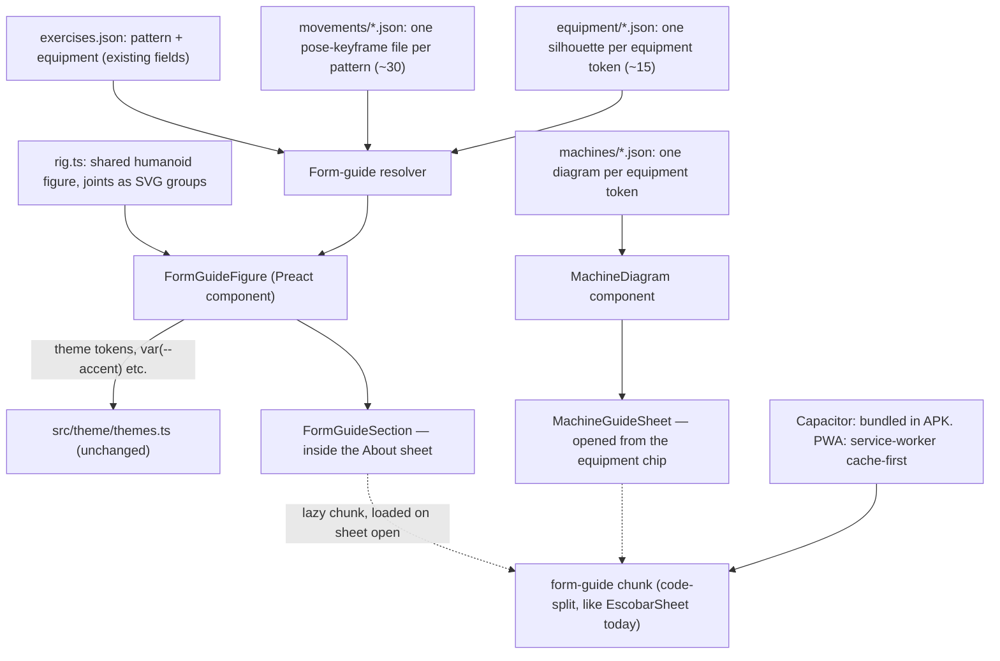

# M/ARC form guide and machine guide: architecture (research, no build)

Date: 26 September 2026. Status: proposed architecture, before implementation. Matches task board item "Form guide upgrade (owner request): architecture only, build after polish."

## Decision in plain words

Add two quiet features, reachable only from an exercise's own screens, never from Today:

1. **Form guide** — inside each exercise's About sheet, a short looping-on-demand animation of correct setup, the movement and tempo, plus a text list of common mistakes and cues. Every exercise in the library gets one, including new ones as the library grows.
2. **Machine guide** — tapping the equipment name (Cable, Smith Machine, Leg Press, …) on that same sheet opens a small "how to use this machine" panel: one rendered diagram of the machine with labelled adjustment points, shared by every exercise that uses it.

Build both on the app's own vector figure, drawn once and re-posed by data, not on a third-party animation player. `src/svg/bodyMuscles.ts` already proves this works here: a hand-drawn low-poly figure, themed at zero runtime cost through the same CSS custom properties every other screen uses. A form-guide figure is the same idea with joints that rotate. This keeps the feature at file-system-only cost (a few KB of path data and pose keyframes per movement, no new npm dependency, nothing to approve under the `package.json` file-ownership rule), keeps it fully offline in the APK, and keeps it inside the existing five-theme system without a recolor step.

The 170-exercise library does not need 170 hand-made animations. It already carries a `pattern` field (33 distinct values across 123 exercises today) and an `equipment` field (19 distinct base tokens). One rigged figure, ~30 pose sequences keyed by `pattern`, and ~15 equipment silhouettes keyed by `equipment`, composed together, cover the whole library combinatorially. This is the central architectural move this document makes, and it is why the feature is buildable at all inside the app's size and battery budget.

No application code was changed for this review. No animation asset was produced. No third-party runtime was added to `package.json`.

## 1. Scope and evidence

| Category | Meaning |
|---|---|
| Audited | Read directly in this repository. |
| Documented | Supported by a primary vendor or spec source cited below. |
| Reported | Supported only by a secondary source (blog, community benchmark); treated as directional, not guaranteed. |
| Proposed | An engineering design choice made in this document, not yet implemented. |

## 2. What the app already gives us to build on

| Audited location | Finding | What it means for this feature |
|---|---|---|
| `src/data/exercises.json` (123 entries today, "~170" per the brief) | Each entry has `id`, `name`, `equipment`, `primary`/`secondary`/`stabilizers` muscle ids, `aliases`, `pattern`, `defaultSets`. `pattern` has 33 distinct values; `equipment` has 19 distinct base tokens once `"X / Y"` compounds are split. | The animation and machine-diagram keys already exist in the data. No exercise needs a bespoke field just to pick its clip. |
| `src/svg/bodyMuscles.ts`, `src/ui/MuscleMap.tsx` | A hand-drawn low-poly figure as SVG path arrays (19 KB source, front + back view). Fill colour is computed per-part from theme tokens via `color-mix(in srgb, var(--accent) …)`; nothing is recoloured at runtime by a library, it just reads CSS variables. `role="img"`, `<title>` per part for accessibility. | This is the exact pattern to extend: an SVG figure whose colour comes from the theme automatically, with zero theming code of its own. It is proof this team can draw and maintain its own rig rather than needing a third-party character asset. |
| `src/theme/themes.ts` | 5 themes (`silent-black`, `paper`, `ember`, `emerald`, `midnight`), one shared `ThemeTokens` shape (`bg`, `surface1-3`, `border*`, `text*`, `accent`, `accentSoft`, `positive/warning/negative/info`, `mapBody`, `mapLine`, …). Re-skinning is `data-theme` on `<html>`. | A form-guide figure that only uses `var(--text)`, `var(--accent)`, `var(--map-body)`/`var(--map-line)` re-themes for free, in both light (Paper) and dark (Silent Black, Midnight, Ember, Emerald) themes, with no new tokens to design. |
| `src/ui/styles.css` | No named `--dur-*`/`--ease-*` tokens yet; current animations hardcode values (`220ms cubic-bezier(.2,.8,.2,1)`, `120ms ease`, etc.). One `@media (prefers-reduced-motion: reduce)` block already turns off `.view`/`.sheet`/`.toast` animation and all `transition`. A few states loop (`exercise-breathe 2.4s … infinite`, `escobar-mark.thinking … infinite`) but only while that state (active set, thinking) holds — not decorative infinite loops. `docs/UI-POLISH-PLAN.md` is already introducing `--dur-fast`/`--ease-standard` tokens for new work. | Form-guide playback must (a) go through the same reduced-motion query, (b) never loop unconditionally — play a bounded number of reps then stop on a held pose, matching the existing "no endless animation" rule, and (c) use the incoming `--dur-*`/`--ease-*` tokens rather than inventing its own numbers. |
| `vite.config.ts` | `assetsInlineLimit: 4096`, `target: es2020`, output to `www/`, no code-splitting config beyond Vite defaults. `www/` today is 760 KB total (main chunk 452 KB, `session` chunk 148 KB, `EscobarSheet` chunk 36 KB — Vite already route-splits the Escobar sheet). | The whole current app is well under 1 MB. Any new feature must be lazy-loaded behind its own chunk (as `EscobarSheet` already is) or it will visibly move the needle on a budget that has stayed this tight on purpose. |
| `package.json` | No animation/3D dependency present (`lottie`, `rive`, `three`, `gsap`, `pixi` all absent). Dependencies are deliberately minimal: Preact, `@preact/signals`, Capacitor plugins. | Per `AGENTS.md`'s file-ownership table, "No new dependency without the supervisor's OK." A design that needs zero new runtime dependency avoids that approval step entirely; this document treats that as a hard constraint, not a nice-to-have. |
| `capacitor.config.json`, `www/` | Capacitor serves `webDir: "www"` — the Android WebView reads the bundled files directly; there is no `server.url`. | Confirms the Android build is fully offline by construction today (see §11). |
| `docs/WATCH-ARCHITECTURE.md`, `docs/ESCOBAR-ARCHITECTURE.md`, `docs/UI-POLISH-PLAN.md` | This repo's convention for a feature like this is exactly one `docs/<NAME>.md` architecture file, written before code, in this tone. | This file follows that convention; a later task builds from it. |

## 3. Research: how to render the demos, compared

Read primary sources first; where only a secondary source had a number, it is marked "Reported" and the exact source is named. All URLs are listed again in Sources at the end.

| Approach | Runtime add (gzip) | Per-exercise asset | CPU/GPU on a budget phone | Theme at runtime | Multi-angle | Pause/scrub/slow-mo | Offline fit | A11y |
|---|---|---|---|---|---|---|---|---|
| **SVG + CSS/WAAPI rig** (recommended) | **0 KB** — no library, our own ~5–8 KB component + shared path/pose data | Pose keyframes as JSON, tens of numbers per pose (a handful of KB per movement pattern, shared across every exercise using it) | Runs on the compositor thread when only `transform`/`opacity` are animated — this is standard browser guidance, not vertical-specific to us [SVG-perf, Zigpoll] | Free — inherits `var(--accent)`/`var(--text)`/`var(--map-*)` exactly like `MuscleMap`, no recolor step, no per-theme asset | Cheap — a second camera is a second small pose file re-using the same rig and equipment silhouette | Native: WAAPI `Animation.currentTime`, `playbackRate`, `pause()` give scrub and slow-motion for free | Trivial — it is source, ships in the JS bundle, works with zero network | Each bone/label is a real DOM/SVG node; can carry `role`, `aria-label`, `<title>`; screen readers can reach it the way `MuscleMap` parts already do — SVG carries this over Canvas by design [SVG-vs-Canvas-a11y] |
| **Lottie (lottie-web)** | lottie-web itself: **≈237.5 KB minified** per a 2025 bundle-size issue on the repo [Lottie-issue-1184]; gzip commonly reported well under that (community reports cluster 60–75 KB gzip, Reported, not independently re-verified here) | A Lottie JSON per clip — no fixed number, but designer-authored After Effects exports for character animation commonly run tens of KB to a few hundred KB each | CPU-bound: on an Android benchmark, Lottie ran **≈17 FPS** vs Rive's ≈60 FPS on the same clip, and used **91.8% CPU** vs Rive's 31.8%, because lottie-web's default renderer is SVG/CPU, not GPU [Callstack] | Only with `lottie-colorify` (post-processes the JSON before load) or hand-placed `dynamicProperties`/keypath colour filters — extra runtime step, not "just" a CSS variable [lottie-colorify] | One JSON per angle — no sharing between angles | Yes — `setSpeed`, `goToAndStop`, standard player API | Needs the ~240 KB (min) library plus one JSON per exercise, all shippable offline, but is the heaviest of the "2D" options for what it buys here | Renders to SVG (CPU path) so screen-reader/DOM access is possible in principle, but the library owns the DOM structure, not us |
| **dotLottie (dotlottie-web)** | JS wrapper **≈12.1 KB gzip**; the Rust/WASM engine itself is **≈500 KB compressed** on first construct [dotlottie-web repo, dotlottie-issue-357] | `.lottie` bundles (zipped JSON + assets); LottieFiles quotes "≈150 KB" ballpark for the web runtime + typical file, 120+ FPS claimed (Reported, vendor's own figure) | Rust+WASM, GPU where available — materially better than plain lottie-web, no independent budget-phone number found for this exact runtime (flagged, not verified here) | Built-in **theme slots**: colours/opacity/gradients get a slot id at author time, then `setTheme('dark')` or `setThemeData(...)` at runtime switches them — closer to "real" theming than plain Lottie, but still a distinct authoring step per asset [dotLottie-theming, dotLottie-android-theming, dotLottie-spec] | One file per angle, same as Lottie | Yes, same player-style API | ~500 KB WASM is a one-time cost across all clips (good if we use many), but it is still ~500 KB more than the SVG rig costs us, and it is a WASM binary to cache correctly offline | Same caveat as Lottie: library-owned rendering surface |
| **Rive** | `rive.wasm` is reported at **78 KB**, but that number comes from a third-party optimization write-up, not the vendor FAQ page itself, which describes the *change* (v2.0 added a text engine and grew the file) without restating the number on the page as fetched for this review — treat 78 KB as Reported, not Documented [Rive-FAQ, Pixelpoint-Rive]. A full `@rive-app/react-webgl2` (wasm + JS glue) was reported elsewhere at **≈925 KB gzip wasm + ≈450 KB JS** (Reported, single secondary source, not independently re-verified) | Reported as small: one case study put an equivalent animation at **18 KB** (Rive) vs **181.7 KB** (Lottie) for the same result, and a second comparison in the same source at **2 KB vs 24.37 KB** [Callstack] | Best of the "2D" group: same Android benchmark showed **≈60 FPS**, **31.8% CPU**, **2.6 MB GPU / 7.3 MB JS heap**, vs Lottie's ≈17 FPS / 91.8% CPU / 149–190 MB GPU / 16.9 MB JS heap on a Sony Xperia Z3 (an old, low-spec device — useful as a budget-phone proxy) [Callstack] | **Data Binding**: bind a shape's colour to a View Model property once at author time; then every runtime (JS, native) can push a new colour into that property — the cleanest theming story of the packaged formats, but it requires authoring in the proprietary Rive editor [Rive-databinding] | State machines can hold multiple angle states in one file | State machines give built-in scrub/step/slow-mo semantics beyond a plain timeline | ~78 KB (or up to ~1 MB, unresolved which build we'd actually ship) is a one-time shared cost; per-file assets are small; still a binary format authored outside this repo, and a new dependency needing supervisor sign-off | No independent accessibility information found in the sources read for this review (flagged) |
| **Canvas 2D** (hand-drawn or sprite blit) | 0 KB library if hand-rolled | Sprite-sheet guidance (game-dev, not fitness-specific): **50–200 KB per character sheet**, stay at or under **2048×2048** [Sprite-guide] | Canvas is pixel-only and can out-perform SVG with *many* objects, but for one figure with a few dozen shapes the advantage is unclear; SVG is "actually more performant... with a small number of objects" per the same comparison [JointJS-SVG-vs-Canvas] | Must be done by hand: redraw with new fill colours, or keep an offscreen colour-remap; nothing is free | Extra sheet per angle | Must be hand-built (custom seek into a frame index); nothing native gives you WAAPI-style scrubbing | Fine offline, ships as image/JS | Weakest a11y of the group: "Canvas graphics are... purely raster and contain no inherent information about their drawn elements" — every label needs a manually maintained parallel text layer [JointJS-SVG-vs-Canvas] |
| **WebGL / three.js + glTF skinned mesh** | three.js core alone reported at **≈155 KB gzip** for the module (Reported, from a 2019-era forum thread re-surfaced in search, not independently re-confirmed on the current release — flagged as uncertain) before adding `GLTFLoader`, `DRACOLoader`/`KTX2Loader`, and an animation mixer | A rigged, skinned, textured 3D character is categorically heavier than a 2D asset — no fitness-app-specific number found, but glTF best practice explicitly targets **under ~60 bones** for a mobile-safe skinned mesh and recommends **Draco** (can cut mesh size to under 10% of original) and **KTX2/Basis** textures to avoid mobile out-of-memory crashes, which by itself signals this path is built for a budget above ours [3js-tips, 3js-mobile-perf] | Explicitly a mobile risk area: the same source notes optimized glTF+SkinnedMesh scenes can "drop to a fallback state or crash on Android WebView without emitting explicit console errors" [3js-mobile-perf] | Shader/material colour swap is possible but is a from-scratch engineering job, not a toggle | Free — 3D is inherently multi-angle (orbit/rotate) | Yes, full control via the animation mixer | Heaviest offline footprint of every option here: engine + loaders + one mesh/texture set per figure, likely megabytes, worst fit for "APK and PWA size, low-end Android performance and battery" | Canvas/WebGL surface, same a11y gap as Canvas 2D, worse: no text-like DOM at all |
| **Sprite sheets** (photographed or illustrated frames) | 0 KB library (a `<canvas>` or even `background-position` stepping is enough) | **50–200 KB per sheet** is the generic game-dev guidance found; a photographed human sheet at usable resolution for many frames would likely sit at the high end or above (not fitness-specific, flagged) [Sprite-guide] | Cheap to play (just blit/step frames), but does not match the app's flat vector style without being illustrated to match, which is extra art production per exercise, not a runtime cost | None at runtime — colour is baked into the pixels; a theme change needs a new sheet per theme (5×) | New sheet per angle | Coarse — scrubbing means picking a frame index, no interpolation between poses | Fine offline | Same raster gap as Canvas: no built-in text/labels |
| **Video (H.264 / VP9 / AV1)** | 0 KB library (native `<video>`) | Depends entirely on resolution/length/codec; not independently benchmarked here for this exact use case (flagged) | Hardware-decoded H.264 is close to free on CPU/battery — "AVC" decode is broadly hardware-accelerated across platforms per MDN, and is the safest universal baseline; VP9/AV1 need the device to have a hardware decoder or battery cost rises from software decode [MDN-codecs] | None — a video is baked pixels; a theme change needs a second recorded clip per theme (5×) or an on-the-fly CSS filter hack that will not match hand-tuned theme colours | New clip per angle (full re-shoot/re-render) | `<video>` gives `currentTime`/`playbackRate` for free, so scrub/slow-mo work natively | Fine offline if bundled, but is the only option here with a real per-clip storage cost that scales badly across ~170 exercises × multiple angles | Needs captions/description text for **every clip** to meet WCAG "video-only" guidance regardless of engine choice — see §10 |

**Alpha-channel note on video** (checked directly against MDN, not secondary blogs): **H.264/AVC has no documented alpha-channel support**; **VP8 supports alpha in the browsers that implement it, except Safari**; MDN's page as fetched for this review did not document VP9 alpha support explicitly, even though it is used in the wild for WebM alpha in some Chromium builds — that specific claim is not confirmed here and should be re-checked before depending on it [MDN-codecs].

### The recommendation

Build the form guide and the machine guide as an **SVG + CSS/WAAPI rig that this team draws and poses itself**, matching `bodyMuscles.ts`/`MuscleMap.tsx` exactly. Concretely:

- **Zero new runtime dependency.** Every packaged option (Lottie, dotLottie, Rive) adds 78 KB to ~500+ KB of library weight for a benefit — smoother CPU-bound playback, editor-assisted authoring — this app does not need at its current animation complexity (a person doing a lift, not a game). Rive is clearly the best packaged option on every number found (60 FPS vs 17, 31.8% vs 91.8% CPU, tiny per-file size), and is the one to reconsider first if the in-house rig ever needs data-driven interactivity Beyond what CSS/WAAPI gives; but it is an unapproved new dependency and a proprietary authoring tool today, so it does not clear the "no new dependency without the supervisor's OK" bar for this phase [Callstack, Rive-databinding].
- **WebGL/three.js and photographed sprite/video are explicitly rejected** as the primary engine: three.js pulls in a general-purpose 3D engine and asset pipeline (loaders, Draco/KTX2, a rigged mesh per figure) sized for games, not a fitness how-to card, and its own ecosystem's mobile guidance is written around avoiding WebView crashes — a strong signal this is over-built for our need [3js-mobile-perf]. Video cannot be recoloured per theme without 5 clips per exercise per angle and cannot be labelled per-frame for accessibility without a parallel transcript anyway (see §10), so it is kept only as an optional, clearly-scoped enhancement (§11), not the default.
- **Canvas 2D and sprite sheets are rejected** because they give up the one thing this app already has for free — SVG nodes that inherit theme colour and carry their own accessible names — for no offsetting benefit at the scale of "one figure, a few dozen shapes."

## 4. Recommended architecture



- **`FormGuideFigure`**: a Preact component, sibling to `MuscleMap`, that takes a resolved pose sequence + an equipment silhouette id and renders one SVG. It owns no exercise-specific knowledge; it is purely "draw this rig at this pose."
- **`movements/*.json`**: one small file per `pattern` value (squat, hip_hinge, horizontal_push, vertical_pull, elbow_flexion, …) holding keyframes as joint angles/positions over normalized time, plus the setup/mistake copy that is pattern-generic (e.g., "keep the bar over mid-foot" for every hip_hinge). ~30 files today, growing slowly as genuinely new patterns are added — far slower than the exercise count grows.
- **`equipment/*.json`**: one silhouette (bench, cable tower with adjustable pulley, Smith machine rails, leg press sled, dip station, …) per base `equipment` token (19 today, realistically ~15 once near-duplicates like `Dumbbell`/`Dumbbells` collapse). Composed behind/around the figure.
- **Per-exercise overrides**: a small, optional object keyed by exercise `id` for the genuinely exercise-specific deltas — grip width, stance, unilateral vs bilateral, an extra "commonly confused with X" note — so no exercise is force-fit into a pattern that doesn't quite match it, without needing a whole new animation.
- **`FormGuideSection`**: the actual UI, living inside the exercise About sheet (see §8), lazy-loaded as its own Vite chunk exactly the way `EscobarSheet` already is (audited in §2), so it costs nothing until a user opens it.
- **`MachineDiagram` / `MachineGuideSheet`**: the equipment-name chip on the About sheet becomes tappable; it opens a small sheet showing that one shared diagram (adjustment points labelled: seat height, pad position, pulley height, safety pins) plus 3–5 plain-language usage steps. Shared by every exercise using that equipment, authored once.

## 5. Data model

Add to the repo, not to `src/core/models.ts`'s saved-data shape (so this needs no migration and no owner sign-off under that file-ownership rule):

```
src/data/formGuide/
  movements/<pattern>.json      # ~30 files: {setup[], movement keyframes, tempo, mistakes[], cues[]}
  equipment/<equipmentToken>.json  # ~15 files: {silhouette path data, machine adjustment points, usage steps}
  overrides/<exerciseId>.json    # optional, only where an exercise truly diverges from its pattern
src/svg/formGuideRig.ts          # the shared humanoid rig path data (joints as named groups)
```

`exercises.json` itself is untouched — `pattern` and `equipment` already carry everything the resolver needs. This also means the resolver degrades safely: any future exercise that is missing an override still renders *something* correct-shaped from its `pattern` + `equipment` alone, so "cover ALL library exercises" is true by construction, including exercises added after this ships (task #23 in progress and beyond).

## 6. Content pipeline — how ~170 exercises get covered without ~170 animations

This is the crux of "architecture this properly... since this will be a large build." The library-wide cost is:

- **~30 movement files** (one per `pattern`), each authored once by whoever draws the rig poses (owner or a hired illustrator/animator — this document does not assume who; it only assumes the format is small, versioned JSON, not a rendered clip).
- **~15 equipment files** (one per base `equipment` token), each authored once.
- **A handful of overrides** for exercises that need a specific detail no pattern/equipment combination captures alone.

That is on the order of 45–60 hand-authored assets to cover a 170-exercise library today, and it stays roughly flat as the library grows, because a new exercise added to `exercises.json` almost always reuses an existing `pattern` and `equipment` value (evidenced by the current data: 123 exercises already collapse to 33 patterns and 19 equipment tokens — a >2.5:1 ratio that only gets denser as the library grows, since new exercises are far more likely to be a new combination of existing patterns/equipment than a genuinely new movement).

## 7. Machine guide detail

Equipment tokens present today, each needing exactly one diagram: Barbell, Dumbbell(s), Machine, Cable, Smith Machine, Bodyweight, Kettlebell, Resistance Band, Sled, Landmine, Trap Bar, EZ Bar, Ab Wheel, Dip Station, T-Bar, Leg Press, Plate-Loaded, Weight (generic) — 19 tokens, several of which (e.g. "Cable / Machine", "Dumbbells / Barbell") are compounds already split for this purpose in §2's data audit. The owner's brief calls out "leg press, cable station, Smith machine, hack squat" by name — "hack squat" is not currently its own `equipment` value in the data (it is filed under `Machine`); if the owner wants it visually distinct, that is a one-line addition to `exercises.json`'s equipment string plus one new diagram, not a schema change.

Each machine diagram is the same SVG-rig technology as the form guide, just without a human figure animating through it (or with a small static figure shown in the "in use" position) — no second engine, no second theming path.

## 8. Where this lives in the app (quiet placement)

- **Exercise About sheet** (the info sheet already planned for ~170 exercises): a new section, below "How to perform it," titled something like "Form guide," collapsed to a single still frame + a small "▶ Play" affordance by default. Tapping it plays the bounded sequence in place; nothing autoplays when the sheet opens.
- **Equipment chip on that same sheet**: becomes tappable, opening `MachineGuideSheet` as a nested sheet (matching the existing sheet-over-sheet pattern already in the app's `.sheet-panel` CSS).
- **Explicitly not on Today.** Today stays exactly as it is; there is no new entry point, badge, or nudge on the main screen. The only other place a very small (i) affordance could reasonably go, if the owner wants a second entry point later, is next to the exercise name in `Train.tsx`'s live exercise header (`src/slices/workout/Train.tsx`) or in `ExercisePicker.tsx` — both open the same About sheet, they do not duplicate the feature. This document does not propose adding that second entry point now; it names it as the only quiet option if requested later.
- **Escobar tie-in (optional, later):** `docs/UI-POLISH-PLAN.md` already has an "Ask Escobar" pattern reusing the `AskAbout` component elsewhere in the app. The same button could deep-link into a specific exercise's form guide when Escobar is asked "how do I do X" — no new UI surface, reuse of an existing pattern, left for a later task.

## 9. Motion, theming and reduced-motion rules

- **Themeable by construction**: the rig uses only `var(--text)`, `var(--accent)`, `var(--map-body)`/`var(--map-line)`/`var(--border)` — the same tokens `MuscleMap` already uses — so it renders correctly in Paper (light) and Silent Black (dark) and the other three themes with no per-theme asset and no runtime recolor step, unlike every packaged format in §3.
- **Duration/easing tokens**: use the `--dur-*`/`--ease-*` tokens `docs/UI-POLISH-PLAN.md` is already introducing, not new hardcoded numbers, so this feature ages the same way the rest of the app's motion system does.
- **No endless animation**: default state is a held pose (a still frame), matching the existing rule; "Play" runs a bounded number of reps (e.g. 2) and returns to the held pose — never an unconditional `infinite` loop. This mirrors how the existing `infinite` animations in `styles.css` are all gated by a live state (`.active`, `.thinking`), not decorative.
- **`prefers-reduced-motion: reduce`**: falls into the SAME media query already in `styles.css` (`@media (prefers-reduced-motion: reduce) { … }`). The fallback is not "no content" — it is a small set of 3–4 static labelled key poses (setup, mid-rep, end-rep) shown side by side, plus the always-present text steps, so a reduced-motion user gets the same information, just not animated.

## 10. Accessibility

- **Every clip ships with the text list it is illustrating** (setup steps, movement, tempo, mistakes) — this is not a caption bolted onto a video, it is the primary content, with the animation as illustration. This satisfies the spirit of WCAG's "Audio-only and Video-only (Prerecorded)" guidance (a text alternative must exist for visual-only content) by construction, for every rendering engine, including if a video clip is ever added under §11's optional path [WCAG-1.2.1, WCAG-1.2.2].
- **SVG a11y**: each rig group/label can carry `role="img"`/`<title>`, same as `MuscleMap` today, so screen readers (TalkBack on Android, VoiceOver on iOS/desktop testing) reach real names, not an opaque bitmap — a documented advantage of SVG over Canvas/WebGL/video for exactly this reason [SVG-vs-Canvas-a11y].
- **Keyboard/switch access**: the Play control and any scrubber are real buttons/sliders (WAAPI's `currentTime` maps directly to a range input), not custom gesture-only surfaces.
- **Captions, if video is ever added** (§11): every clip needs an on-screen or track-based text description regardless of codec choice — this is a content-production requirement, not something a codec picks its way out of.

## 11. Online vs offline — the actual decision

Two different runtimes, two different answers, both audited in §2:

- **Capacitor/Android**: the app ships `www/` bundled into the APK; there is no `server.url`; a service worker "doesn't work well when using Capacitor" and the platform's own maintainers recommend disabling it for native builds, relying on the bundled files instead [Capacitor-SW-discussion]. **Decision: the entire form guide and machine guide ship inside the APK as part of the normal JS/asset bundle**, lazy-loaded as their own chunk (§4) so they cost nothing until opened, but never fetched over the network on Android. This matches "decide online vs offline properly" by simply not introducing a network dependency where the platform already tells us not to.
- **PWA (web)**: a service worker is the right tool here, and the project can add a cache-first strategy for the form-guide chunk and its JSON data (movements/equipment/overrides) the first time a user opens any About sheet, so the second exercise onward is instant and offline, consistent with standard PWA caching guidance [PWA-caching].
- **No CDN, no third-party asset host.** Because the entire feature is our own SVG + JSON, there is no reason to fetch from lottiefiles.com, a public asset CDN, or any third party — which also avoids the tracker/privacy question the brief raises: nothing here calls out to an external service, so there is nothing to audit for telemetry. If a future video enhancement (below) is added, it must be self-hosted (e.g. the existing `escobar-worker/` Cloudflare Worker, or plain static hosting under the app's own domain), never embedded via a third-party player.
- **Optional later enhancement, explicitly out of scope now**: a small number of "hero" exercises (e.g. the ones the owner cares most about getting exactly right, or ones the vector rig genuinely cannot convey well) could get a short, muted, captioned H.264 clip, downloaded on demand via Capacitor's Filesystem plugin (already a dependency — `@capacitor/filesystem` is in `package.json` today) and cached to disk, with the PWA using the browser cache instead. This keeps the 170-exercise baseline at zero network cost and zero per-clip storage cost, and only spends video's real storage cost (§3) on the handful of cases where it earns its keep. H.264 is the safe default codec choice here for its near-universal hardware decode [MDN-codecs]; VP9/AV1 are not recommended as the primary codec until hardware-decode coverage on the actual budget-Android install base is checked, which this review did not do.

## 12. Size and performance budget

- **Baseline (SVG rig, all ~170 exercises + ~15 machines)**: engine cost 0 KB (no new dependency); content cost is the rig path data (comparable order of magnitude to `bodyMuscles.ts`'s 19 KB source for a whole two-view body figure) plus ~45–60 small JSON files of pose/silhouette data, plausibly in the low hundreds of KB uncompressed, a low double-digit KB figure once gzipped/APK-compressed — small next to the app's current 760 KB `www/` total (audited in §2), and it only loads when the chunk is requested.
- **Guardrail to write into the build**: add a check (in `scripts/screenshot-gate.mjs` or a new script, per this repo's "add your own blocks, named with your task ID" convention for shared gate files) that fails CI if the form-guide chunk exceeds an agreed cap (e.g. 150 KB gzipped for the whole baseline feature) — a concrete, enforced version of "APK and PWA size" budget rather than a promise.
- **CPU/battery**: because playback only ever animates `transform`/`opacity` on a handful of SVG groups, it runs on the compositor thread, the standard advice for battery-conscious mobile animation, and is unrelated in cost to the number of exercises in the library (one movement file is reused by every exercise sharing that pattern) [SVG-perf, Zigpoll].
- **Low-end Android reality check**: 2026 budget Android devices (4 GB RAM class, e.g. the Galaxy A17 5G) already show materially lower JS/browser throughput than mid-tier (a reported ~70% gap in one benchmark) [csswizardry-2026]. This is exactly why the packaged-runtime options (Rive's 78 KB–~1 MB wasm, Lottie's ~240 KB library, three.js's 155 KB+ core plus loaders) are the wrong default here — they spend budget-phone headroom on an engine before a single exercise is drawn — and why the recommended path spends that headroom on content instead.

## 13. Privacy

No analytics, no third-party SDK, no remote asset host in the baseline design (§11). The only optional future network call (an on-demand hero video) would go through infrastructure the project already owns (`escobar-worker/`) or plain static hosting, not a third-party player/CDN, so it introduces no new tracker.

## 14. Build/CI additions (for the later build task, not done here)

- A new `scripts/render-form-guide-preview.mjs`-style tool (optional) to spot-check that every `pattern` in `exercises.json` resolves to a movement file and every `equipment` token resolves to a silhouette, failing CI if the library grows a pattern/equipment value with no corresponding asset — this turns "cover ALL library exercises" into an enforced invariant, not a one-time promise, and directly protects task #23's in-progress library expansion from silently shipping exercises with no guide.
- Extend `tests/theme.test.ts` (shared, add-only per `AGENTS.md`) with a block, tagged with this task's id, asserting the new SVG only references existing theme tokens.

## 15. Phasing (for whoever builds this next)

1. Rig + 3–5 movement patterns covering the most common exercises (horizontal_push, squat, hip_hinge, vertical_pull, elbow_flexion together already cover 43 of 123 exercises today) + the About sheet section, behind the lazy chunk.
2. Remaining ~28 movement patterns + ~15 equipment silhouettes → full library coverage.
3. Machine guide sheet, reusing the equipment silhouettes from step 2.
4. CI guardrails (§14) so future library growth (task #23 and beyond) cannot silently ship an exercise with no guide.
5. Optional: PWA service-worker caching polish, hero-exercise video enhancement (§11), Escobar deep link (§8) — each independently shippable, none blocking the others.

## 16. Risks and mitigations

| Risk | Mitigation |
|---|---|
| Drawing ~30 movement poses well enough to look right for every exercise in that pattern is real illustration/animation work, not free. | Phase it (§15); ship the highest-coverage patterns first; the resolver degrades safely (§4) so a not-yet-authored pattern can fall back to a generic "no guide yet" state rather than blocking the whole feature. |
| A future request to "make it fancier" pulls in Rive/Lottie later, re-opening the "no new dependency" question. | This document already names Rive as the correct escalation path if/when the in-house rig's ceiling is reached (§3), so that decision is pre-researched, not ad hoc; it still needs the supervisor's sign-off on the new dependency when/if proposed. |
| Hand-authored SVG path data drifting from the theme contract (hardcoded colours creeping in) over time. | The CI addition in §14 (assert only existing theme tokens are referenced) catches this the same way `tests/theme.test.ts` already guards the rest of the app. |
| "Hack squat" and similarly named machines the owner expects visually distinct are currently folded into the generic `Machine` equipment token. | Called out explicitly in §7; a one-line data change plus one new diagram, not a design change. |
| Some numbers in §3 (three.js core gzip size, Rive's full-wasm size, VP9 alpha support) came from a single secondary source or a vendor page that did not restate the figure at fetch time. | Each is marked "Reported"/flagged in §3 rather than stated as fact; re-verify directly against `bundlephobia.com` and Rive's current docs before this influences a real dependency decision, which is not the decision this document makes. |

## 17. Non-goals / out of scope (this review)

No code was written or changed. No animation asset was produced. No third-party runtime was added. No decision was made on who illustrates the ~45–60 movement/equipment assets (owner-drawn, commissioned, or AI-assisted then hand-corrected — all are compatible with the JSON/SVG format proposed here). No change was made to `exercises.json`'s schema. Task #23 (exercise library expansion) and this review's phase-1 coverage numbers should be re-checked against each other once #23 lands, since the pattern/equipment distribution used in §2 and §6 was measured against the 123-exercise file as it stood on 26 September 2026.

## Sources

- [lottie-web bundle-size issue (≈237.5 KB minified)](https://github.com/airbnb/lottie-web/issues/1184)
- [lottie-web on Bundlephobia](https://bundlephobia.com/package/lottie-web)
- [lottie-colorify (recolor Lottie JSON before load)](https://www.npmjs.com/package/lottie-colorify)
- [dotlottie-web (Rust + WASM player)](https://github.com/lottiefiles/dotlottie-web)
- [dotlottie-web bundle-size issue (+30 KB min+gzip)](https://github.com/LottieFiles/dotlottie-web/issues/357)
- [dotLottie theming (LSS / theme slots)](https://developers.lottiefiles.com/docs/tools/dotlottie-js/theming/)
- [dotLottie Android theming](https://developers.lottiefiles.com/docs/dotlottie-player/dotlottie-android/usage/theming/)
- [dotLottie 2.0 spec](https://dotlottie.io/spec/2.0/)
- [Rive Web (JS) FAQ](https://rive.app/docs/runtimes/web/faq)
- [Rive React optimization techniques (78 KB wasm, lazy-load/code-split/conditional-render advice)](https://pixelpoint.io/blog/rive-react-optimizations/)
- [Rive Data Binding overview](https://rive.app/docs/editor/data-binding/overview)
- [Getting started with Rive Data Binding](https://rive.app/blog/getting-started-with-data-binding)
- [Lottie vs. Rive: Optimizing Mobile App Animation (Callstack — FPS/CPU/memory/file-size benchmark)](https://www.callstack.com/blog/lottie-vs-rive-optimizing-mobile-app-animation)
- [three.js file size discussion (core gzip, reported)](https://discourse.threejs.org/t/three-js-file-size-when-importing-via-webpack/8904)
- [100 three.js tips (mobile bone-count, Draco, KTX2 guidance)](https://www.utsubo.com/blog/threejs-best-practices-100-tips)
- [Faster WebGL/three.js with OffscreenCanvas and Web Workers](https://dev.to/evilmartians/faster-webgl-three-js-3d-graphics-with-offscreencanvas-and-web-workers-43he)
- [SVG animation performance guidance](https://www.svgator.com/blog/why-use-svg-animations/)
- [Optimizing SVG animation on mobile (GPU-friendly properties)](https://www.zigpoll.com/content/how-can-i-optimize-svg-animations-to-run-smoothly-on-both-desktop-and-mobile-browsers-without-significant-performance-loss)
- [SVG vs Canvas — JointJS (performance and accessibility tradeoffs)](https://www.jointjs.com/blog/svg-versus-canvas)
- [MDN: Web video codec guide (alpha channel support, hardware decode)](https://developer.mozilla.org/en-US/docs/Web/Media/Guides/Formats/Video_codecs)
- [W3C: Understanding SC 1.2.2 Captions (Prerecorded)](https://www.w3.org/WAI/WCAG22/Understanding/captions-prerecorded.html)
- [WCAG 1.2.1 Audio-only and Video-only (Prerecorded), plain-English](https://aaardvarkaccessibility.com/wcag-plain-english/1-2-1-audio-only-and-video-only-prerecorded/)
- [Sprite sheet animation guide (size/resolution guidance)](https://jaconir.online/blogs/sprite-sheet-animation-guide)
- [Capacitor + service worker discussion (official maintainer guidance)](https://github.com/ionic-team/capacitor/discussions/3205)
- [PWA caching strategies — web.dev](https://web.dev/learn/pwa/caching)
- [Low- and mid-tier mobile for the real world, 2026 — CSS Wizardry](https://csswizardry.com/2026/07/low-and-mid-tier-mobile-for-the-real-world-2026/)
- [Android Go Edition](https://en.wikipedia.org/wiki/Android_Go)
