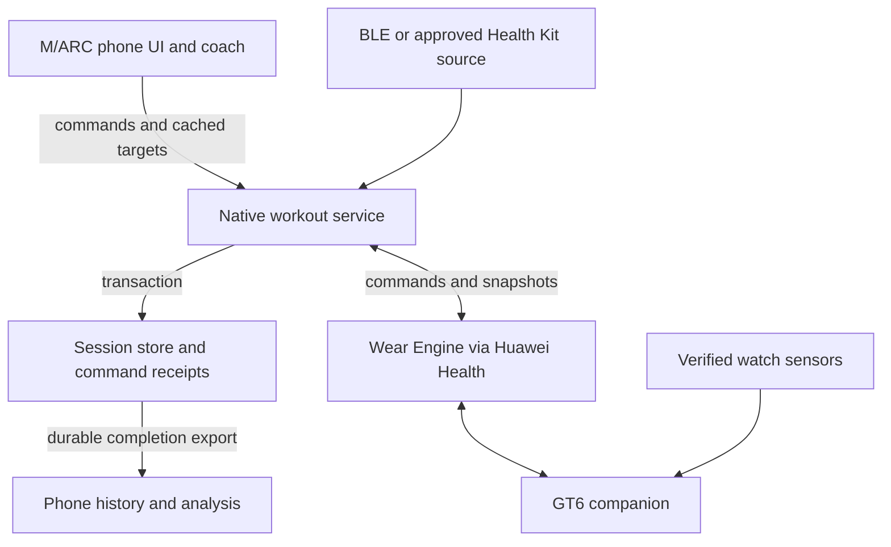

# M/ARC watch companion: architecture and feasibility review

Date: 23 September 2026. Status: proposed architecture; implementation tracked separately below.

24 September clarification: M/ARC is an **offline-capable Android workout
tracker with an optional online AI coach (Escobar)**. Workout logging and its
saved record are local; Escobar needs an internet connection when used. The
Wear Engine application requests Basic device information/P2P for the phone
app only. Communication requires M/ARC open in the foreground. Native storage
and a foreground service do not establish support for communication while the
phone app is inactive. The sections below remain a proposed architecture;
`WATCH-PROGRESS.md` and `native/wear/GATE-B.md` track implemented boundaries.

## Decision in plain words

Build a small Huawei watch companion that controls the workout already running in M/ARC. Keep the approved C2 Split design: very large heart rate, visible current set, exercise name, and clearly labelled active and total workout calories when available. Use four gesture-driven screens. The phone owns the workout record and coaching decisions; the watch displays them, collects deliberate user actions, and can contribute sensor readings where its APIs permit.

The first engineering milestone must prove the connection and sensor capabilities on the actual GT6. Wear Engine approval does not by itself prove access to heart rate, RR, HRV, sleep, or Huawei Training Index. An API existing elsewhere in Huawei's ecosystem does not establish GT6 support.

Use durable native storage for recoverable workout ownership. Any eventual
phone-in-pocket communication remains subject to Huawei's restrictions and
actual device evidence; it is not a capability promised by this design.

No application code, repository branch, or pull request was created for this review. No GT6 hardware test, SDK build, signing test, or new service approval was performed.

## 1. Scope and evidence

Reviewed repository: [macdarenz-droid/M-arc](https://github.com/macdarenz-droid/M-arc), pinned to [e34076fbc5ba4c4962416ac26653795bb6d8a606](https://github.com/macdarenz-droid/M-arc/tree/e34076fbc5ba4c4962416ac26653795bb6d8a606), the source associated with the user's supplied [build](https://github.com/macdarenz-droid/M-arc/actions/runs/35853038794). The default branch was older than this build when inspected. Future implementation should recheck the latest intended branch and incorporate changes made after this review.

Project identity: M/ARC, Android package `com.mrcdrnzz.dailytracker`, Huawei app ID `119100049`. The supplied screenshots show developer identity approval and a submitted Wear Engine application; they do not show Wear Engine approval. The application requests basic device information/data communication and describes a planned lightweight wearable app.

Evidence categories used here:

| Category | Meaning |
|---|---|
| Audited | Read directly in the pinned repository source. |
| Documented | Supported by the primary vendor references listed below. |
| Proposed | An engineering design choice, not an existing implementation. |
| Device gate | Requires the actual watch, phone, account permissions, and installed SDK. |

Some Huawei documentation pages returned only a JavaScript shell. Their indexed excerpts identify a platform or API to investigate, but are not treated as complete compatibility verification. The current Health Kit real-time HR guide and Huawei's official Wear Engine sample were readable. Regional/account eligibility remains unresolved.

## 2. Feasibility and data access

Three integrations serve different purposes. Wear Engine provides phone/watch communication through Huawei Health [S1]. A watch sensor API, if supported, supplies measurements inside the companion. Health Service Kit is a separate authorization route for approved health data and selected real-time capabilities [S2, S3]. Keep their permissions and failure states separate.

| Desired feature | Proposed path | Confidence / dependency |
|---|---|---|
| Workout, exercise, current set and progress | M/ARC snapshots over Wear Engine P2P | Documented communication route; approval and real-device messaging still required. |
| Tap to log sets, pause, rest controls | Watch commands to M/ARC | Software under our control once P2P works. |
| History-based targets | Existing phone progression engine | Audited; adapt its output to a small watch view model. |
| HR without the broadcast toggle | Test watch-local HR subscription; separately assess Health Kit extended real-time HR | Neither is proven for this account/device. Do not promise either as already working. |
| Existing broadcast HR | Existing BLE adapter | User reports it works; retain as fallback. |
| Live workout calories | Phone estimate with source label, or a verified compatible provider | Current app contains estimates, not proof of Huawei's own calorie values. |
| RR intervals | A source explicitly supplying valid beat intervals | Optional BLE field exists; real GT6 output and companion access unverified. Here RR means beat-to-beat intervals, not respiratory rate. |
| HRV | Approved vendor HRV, or separately validated computation from suitable intervals | Deferred. Average BPM is insufficient; do not generate intervals as 60000/BPM. |
| Sleep | Separately approved Health Kit read integration, or records actually present in Health Connect | Historical sync; not a live workout channel. Do not assume Huawei exports it to Health Connect. |
| Huawei Training Index | Exact vendor metric and approved API must be identified | Unverified. A M/ARC-derived score must have a different name and provenance. |
| Auto-open companion / sensor start from phone | Model-specific supported launch/wake flow | Device gate. Basic communication approval is not evidence of this capability. |
| Continuous operation while watch screen is off | Watch lifecycle/sensor capability | Device gate; a phone foreground service cannot extend watch runtime permissions. |

Huawei documents `startReadingHeartRate` under extended Health Kit capabilities, with approximately five-second callbacks while a compatible device measures HR. It requires Huawei-approved and user-granted scopes [S2]. This is a candidate for the user's accepted 3–5 second delay, not a guaranteed latency or proof that the API starts continuous measurement. Confirm account eligibility, region, GT6 support, Huawei Health version and measurement lifecycle before choosing it. The current permission application does not include this separate scope.

The older Lite Wearable sensor reference names heart-rate subscription but contains device-specific support restrictions [S5]. Therefore the architecture must remain useful if direct watch HR access is unavailable: the watch can display a phone-provided reading with its age and source. If neither non-broadcast route is available, the honest deliverable remains a workout-control companion plus the existing broadcast fallback.

The GT6 appears in Huawei's Lite Wearable development guidance [S4]. Target that device category; do not build a Wear OS APK or assume a full HarmonyOS/ArkTS app template is interchangeable. Pin the actual DevEco template, SDK, API level, packaging and signing procedure during the feasibility milestone.

## 3. What the current code means for this project

Paths below refer to the pinned source, not a proposed new implementation.

| Audited location | Finding | Required design response |
|---|---|---|
| `package.json`, `docs/ARCHITECTURE.md` | Preact/TypeScript/Vite UI, Capacitor Android wrapper, Java native plugins | Extend this architecture; do not replace the gym app with a separate phone app. |
| `src/native/watch.ts`, `native/watch/WatchService.java` | BLE heart-rate adapter, saved device, connection/freshness states, Android connected-device foreground service | Preserve BLE; add a distinct Huawei companion transport. Existing foreground BLE work is not a native workout engine. |
| `src/slices/workout/session.ts`, `src/core/models.ts` | Active session/entry/set writes use array positions; finished session ID is created at finish | Create stable IDs at session start and keep them into history. Never identify a command target by position. |
| `session.ts: commitSet` | Phone receipt time controls fidelity, rest and heart association; no explicit already-committed command guard | Separate event time from receipt time; add idempotency and explicit completion/correction semantics. |
| `session.ts: addSet` | Copies the previous set object except effort | Copy draft values only. Never inherit timestamps, heart summaries, fidelity or completion identity. |
| `Train.tsx` | Weight/reps inputs can commit on blur | Phone and watch need the same deliberate command model. Preserve phone editing behavior through an adapter rather than letting multiple paths mutate native state. |
| `src/core/store.ts` | Whole state in localStorage, debounced 250 ms; save failure is reported separately; `flushSave` returns no success value | Current mutation calls cannot supply a reliable durable acknowledgement to the watch. |
| `src/slices/workout/heart.ts` | Raw samples live in JS memory until finish; receive time drives their position; summary source hardcoded to BLE | Add native capture/checkpointing, source metadata and source/sample timestamps. Do not lose all prior HR on WebView restart. |
| `src/brain/progression.ts`, `history.ts`, `units.ts` | Existing suggestions, previous-set lookup, readiness/deload considerations and equipment rounding | Reuse on phone. Current history lookup is exercise-based; do not claim it already filters histories by gym. |
| `src/brain/energy.ts` | Has active/gross estimates and provider-selection helper; imported active/watch helpers currently set gross equal to active | Separate the meanings before showing two calorie totals. The current finalization path uses the HR estimate; helper existence does not prove provider ingestion. |
| `src/escobar/apply.ts` | Some accepted proposals directly change app state, including clearing active workouts | Include coaching, restore/import and reset paths in the write-ownership audit. |
| `src/theme/themes.ts` | Five theme token sets; default Silent Black accent is `#5e6ad2` | Send a compact palette to the watch; do not hardcode an unrelated design. |

These are integration findings from code review, not claims that the existing phone app is failing in normal use.

## 4. Recommended component architecture

This is a proposed ownership design. It does not claim all vendor paths have passed the device gate.

**Phone UI and coach.** Keep the existing progression, equipment, history and Escobar logic. Prepare the selected workout and compact per-set targets before starting. Send a bounded suggestion package to the native service; cached targets remain usable while the web UI is asleep. Fresh coaching can wait until the UI resumes. No LLM or full workout history is needed on the watch.

**Native workout service.** On Android, own the active session lifecycle, committed sets, authoritative rest state, command receipts and sensor capture. Use Java to fit existing native code unless a later repository decision standardizes Kotlin. Use a transactional local database, with an Android foreground service only during a user-visible workout when the platform and vendor permit it [S7]. All phone, watch and coaching mutations affecting that active session go through this one service.

**Existing app state.** Initially keep unrelated profile, templates and historical analysis in the current store. Treat `state.active` on Android as a projection of native state, not another writer. For web/PWA, retain a TypeScript implementation behind the same workout command interface. Share protocol types and conformance fixtures; do not pretend Java and TypeScript are automatically the same implementation.

**Watch.** Own page state, an unsubmitted draft, a bounded durable command outbox and last confirmed snapshot. It may show provisional progress while offline, but cannot declare phone persistence before an applied acknowledgement. Its HR display may be local even when phone messaging fails, if that capability was verified.

**Provider boundaries.** Keep `CompanionTransport`, `LiveHeartRateSource` and `HistoricalHealthSource` separate. Standard BLE HR can provide a measurement without supporting set logging. A later Wear OS, Garmin or other adapter implements only its available capabilities. There is no universal Bluetooth API granting every watch's private metrics.

### Why native ownership is recommended

The requirement includes leaving the phone in a pocket. The current workout engine executes in a WebView. A native receiver can queue packets while that UI is unavailable, but cannot guarantee those TypeScript functions execute. A hidden WebView or permanent wake lock is not the architectural answer.

For an early foreground-only test, commands may be durably queued and later applied by TypeScript; the watch must say “Pending on phone.” For the intended product, move the small active-workout command state machine into native code. This adds migration work but gives persistence a clear owner. It still cannot bypass a Huawei restriction requiring a foreground phone app: if the actual SDK enforces that restriction, the product must expose the limitation until a supported route is found.

## 5. Workout data and synchronization contract

### Identity and state

Create `sessionId`, `entryId` and `setId` before sending the first snapshot. Preserve session ID into history. Add session status (`active`, `paused`, `finished`, `discarded`), session revision, entity revisions and a distinct rest ID/revision. Exercise substitution creates new target identities rather than reusing stale ones. Reordering only changes display order.

A set needs explicit state (`draft`, `committed`, `skipped`) so accepting a suggested weight never silently counts as completing the exercise. Existing saved sets need a versioned migration preserving their historical meaning; do not fabricate measurement times for old records.

### Message families

| Message | Purpose |
|---|---|
| Hello / capabilities | Protocol version, app version, selected device/install identity, available features, supported payload limits. |
| Session snapshot | Confirmed revision, current entry/set IDs, progress, rest, compact targets, palette and metric metadata. |
| Workout command | Complete/correct set, undo, pause/resume, adjust/skip rest, select entry, request finish. |
| Command result | Applied revision and receipt, or conflict/rejection reason. A transport delivery callback is not this result. |
| Heart-rate sample/batch | Source identity, sequence, measurement/receipt times, BPM and available quality fields. |
| Resync request | Last confirmed revision and unresolved command IDs, followed by a bounded replacement snapshot. |

Every state-changing command carries a schema version, unique command ID, bound installation/session IDs, target IDs, expected relevant entity revision, and payload. Record original action time and receipt time separately, with clock confidence. A per-device persistent counter plus installation ID can supply uniqueness if the watch runtime lacks a suitable UUID generator. Reinstallation starts a new identity.

### Exactly-once effect despite retries

1. Validate the sender binding, schema, payload sizes/ranges, session state and target identities.
2. Look up the command ID. If it was handled, return its existing result.
3. Check the affected entity revision. Unrelated exercise changes need not reject the command; a changed target must.
4. In one database transaction, apply the valid change, update revisions, and store the command result plus pending side effects.
5. Acknowledge only after commit. Retry notifications/haptics using side-effect IDs so replays do not restart rest or repeatedly vibrate.

Keep delivery at least once and effects idempotent. After a phone crash between database commit and acknowledgement, a retry returns the same result. Closed session IDs remain terminal. Old commands can never create a new session or reopen a discarded one.

Treat completion and editing as separate commands. Repeated taps while saving must reuse the same pending operation. Two phones are outside the initial scope; one selected watch binding controls the active session. Do not select a replacement device solely because its Bluetooth name matches.

### Disconnects and conflicts

The watch first persists a command locally, then displays “Pending.” If local persistence fails or the bounded queue is full, clearly report that the action was not saved. Never silently drop a set to make room for HR samples. Command traffic has priority; coalesce disposable live samples separately.

On reconnect, reconcile each queued command with its original identity. A changed exercise/set produces a conflict shown on the phone; do not apply it to the current list position. A changed session or plan epoch stops replay. Dependent queued actions declare their predecessor or are reconciled serially, so later set/rest actions do not assume a rejected predecessor succeeded.

Undo is a targeted inverse action tied to its receipt and revision. If later phone edits prevent a safe undo, offer review instead of replacing the whole session with an old snapshot. Pending finish remains visibly pending. If phone and watch disagree on the workout, the phone's confirmed record wins while preserving the rejected watch draft for review.

Bound all messages and queues. Confirm actual Android-to-Lite message-size and rate limits with the selected SDK; do not import an iOS or full-watch limit into this implementation. Chunk larger snapshots with revision, chunk index/count, integrity check and expiry; apply only a complete consistent snapshot. Prefer current/next exercise windows over shipping the entire history.

## 6. Timing, rest and app lifecycle

Use monotonic elapsed time within each running device process, plus wall-clock timestamps and boot identity for recovery. Estimate phone/watch clock offset during synchronization; do not compare unrelated monotonic clocks directly. Reboots invalidate the prior monotonic mapping. Large clock changes reduce timing confidence and may require phone review.

Log a delayed set at its credible action time, with received time preserved. Do not replay three offline sets through today's `commitSet` and classify all three as performed within 15 seconds. Associate HR only with a credible matching time window.

The authoritative rest record contains ID, revision, duration, start/deadline and paused remainder. Watch countdown renders locally from this record instead of requesting a packet every second. Pause/resume and +30 seconds are commands. A stale rest command must not modify the following set's timer. Offline countdown may continue visually; reconciled state settles it after reconnect. Never restart an expired rest because its packet arrived late.

Watch wrist-down, page hidden, another app opened, system workout opened and display off are separate lifecycle cases to test. Native Huawei workout coexistence is not assumed. Stop unnecessary sensor work at finish/disconnect/permission revocation according to the verified route. Do not sell 24-hour monitoring as part of this workout feature.

## 7. C2 watch interaction design

Use vertically paged screens where supported and tested, with visible page indicators and a large tap alternative. Retain platform navigation conventions. Watch face size and safe area must be read from the actual GT6 variant; the HTML mockup is a visual reference, not a deployable watch app.

| Screen | Main content | Inputs |
|---|---|---|
| 1 — Live / C2 Split | Oversized HR, visible current set, exercise, compact HR trend, workout total/active kcal, rest status | Tap current set to edit; tap rest area for rest screen. |
| 2 — Current set | Suggested weight/reps or timed target, “Last time”, effort and save state | Tap “Use target” or “Repeat last”; weight/reps pickers; Easy / Ideal / Max; Complete set; Undo. |
| 3 — Rest | Large countdown, HR with freshness, next target, brief cue | +30 seconds, Skip rest, navigate back. Vibration only if verified. |
| 4 — Session | Completed/planned sets, exercise list, elapsed time, average/max HR with coverage | Choose an exercise, pause/resume, confirmed Finish. Detailed timing/template resolution stays on phone. |

Weight/reps adjustment opens a focused picker with the current value, nearby allowed values and large minus/plus controls. Swiping inside that picker adjusts the draft; page swipes are disabled there. An explicit Done closes it. Crown support is optional after verification; it cannot be required. No free-text naming, search keyboard, credential entry or numeric keyboard on the watch.

Completing a set logs the displayed draft only after a deliberate tap. Show “Saved” only after durable phone acknowledgement, otherwise “Pending.” Do not move the screen while the user edits. Allow a pending local advance only with a visible queue state. Finishing requires a second confirmation and never updates the programme template silently.

Suggestions use this order: preserve the user's in-progress draft; offer the phone's current planned target; offer prior performance as a distinct alternative. Label which one is being shown. Use existing `suggestNext`, `previousSet` and equipment rounding. Send load meaning (total, each dumbbell, assistance, added load, timed exercise) as well as units. Never silently switch kg/lb or invert assisted exercise meaning. If equipment context is unknown, provide conservative manual selection and explain on phone.

Expose existing effort values Easy / Ideal / Max without converting them into invented RPE precision. Leaving effort blank is valid. Short phone-generated coaching cues may be cached; ongoing logging must work without AI/network access.

Theme transfer includes background, surface, text, secondary text, accent and semantic colours. Default tokens come from Silent Black: background `#08090a`, main text `#f7f8f8`, accent `#5e6ad2`. Keep round-edge safe margins and large touch targets. Adapt light themes for legibility and energy use rather than copying every desktop CSS effect. Status must remain understandable without colour. Typography uses available watch fonts; do not assume Inter is installed.

## 8. Measurement integrity and calories

Use a common measurement envelope containing provider/device identity, unit, value, measurement time if available, receipt time, sequence, quality and freshness. Unsupported or unknown values are null with a reason, not zero. Distinguish local-watch HR freshness from phone-sync freshness.

Only one source contributes to each live HR timeline segment; retain source changes and gaps. Never average the same watch's BLE and companion readings as two independent measurements. For a phone-mediated source, return its provenance when displaying it on the watch to prevent an echo loop.

The two-minute chart is a history of measured BPM, not an ECG. Preserve gaps; do not synthesize new data to keep an animation moving. Limit visible redraws to a reasonable rate such as once per second; that is a rendering target, not a sensor sampling claim. Use source-aware freshness thresholds after measuring real cadence. Queued historical samples must not appear as fresh live readings.

For calories, label the two values **Workout total** and **Active**, both for the same workout interval. Total includes resting expenditure; active excludes it. A daily total is a separate metric. A source that supplies only active kcal does not establish total kcal. Do not set both equal to satisfy the layout.

M/ARC already estimates expenditure from HR and profile inputs. If reused, label it “Estimated,” preserve the profile/formula version and coverage, and do not present it as Huawei's calorie counter. This review does not validate that formula's accuracy for strength training. Current gap-filling and uncertainty-band assumptions also require review before presenting a live estimate. Missing inputs or unsuitable coverage mean an unavailable value, not fabricated precision.

Do not add Huawei, Health Connect, BLE and estimated calories together. Choose one suitable source per metric and interval; preserve source provenance. Later imports require source record IDs and interval reconciliation to prevent double counting the same workout. Final estimates are frozen with provenance; corrections are explicit, not silent historical rewrites.

HRV, sleep and Training Index are future capability tracks. Name the specific metric, units, observation window and source before integrating it. Do not feed absent data into readiness as if it were normal data. Huawei's own sleep-access example uses separate account/health-data authorization [S3].

## 9. Persistence, migration and release compatibility

For native active workouts, one SQLite transaction owns session records, command receipts and the outbox. Suggested entities: sessions, entries, sets, rest, processed commands, pending effects, sensor batches, completion exports and device bindings. Keep sensor volume separate from critical commands. Retain command receipts until terminal reconciliation; expired sessions must still reject late commands after detailed receipts are compacted.

Finish produces a durable completion export keyed by the original session ID. The TypeScript side imports it by ID and stores an import receipt with the resulting history state, then acknowledges. Repeated export does not duplicate a workout. Detailed recovery/coach computation can happen on phone resume. If final timing needs review, preserve a pending review state rather than inventing a trusted result in the background.

Migrate only when there is no active workout, or through an explicit single-owner handover: freeze writes, export/check existing state, create stable identities once, commit native state, mark the handover, then expose its projection. On Android boot, wait for reconciliation before accepting edits. Backups/imports/reset and Escobar actions must honor the same ownership gate. Keep a recoverable pre-migration backup; a downgrade must not resume an outdated cached active session.

Version the wire protocol separately from app releases. Handshake negotiates capabilities. Additive fields may be ignored safely; unknown commands/major versions fail with “Update needed.” Phone and watch updates need not happen together. Keep Android package and signing identities deliberate and stable. Registration fingerprints must match the actual signed build; debug and release signing are separate concerns. Never place the Huawei application secret in client code, source control or diagnostics.

## 10. Verification gates and delivery order

### Gate A — prove the platform before building the full UI

Record exact watch variant/model, firmware, device region, phone model/Android version, Huawei Health/HMS versions, developer account region, granted scopes, SDK/toolchain versions and installed companion identity. Existing screenshots do not settle these details.

Use a minimal signed private test app to answer:

1. Can it install and run on this GT6 with the developer's approved account/signing path?
2. Can phone and watch exchange an identified request and application acknowledgement through Wear Engine?
3. Can the watch obtain HR without enabling HR broadcast? If not, is the separately approved Health Kit route eligible and functional?
4. Does communication/sensing continue with phone locked, phone app backgrounded, watch display off, or native watch workout running?
5. Can Start workout reach an already-installed companion when it is closed? If not, what explicit watch action is required?
6. Do supported local storage, haptics, gesture components and payload limits satisfy the proposed UX and recovery behavior?

Pass criteria include captured logs and observed results, not a simulator animation. If non-broadcast HR fails, retain that limitation visibly while enabling verified controls. If background transport fails, do not claim native service work fixes Huawei's restriction.

### Gate B — safe command foundation

Implement stable identities, the workout command interface, explicit draft/completion states, durable receipts and storage error propagation. Correct metadata inheritance in new sets. Add meaningful tests for reordering, substitution, duplicate completion, save failure and finish replay. Preserve existing progression and unit tests.

### Gate C — one end-to-end vertical slice

Implement one exercise, one suggested set, complete/undo and rest, through actual Wear Engine. Deliberately interrupt the link before and after the database commit. Reconnect must produce exactly one saved set with the correct identity/time. No additional watch screens are needed to prove this foundation.

### Gate D — C2 and phone-in-pocket reliability

Complete four screens, native active-workout ownership, native capture, cached suggestions, independent source freshness, and migration. Run real workouts with phone locked, wrist-down and reconnects. Keep a feature flag and rollback path for existing BLE users.

### Gate E — optional health enrichment and distribution

Add individually verified permissions and sources for sleep, RR/HRV or a named training metric. Update disclosures/consent to match actual data handling. Validate private installation and signing before treating AppGallery release as the distribution plan. Developer approval, service access and app publication remain distinct steps.

### Acceptance matrix

| Scenario | Required result |
|---|---|
| Same command delivered repeatedly; acknowledgement lost | One committed action and one original result. |
| Phone changes weight or substitutes/reorders an exercise while watch is offline | Correct stable target or explicit conflict; never silent retargeting. |
| Phone killed immediately after commit | Record survives; retry returns the same receipt. |
| Watch killed with pending commands | Pending actions recover if persistence succeeded; no false Saved state. |
| Bluetooth off, Health unavailable, permission revoked | Specific disconnected/permission state; logging data retained; no fabricated live metrics. |
| Phone locked for 30 minutes during a workout | Verify transport, durable commands and capture on actual phone; any failure blocks a background-reliable claim. |
| Watch screen off / different app / native workout | Document supported behavior independently for each state. |
| Wall clock/timezone changes or device reboots | No negative timers, future set times or silently trusted remapped HR. |
| Queue or disk full | No acknowledged-but-lost sets; explicit retry/review path. |
| Mixed phone/watch versions and downgrade | Compatible operation or clear update block; no stale session resurrection. |
| Finish/discard arrives before late sets | Terminal lifecycle respected; pending conflicting records preserved for review. |
| Estimated/imported active kcal present but total unknown | Distinct labels and null total; no duplicated total. |
| Repeated workout import or restore | One history session per identity; projections reconcile before writes resume. |

Performance targets are proposed test budgets: local tap feedback within 100 ms, healthy-link command confirmation at the 95th percentile within 3 seconds, and no duplicates in retry tests. These are not measured results. HR age follows the chosen source's measured cadence; Huawei's roughly five-second callback is not a 1 Hz sensor promise. Measure battery over a representative 60-minute workout against baseline before setting a published battery claim. Do not block the UI while awaiting sensors or coaching.

## 11. What can proceed now and what remains unresolved

The architecture, protocol schema, source audit and conformance-test design can proceed without approval. Full vendor integration depends on the pending Wear Engine decision and the real-device feasibility test. The extended Health Kit route needs a separate eligibility/scope check; historical documents and generic kit marketing are insufficient to promise advanced data to an individual account.

The recommended next implementation task is Gate A, not a full polished watch application. Once that test determines which routes actually work, the architecture narrows to an explicit supported feature set. The C2 design and four-screen interaction plan are already selected; no further visual approval round is needed.

A calendar delivery promise would be premature before installation, scope eligibility and lifecycle behavior are known. Track progress by the gates above and estimate the production build after Gate A. Huawei review time is an external dependency, separate from development effort.

## References

### Primary platform sources

- **S1 — Huawei official Wear Engine sample:** [huaweicodelabs/WearEngine](https://github.com/huaweicodelabs/WearEngine). Supports the Android/Huawei Health communication model, authorization, bound-device listing and P2P sample operations. It is an older sample, not a current GT6 compatibility certification.
- **S2 — Huawei, Obtaining Real-time Heart Rate:** [current retrieved guide](https://developer.huawei.com/consumer/pt/doc/HMSCore-Guides/extended-obtaining-real-time-heart-data-0000001050163997). English content retrieved from Huawei's localized URL; page dated 8 September 2026. Documents the extended permission, approximate cadence, callback fields and deprecated interval fields.
- **S3 — Huawei SleepTracker codelab:** [SleepTracker](https://developer.huawei.com/consumer/en/codelab/SleepTracker/index.html?cardName=SleepTracker&lang=en). Establishes the separate account and Health Kit authorization flow for sleep, not guaranteed current eligibility for this applicant.
- **S4 — Huawei Lite Wearable guide:** [English](https://developer.huawei.com/consumer/en/doc/best-practices/bpta-lite-wearable-guide), [Chinese](https://developer.huawei.com/consumer/cn/doc/best-practices/bpta-lite-wearable-guide). Indexed Chinese excerpt identifies WATCH GT 6 and the Lite Wearable project category. Full rendered page was not available to this review.
- **S5 — Huawei older Lite Wearable sensor reference:** [sensor API, V3](https://developer.huawei.com/consumer/cn/doc/harmonyos-references-V3/lite-wearable-system-sensor-0000001222566847-V3). Indexed methods/support restrictions; not evidence that the GT6 exposes HR or RR to this application.
- **S6 — Huawei Applying for Health Service Kit:** [extended capabilities application guide](https://developer.huawei.com/consumer/en/doc/HMSCore-Guides/extended-apply-kitservice-0000001211703555). Separate test-scope review and later verification; does not resolve this developer's specific advanced-data eligibility.
- **S7 — Android Developers:** [Foreground services overview](https://developer.android.com/develop/background-work/services/fgs). User-visible long-running work, service notifications and links to lifecycle/start restrictions. Service type and required permissions must match the implementation and target Android version.

### Audited repository source links

- [Package and dependency configuration](https://github.com/macdarenz-droid/M-arc/blob/e34076fbc5ba4c4962416ac26653795bb6d8a606/package.json)
- [State and models](https://github.com/macdarenz-droid/M-arc/blob/e34076fbc5ba4c4962416ac26653795bb6d8a606/src/core/models.ts), [persistence](https://github.com/macdarenz-droid/M-arc/blob/e34076fbc5ba4c4962416ac26653795bb6d8a606/src/core/store.ts)
- [Workout mutations](https://github.com/macdarenz-droid/M-arc/blob/e34076fbc5ba4c4962416ac26653795bb6d8a606/src/slices/workout/session.ts), [phone workout UI](https://github.com/macdarenz-droid/M-arc/blob/e34076fbc5ba4c4962416ac26653795bb6d8a606/src/slices/workout/Train.tsx)
- [Native BLE service](https://github.com/macdarenz-droid/M-arc/blob/e34076fbc5ba4c4962416ac26653795bb6d8a606/native/watch/WatchService.java), [watch bridge](https://github.com/macdarenz-droid/M-arc/blob/e34076fbc5ba4c4962416ac26653795bb6d8a606/src/native/watch.ts)
- [Heart capture](https://github.com/macdarenz-droid/M-arc/blob/e34076fbc5ba4c4962416ac26653795bb6d8a606/src/slices/workout/heart.ts), [energy calculations](https://github.com/macdarenz-droid/M-arc/blob/e34076fbc5ba4c4962416ac26653795bb6d8a606/src/brain/energy.ts)
- [Progression](https://github.com/macdarenz-droid/M-arc/blob/e34076fbc5ba4c4962416ac26653795bb6d8a606/src/brain/progression.ts), [history](https://github.com/macdarenz-droid/M-arc/blob/e34076fbc5ba4c4962416ac26653795bb6d8a606/src/brain/history.ts), [equipment units](https://github.com/macdarenz-droid/M-arc/blob/e34076fbc5ba4c4962416ac26653795bb6d8a606/src/brain/units.ts)
- [Escobar proposal application](https://github.com/macdarenz-droid/M-arc/blob/e34076fbc5ba4c4962416ac26653795bb6d8a606/src/escobar/apply.ts), [theme tokens](https://github.com/macdarenz-droid/M-arc/blob/e34076fbc5ba4c4962416ac26653795bb6d8a606/src/theme/themes.ts)
