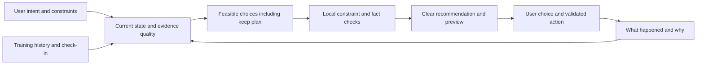

# Part 1 — User adaptation

**Date:** 1 October 2026. **Source snapshot:** `d5ebc771b3194dc557d469e40945dfa2ddf1f8ab` (main verified at the start of this research). **Scope:** research, source QA and proposed acceptance criteria only.

This report builds on the separate [original audit](https://github.com/macdarenz-droid/M-arc/blob/7596ee385fe622b8f4635146368505644960c352/codex-audit.md) and [improvement audit](https://github.com/macdarenz-droid/M-arc/blob/83463cf0cdf1f93c57a06a4933267318f2cfa31e/improvement-audit.md). Existing findings keep their original IDs and evidence dates. Another builder owns implementation. No application, repository-root file, branch, dependency, configuration or deployment was changed for this research. The documents are saved outside the checkout.

**Recommendation:** unify the app's existing adaptive engines around explicit user intent, reliable current state and practical constraints. Deliver time-aware sessions and flexible-week support first; add more ambitious individual response models only after demonstrating that they improve decisions.

The companion Part 2 report covers Escobar's capabilities, proposed daily role and evaluation design. Throughout this document, “current” means traced implementation; “proposal” means a design to validate; “research” distinguishes results, limitations and this audit's inference. No proposed feature is presented as implemented or scientifically validated.

## Judgment

M/arc already adapts many individual calculations. Its next advance should be **one coherent plan that reflects what this person wants, can do today, has chosen to preserve, and has actually responded well to**. Adding more independent rules before fixing their shared inputs would make contradictory advice more frequent.

There are four different meanings of adaptation, and the app should treat them separately: (1) presentation preference, (2) practical fit, such as time and equipment, (3) performance-based programming, and (4) physiological estimation. A person ignoring a card can inform presentation; it cannot establish that their muscles need less recovery. Completing a proposed workout can establish feasibility; it cannot establish that the prescription caused strength gains. These distinctions should determine which changes can occur automatically and which remain suggestions.

## Current inventory

The table describes implemented logic, not a guarantee that every caller supplies correct context. The prior audits document important exceptions.

| Current feature | Inputs and current adaptation | Limit or improvement opportunity | Source |
|---|---|---|---|
| Four goals | Lean muscle, growth, strength-and-muscle and strength select main/accessory rep ranges, policy RIR targets, effort caps, rest suggestions, starter templates, and body-weight trend bands. Goal change updates the goal; rest and templates remain separate explicit actions. | One enum bundles distinct intentions. Someone can want strength, stable body weight, two short sessions, and a preferred programme. A lifting goal should not silently decide a nutrition/body-weight objective. This is a proposed policy improvement, not an additional defect finding. | [src/data/goals.ts:9-60](https://github.com/macdarenz-droid/M-arc/blob/d5ebc771b3194dc557d469e40945dfa2ddf1f8ab/src/data/goals.ts#L9-L60); [src/slices/profile/profile.ts:60-79](https://github.com/macdarenz-droid/M-arc/blob/d5ebc771b3194dc557d469e40945dfa2ddf1f8ab/src/slices/profile/profile.ts#L60-L79); [src/brain/coach/weeklyReview.ts:368-380](https://github.com/macdarenz-droid/M-arc/blob/d5ebc771b3194dc557d469e40945dfa2ddf1f8ab/src/brain/coach/weeklyReview.ts#L368-L380) |
| Next workout targets | Exercise history, goal, resistance mode, effort coverage, rep performance, gaps, deload, readiness, recovery and one-day changes produce targets with reasons and confidence. Weighted lifts can repeat, add reps, earn a load increase, reduce or return after a break. | Confidence is partly sample-count based; large history does not automatically mean relevant evidence. Modes have different paths, including the prior SCI-04 gap. A user’s purpose for a session and current constraints are not shared policy inputs. | [src/brain/progression.ts:117-146](https://github.com/macdarenz-droid/M-arc/blob/d5ebc771b3194dc557d469e40945dfa2ddf1f8ab/src/brain/progression.ts#L117-L146), `294-318`, `321-530` |
| Live autoregulation | First-set performance versus the target adjusts following sets: reps first at planned load, a lower rung after a sufficiently missed max-effort set, and bounded catch-up from an easy below-plan set. Hold-load flags prevent some increases. | Current first-set signal is useful but not a full within-session fatigue estimator. Preserve committed work and use the actual active gym/load override before extending it. | [src/brain/retarget.ts:201-278](https://github.com/macdarenz-droid/M-arc/blob/d5ebc771b3194dc557d469e40945dfa2ddf1f8ab/src/brain/retarget.ts#L201-L278); [src/slices/workout/Train.tsx:596-610](https://github.com/macdarenz-droid/M-arc/blob/d5ebc771b3194dc557d469e40945dfa2ddf1f8ab/src/slices/workout/Train.tsx#L596-L610), `676-684` |
| Gym and equipment learning | Equipment profiles hold real units/steps/ladders. A load menu learns repeated unflagged loads within the same gym. Known exercise/group profiles outrank defaults; another gym is a unit hint. | Equipment certainty is not strength certainty. Gym A’s ladder must never be assumed in Gym B; the retarget path currently violates this in ENG-01. A repeated log can still be a repeated unit error. | [src/brain/units.ts:126-161](https://github.com/macdarenz-droid/M-arc/blob/d5ebc771b3194dc557d469e40945dfa2ddf1f8ab/src/brain/units.ts#L126-L161) |
| Likely gym | Eight weeks of same-weekday sessions within approximately two hours of current time inform a likely gym; Train preselects it once per app session when multiple gyms exist. | This is behavior-based adaptation already. Make the inference easy to see/correct; an explicit current choice must outweigh a historical pattern. | [src/brain/units.ts:297-318](https://github.com/macdarenz-droid/M-arc/blob/d5ebc771b3194dc557d469e40945dfa2ddf1f8ab/src/brain/units.ts#L297-L318); [src/slices/workout/Train.tsx:249-256](https://github.com/macdarenz-droid/M-arc/blob/d5ebc771b3194dc557d469e40945dfa2ddf1f8ab/src/slices/workout/Train.tsx#L249-L256) |
| Muscle recovery | Working-set exposure, exercise novelty, effort, roles, load changes, training age, age and systemic factors feed decaying per-muscle doses. Soreness can cap the estimate and a fresh mark can override prior residuals. | A modeled percentage is an estimate, not a measured recovery fraction. SCI-01/02/03/06 and ENG-05 must be addressed before stronger automation relies on it. A fresh mark and soreness must have an explicit, consistent precedence. | [src/brain/recovery.ts:174-258](https://github.com/macdarenz-droid/M-arc/blob/d5ebc771b3194dc557d469e40945dfa2ddf1f8ab/src/brain/recovery.ts#L174-L258), `336-401` |
| Recovery calibration | Eligible matched max-effort exercise sessions compare estimated performance change with predicted recovery; bounded per-muscle decay scales change slowly and can drift toward their prior. | This is actual personalized state, but performance changes have multiple causes. The rule should not call a performance discrepancy proof of faster/slower biological recovery. Replay must match all history mutation paths. | [src/brain/recovery.ts:415-431](https://github.com/macdarenz-droid/M-arc/blob/d5ebc771b3194dc557d469e40945dfa2ddf1f8ab/src/brain/recovery.ts#L415-L431), `503-548`, `558-591` |
| Readiness | Check-in, sleep, target-muscle recovery, resting HR, HRV where available, and recent training load are combined. Personal baselines are used for check-in and HR; missing inputs are omitted. Load alone is prevented from leading a load reduction. | Present-input count currently drives confidence. Correlated or stale inputs can look richer than they are. Personal usual sleep is not automatically sufficient sleep (SCI-02). Do not add passive signals until provenance and evidence strength are reliable. | [src/brain/readiness.ts:149-303](https://github.com/macdarenz-droid/M-arc/blob/d5ebc771b3194dc557d469e40945dfa2ddf1f8ab/src/brain/readiness.ts#L149-L303) |
| Reactive lighter week | Plateaus/declines, effort drift with rising volume, repeated over-band volume with a stalled lift, or repeated red readiness can trigger an offer. It has history/cooldown conditions. User acceptance saves a bounded lighter week. | Good foundation: it is an offer with a reason. Extend toward choosing between a local exercise adjustment and programme-level change; do not make every plateau a universal fatigue diagnosis. | [src/brain/deload.ts:42-129](https://github.com/macdarenz-droid/M-arc/blob/d5ebc771b3194dc557d469e40945dfa2ddf1f8ab/src/brain/deload.ts#L42-L129); [src/slices/coach/coach.ts:53-57](https://github.com/macdarenz-droid/M-arc/blob/d5ebc771b3194dc557d469e40945dfa2ddf1f8ab/src/slices/coach/coach.ts#L53-L57) |
| Volume and experience | Per-muscle lifetime exposure and stated training age select volume landmark bands. Under-volume requires completed full weeks; planned days help define a full week. | Lifetime exposure is a proxy, not measured capacity; calendar experience does not tell current tolerance after a long break. Do not automatically raise volume because the app’s level rose. | [src/brain/exposure.ts:136-171](https://github.com/macdarenz-droid/M-arc/blob/d5ebc771b3194dc557d469e40945dfa2ddf1f8ab/src/brain/exposure.ts#L136-L171); [src/brain/volume.ts:12-16](https://github.com/macdarenz-droid/M-arc/blob/d5ebc771b3194dc557d469e40945dfa2ddf1f8ab/src/brain/volume.ts#L12-L16), `44-62` |
| Schedule and adherence | Weekday split schedule, planned-days fallback and explicit days off shape weekly targets and streaks. Four-week adherence can suggest moving/reducing planned days. | It advises rather than actually negotiating a feasible rolling plan. Current plan is also used in past adherence calculation; future plan versions would make historical denominators auditable. Day-off inconsistency is UI-R03. | [src/brain/weekly.ts:95-160](https://github.com/macdarenz-droid/M-arc/blob/d5ebc771b3194dc557d469e40945dfa2ddf1f8ab/src/brain/weekly.ts#L95-L160); [src/brain/coach/weeklyReview.ts:92-105](https://github.com/macdarenz-droid/M-arc/blob/d5ebc771b3194dc557d469e40945dfa2ddf1f8ab/src/brain/coach/weeklyReview.ts#L92-L105), `320-339`; [src/slices/today/dayOff.ts:7-10](https://github.com/macdarenz-droid/M-arc/blob/d5ebc771b3194dc557d469e40945dfa2ddf1f8ab/src/slices/today/dayOff.ts#L7-L10) |
| Substitutions | Candidates share primary muscles and rank by movement pattern/equipment. Some unseen substitutes receive a low-confidence starting estimate from a sourced transfer ratio and load menu. | Shared muscle is insufficient to guarantee equivalent comfort, skill, stimulus or availability. User preferences and exclusions need enforcement, not merely a chat memory. SCI-08 and UI-R01 must be fixed before relying on substitute automation. | [src/brain/substitute.ts:9-14](https://github.com/macdarenz-droid/M-arc/blob/d5ebc771b3194dc557d469e40945dfa2ddf1f8ab/src/brain/substitute.ts#L9-L14), `32-49` |
| Rest and heart guidance | Rest uses effort floors and optionally live HR versus a personal baseline; main lifts retain a timer floor, and stale streams are intended to fall back to timer behavior. | A device signal cannot establish readiness for every kind of set. Fix stale-watch/paused-session evidence issues, and judge suggestions against actual set performance rather than optimizing the shortest rest. | [src/brain/heart.ts:175-216](https://github.com/macdarenz-droid/M-arc/blob/d5ebc771b3194dc557d469e40945dfa2ddf1f8ab/src/brain/heart.ts#L175-L216); [src/slices/workout/Train.tsx:1254-1278](https://github.com/macdarenz-droid/M-arc/blob/d5ebc771b3194dc557d469e40945dfa2ddf1f8ab/src/slices/workout/Train.tsx#L1254-L1278) |
| Local coaching | Rules select recovery, progress, balance, specialization, volume, gap, effort, profile-change and heart notes; pre/live/post and weekly notes use contextual evidence. Ranking and deduplication choose a small set. | Mostly hand-set priorities. Advice can be internally correct but irrelevant to the user’s current objective. “Most likely lever” should not imply proven cause. Period/source mismatches remain ENG-03/04/06/07. | [src/brain/coach/rules.ts:208-655](https://github.com/macdarenz-droid/M-arc/blob/d5ebc771b3194dc557d469e40945dfa2ddf1f8ab/src/brain/coach/rules.ts#L208-L655), `680-728`; [src/brain/coach/post.ts:202-218](https://github.com/macdarenz-droid/M-arc/blob/d5ebc771b3194dc557d469e40945dfa2ddf1f8ab/src/brain/coach/post.ts#L202-L218) |
| Insight feedback | Helpful hides an insight for that day; Not now hides it for seven days. Undo and show-again exist. | These are display controls, not a learning system for training outcomes, enduring dislikes or timing preferences. Do not relabel them as successful personalization. | [src/brain/coach/rules.ts:661-677](https://github.com/macdarenz-droid/M-arc/blob/d5ebc771b3194dc557d469e40945dfa2ddf1f8ab/src/brain/coach/rules.ts#L661-L677); [src/slices/coach/coach.ts:17-52](https://github.com/macdarenz-droid/M-arc/blob/d5ebc771b3194dc557d469e40945dfa2ddf1f8ab/src/slices/coach/coach.ts#L17-L52) |
| Programme evaluation | A draft is checked for exercise/split validity, volume bands, push/pull and upper/lower proportions, adjacent hard days, goal rep ranges and estimated session duration. | Duration uses a fixed work-per-set constant plus goal rest, with generic 90/120-minute warnings/blocks. There is no person-specific time budget in this evaluator. Its scientific thresholds need evidence review, not automatic treatment as hard physiological laws. | [src/brain/plan.ts:35-51](https://github.com/macdarenz-droid/M-arc/blob/d5ebc771b3194dc557d469e40945dfa2ddf1f8ab/src/brain/plan.ts#L35-L51), `144-156` |
| Onboarding and remembered context | Optional profile inputs, training age, planned days, persistent exercise notes, and Escobar memories already exist. Onboarding backs off after dismissals and can request a periodic review. Memory distinguishes user-said/inferred/edit/summary, and can expire. | A note saying “I avoid this exercise” is not yet a shared constraint guaranteed across every target/planner. Onboarding currently emphasizes body fields; high-value intent/time/equipment questions could provide more practical benefit with less burden. | [src/core/models.ts:267-281](https://github.com/macdarenz-droid/M-arc/blob/d5ebc771b3194dc557d469e40945dfa2ddf1f8ab/src/core/models.ts#L267-L281), `394-408`; [src/brain/onboarding.ts:43-68](https://github.com/macdarenz-droid/M-arc/blob/d5ebc771b3194dc557d469e40945dfa2ddf1f8ab/src/brain/onboarding.ts#L43-L68); [src/slices/workout/session.ts:287-297](https://github.com/macdarenz-droid/M-arc/blob/d5ebc771b3194dc557d469e40945dfa2ddf1f8ab/src/slices/workout/session.ts#L287-L297) |

## Recommended scope

Audience confirmed by the owner: mixed experience levels, with a simple path for beginners and intermediate lifters and an explicit way for experienced users to protect an existing programme. The initial evidence base principally concerns adult exercise; specialized populations need separate validation. No sex, age, body shape or attendance pattern should be used to invent the person's goal.

Related feature research: [Gym Finder](../gym-finder/RESEARCH.md) covers nearby-gym discovery, explicit gym linking, optional arrival reminders and Escobar integration. It is a separate proposal and does not change the source inventory.

The strongest first product is a **goal-aware training companion that adapts to real life**. It should make practical constraints reliable before adding increasingly precise physiological predictions. The first version can deliver substantial value from data already present, plus a few optional choices about what the person wants today.

| Proposed priority | Feature | User benefit | Minimum acceptance |
|---|---|---|---|
| A0 — foundation | One current decision context and repaired learned state | Every screen agrees about the workout, gym, clock, plan and evidence | Audit regressions pass; saved models match replay after corrections. If a fixed calculation previously corrupted learned state, rebuild affected derived state instead of fixing only future updates. |
| A1 — first release | Independent training intent and constraints | “Stronger, same body weight, two short sessions” is a valid complete request | No unchosen weight target; protected exercises/programmes survive every planner; missing optional body data never blocks normal use. |
| A2 — first release | Flexible session length | A normal, short or minimum useful option fits today's available time | Use a duration range with a transition buffer, preserve priority work and approved rest floors, show omissions, and retain completed sets. If no candidate fits, say so. |
| A3 — first release | Flexible week and return flow | The app helps after a missed session, travel or a break | Use remaining available windows or a user-selected rolling sequence; never automatically double work to repay a missed session; preserve historical plan versions. |
| A4 — next | Goal-specific progress review | The user knows whether the chosen plan is serving their actual objective | Compare eligible like-for-like evidence; choose one meaningful adjustment or keep the plan; separate execution, feasibility and physical outcomes. |
| A5 — next | Explicit preference and barrier learning | The same unwanted suggestion stops recurring for the right reason | “Rack busy today,” “I dislike this,” and “I cannot do this” have distinct scopes. Silence/dismissal is not automatically a permanent restriction. |
| A6 — later research | Individual response and recovery calibration | Personal evidence gradually improves suggestions when there is enough comparable data | Demonstrate better prediction and useful decisions over a conservative baseline, with uncertainty and subgroup checks; do not equate prediction with causal explanation. |

These priorities are product judgments derived from the source review and research. They are not published clinical recommendations or development-time estimates.

A1's durable intent/constraint fields and A3's rolling schedules/historical plan versions need the owner's saved-data approval and a migration design before implementation. A smaller initial release can use explicitly temporary session choices and the existing schedule/proposal structure. Here, a rest floor means an applicable product rule or explicit user constraint; a goal's advisory rest default is not a validated physiological minimum. Do not silently shorten a user's chosen rest merely to make an infeasible plan appear to fit.

## Adaptation contract

One conceptual loop should support both the app and Escobar:

The output of this loop should be a reviewable decision, not just a number or paragraph. Its logical contract is: **for this goal, in this session and evidence window, these options are feasible; this option best matches the stated priorities; these uncertainties remain; this is what would change; this is when to reassess.** This can be implemented incrementally around existing engines. It does not require training a new foundation model.

Use three different learning speeds:

- **Immediate explicit correction:** “I use pounds here” or “do not change my programme” changes the assistant's interpretation and applicable temporary context immediately. Persisted equipment, unit or programme changes still follow the existing proposal/Apply contract; do not silently rewrite logged values. Make the scope clear.
- **Repeated feasibility patterns:** several sessions running longer than expected can update a time estimate from trusted observations; repeated short sessions can justify asking about the normal time budget. They cannot prove laziness or low exercise tolerance.
- **Slow response estimates:** performance patterns across comparable exposures can change a prediction cautiously. Keep a conservative prior for sparse data, downweight stale/incomparable evidence, and retain a no-change option. The exact algorithm and minimum evidence are research/validation work, not established by this report.

Separate prediction from intervention. Predicting that a session may run long is a testable forecast. Predicting that this person will gain a particular amount of muscle is a different, much stronger claim. Observing better results after a plan change does not isolate that change from learning, effort, sleep, equipment, motivation or regression to the mean.

## Proposed structure

### 1. Intent

Keep separate, user-visible fields for the primary training outcome, optional secondary priorities, and optional body-weight objective. Include legitimate goals such as maintain strength, establish a routine, get back after time away, or follow an outside coach’s programme. A person may choose tracking only. “No body-weight goal” must be a valid complete state.

Capture practical constraints only when useful: typical available days, typical and today-only time budget, current gym/equipment, movements the person wishes to avoid, exercises to keep, and whether their programme is fixed. Reuse existing schedule, equipment and notes where possible. Do not infer medical conditions, pain diagnoses, body ideals or reasons for missing training from behavior.

Distinguish **hard constraints** (unavailable equipment; an explicit exclusion; a fixed time limit; do not alter my programme) from **preferences** (likes dumbbells; prefers mornings) and **temporary choices** (skip this today). A temporary exception must not silently become a permanent preference. An inferred preference should be editable and should yield to an explicit choice immediately.

### 2. Shared state

Create one logical decision context used by Today, Train, local insights, reminders, programme evaluation and Escobar. It should resolve the same effective day/session plan, active gym, current goal version, day off, live overrides, committed sets, current pause, completed-week evidence and history revision. This is an extension of existing selectors and target logic, not another independent “AI truth.”

For every input, distinguish observed fact, reported preference, inferred state and model estimate. Current goal RIR values are policy outputs; recorded Easy/Ideal/Max labels are user inputs. The current effort-bias rule produces explanatory advice, not a learned correction automatically applied to e1RM ([src/brain/coach/rules.ts:534-551](https://github.com/macdarenz-droid/M-arc/blob/d5ebc771b3194dc557d469e40945dfa2ddf1f8ab/src/brain/coach/rules.ts#L534-L551)). Attach source, relevant entity, time/window, quality and uncertainty. “No recent sleep data” is different from “slept poorly.” “No workout log” is different from “did not train.” A fresh preference can outweigh a rich old pattern without treating either as a physiological measurement.

Time horizons should be explicit: this set, remaining workout, today, current week, or future programme. Store only what genuinely needs persistence. A current time budget can remain ephemeral; a durable weekly budget or constraint history would need a new approved saved-data design.

### 3. Decision policy

Generate a small set of feasible candidates, including **keep the plan**, using the same deterministic engines and constraints. Examples: full session, shortened session that preserves the user’s priority, swap remaining work, move a session, or simply repeat the previous successful load. Evaluate how each fits the stated goal, time, equipment, user constraints, current evidence, change burden and uncertainty.

Use priority rules first, not a fabricated precision score: hard constraints and user commitments; relevant evidence; practical feasibility; expected goal benefit; then preference and variety. Population training guidance should bound and inform options, while user-specific conclusions require actual user evidence. If two options have no defensible advantage, explain the tradeoff and let the user choose. If uncertainty would change the decision, ask one focused question; otherwise avoid collecting more data.

One accepted programme change should invalidate conflicting older proposals. Stable situations should preserve the plan rather than constantly rewriting it. Personalization should have hysteresis: minor noise does not cause back-and-forth advice. Any numerical threshold, tolerance or change cap introduced here is an implementation policy that needs domain review and validation; this contribution does not certify new universal prescriptions.

### 4. Change authority

Let people choose a coaching style: track only; advise when asked; or proactively suggest relevant changes. These are proposed product options, not current controls. Separately define allowed changes: presentation can adapt; today’s uncommitted work may change after acceptance; the durable programme needs an explicit preview and acceptance. Broader automatic execution would require its own bounded authorization and validation, not permission inferred from opening a chat.

Every meaningful change needs a compact explanation of the actual driver, what will change, its scope and how to keep the original. The accepted operation must bind to stable IDs and revisions. Undo should restore that operation without overwriting later edits. Logged sets remain facts, even when the future workout changes.

### 5. Feedback

Ask lightweight feedback at a useful moment: “too long,” “equipment unavailable,” “didn’t like it,” “too difficult,” “worked well,” or “keep my original.” The reason matters more than acceptance. Dismissing an exercise could mean the rack was busy, not dislike; shortening a workout could mean a meeting, not low capacity. Offer explicit persistent preference only when the person wants it saved.

Keep preference learning separate from response learning. Preferences can immediately update after clear user input. Claims about programme response require comparable sessions, enough relevant observations and uncertainty checks. Short personal trials can test feasibility, perceived fit or prediction quality; they do not prove a causal hypertrophy effect. Avoid chasing a single bad set or building a recovery model from the app’s own recommendations without accounting for that feedback.

### 6. Evaluation

Judge success by correct and useful decisions, goal fit, preserved autonomy, reduced logging/decision burden, and the user’s chosen outcomes. Useful completion and appropriate rest can both be successes. Number of app opens, accepted prompts, longer sessions and conversation length are not sufficient success metrics. Returning less often because a plan is working is not failure.

Evaluate against a credible baseline: the current deterministic plan plus no-change option. First use synthetic decision cases and retrospective replay, then shadow suggestions that cannot mutate state, then a consented limited rollout. Measure disagreement, overrides, error types, unnecessary changes, effort/time burden and outcome uncertainty. Report separately by training mode, experience, schedule type, data availability, logging fidelity and goal; an aggregate score can hide regressions for sparse-data users.

## Goal measures

| User's chosen outcome | Useful review evidence | Misleading substitute |
|---|---|---|
| Get stronger | Comparable exercise performance, consistent technique/range where known, load/reps/effort and available increments; estimated strength labeled as estimated | Total tonnage alone, a lighter assistance value read as less strength, or a mandatory personal best every session |
| Build muscle | Completion of the chosen programme, relevant working volume and progression, tolerability, optional agreed body measurements over an appropriate interval | Claiming muscle gained from scale change, pump, sweat, calorie estimates or a few logged sessions |
| Maintain | Stable relevant performance and a sustainable chosen routine | Treating lack of new records as failure |
| Establish consistency | Feasible agreed sessions, barriers resolved, voluntary continuation and lower effort to start | A perfect calendar streak at the cost of unwanted sessions or discouraging rest |
| Return after a break | Feasible restart, current performance, tolerability and gradual re-establishment of routine | Immediately matching lifetime bests or assuming previous training age equals current capacity |
| General fitness | The person's agreed mix of strengthening and aerobic activity, with suitable measurements for each | One strength score representing the whole goal |
| Track an external plan | Accurate fast logging, faithful records and useful requested explanations | Rewriting the coach's programme because the app prefers another one |

This is a proposed product measurement map. The research ledger supplies the population-level basis and its limits; no single row is a validated M/ARC outcome model.

For hypertrophy, programme completion, volume and progression are process/proxy indicators, not proof of muscle growth. Optional weight or circumference measurements also contain uncertainty. Escobar must distinguish a well-executed muscle-building plan from an established change in muscle mass.

## Daily examples

These are proposed behaviors, not claims that these complete workflows already exist.

| Situation | Adaptive response | What it should learn or preserve |
|---|---|---|
| “I want muscle, but my weight should stay stable.” | Keep the lifting goal; set a distinct maintenance/no-change body-weight intention. Do not produce automatic gain/loss advice from the lifting label. | Explicit goal separation; body data remain optional. |
| “Only 25 minutes today.” | Show a shortened option centered on the user’s priority, with duration ranges with transition buffers and a preview of omitted work. Preserve approved rest floors; omit or move work if needed instead of shortening rest just to fit the deadline. Offer the original too. | Today-only constraint; do not permanently shrink the programme. |
| A person keeps missing Wednesday | Describe the recorded pattern without guessing a cause. Offer a move or fewer planned days after checking what fits. | New accepted schedule applies prospectively; previous weeks retain their historical plan. |
| Night-shift worker trains whenever possible | Use a rolling sequence or flexible weekly target chosen by the user instead of insisting on weekdays. | Rest is not a broken streak; do not equate calendar variation with poor motivation. |
| The gym rack is occupied | Suggest available, permitted alternatives for remaining work and carry over only a cautious starting estimate. | This session’s equipment constraint; preserve completed sets and original exercise history. |
| A lifter chooses an outside coach’s programme | Log, explain and flag relevant observations without rewriting the programme. | Programme protection outranks the app’s desire to optimize. |
| Returning after a long break | Use current return rules as a base, ask only for material current constraints, and offer a feasible return session. | Old bests remain historical; old experience is not assumed to equal current tolerance. |
| Recovery estimate is green but the user reports a problem | Reflect uncertainty and the reported constraint; avoid reassuring solely from the model. For pain/medical concerns, avoid diagnosis or automated rehabilitation. | Explicit constraint wins; a model estimate is not clearance. |
| No watch, no weigh-ins, minimal effort ratings | Use the strongest available workout evidence, explain only material uncertainty, and offer normal logging without repeated health-data demands. | Missing optional data do not make the user a low-quality or noncompliant user. |
| Two weeks feel good and lifts improve | Keep a useful plan unless there is a reason to change. Offer the next small evidence-based progression where appropriate. | Success can justify stability, not more features or more volume. |
| Frequent “not now” on weekly notes | Lower prompt burden or offer a preferred review time. | It is a communication preference hypothesis, not proof the training advice is wrong. |
| A saved workout is corrected later | Recompute dependent trends/recovery and invalidate obsolete advice; show the newly supported conclusion. | Revisions must propagate; the app should not retain confidence in conclusions based on deleted facts. |

## Example decision

Assume a user has explicitly chosen strength as the primary goal, stable body weight, three usual training opportunities, a protected main lift, and a 30-minute limit today. Two working sets are already logged; one planned accessory machine is occupied. This is a synthetic specification scenario.

1. Resolve the active session and actual gym. Do not switch to today's global defaults or another gym's ladder.
2. Preserve the two performed sets exactly. Treat the machine problem as a temporary availability fact.
3. Evaluate remaining options against time, rest floors, user exclusions and the protected lift. Estimate time with a range; do not promise an exact finish.
4. Offer feasible shorter versions. The unchanged plan can remain available, but if it exceeds 30 minutes, label it as outside the requested limit rather than another feasible option. Explain omitted/substituted work and its relation to the user's priority. If constraints conflict, ask which can change; do not secretly relax one.
5. Recheck the session revision when Apply is tapped. An intervening logged set changes what is still eligible to edit.
6. After completion, distinguish “fit in time,” “felt appropriate,” and “improved performance.” Learn a persistent preference only when the user intended one.
7. At the next comparable opportunity, use valid history and current constraints. Do not repay omitted sets automatically or claim this short session caused later progress.

The same logs with a different stated priority may warrant another remaining-session choice. That is useful personalization. Merely changing the name, tone or motivational message while prescribing the same inappropriate plan is not enough.

## Delivery map

| Proposal | Existing / extension / new | Saved-data or service implications | Dependencies |
|---|---|---|---|
| Consistent target and effective-day context | Extension/foundation | Can start with derived context and existing IDs; no external service inherently needed. | ENG-01/02; UI-R03/06; IMP-E01/04/05; first audit UI-06/12. |
| Atomic history repair and decision invalidation | Foundation | Revision/operation metadata may require schema design; derived rebuild can reuse current state. | ENG-05/06/07; UI-R02/04; first audit data integrity findings. |
| Intent separated from body-weight goal | New product policy over existing goals | New persistent kind of user intent if saved; owner approval before implementation. | First audit SCI-11; appropriate research on the actual target population. |
| Today-only time/equipment constraint | Extension | Can initially remain ephemeral and use present proposal actions. Persistent routine budgets require approved schema. | Accurate duration data (ENG-06), substitution preservation (UI-R01), goal-consistent plan evaluation (SCI-09). |
| Rolling plan and reliable historical adherence | New schedule mode | Plan revisions/effective dates, day/session exceptions and adherence semantics need approved schema/migration. | UI-R03, ENG-03/04; avoid scoring old behavior against a new plan. |
| Preferences and exclusions enforced everywhere | Extension of notes/memories, new enforcement | Reuse existing explicit facts where possible; structured scope, expiry, confidence and constraint fields require schema approval. | Identity stability and stale Apply/Undo fixes; clear trust rules for inferred memory. |
| Feedback reasons and review outcomes | New outcome loop | Current feedback only supports Helpful/snoozed; richer saved reasons/outcomes are new data. | Correct insight IDs/windows; avoid making acceptance a surrogate for physical benefit. |
| Goal-aware insight ranking | Extension | Can begin with declared existing goal and contextual rule eligibility; persistent communication choices are new preference data. | ENG-03/04/06; first audit SCI-11. |
| Personal response modelling | Longer-term research | New model state/versioning, outcome definitions and evaluation corpus; no new provider necessarily required. | All relevant first-audit science fixes, calibrated uncertainty and enough comparable data. Not first release. |

The repo rules reserve new kinds of stored/sent user data and paid providers to the owner. This research can specify them now; it does not authorize another builder to implement new data categories or activate a service without that existing approval step. No approval is needed to finish this research/QA report.

## QA invariants

1. **One answer:** Today, live targets, Escobar and post-session explanations agree for the same context revision, units and time.
2. **Explicit intent:** Strength/growth goals do not introduce an unchosen weight-loss/gain goal; tracking-only and an outside programme remain valid.
3. **Constraint priority:** An excluded movement, unavailable machine or protected programme cannot re-enter through substitution, a different screen, an old proposal or a model answer.
4. **Scope:** A today-only change cannot silently alter the durable schedule, goals or preferences; a durable change has an explicit effective date.
5. **Preserved history:** Adaptation never deletes, reassigns or overwrites committed work to make the revised plan look completed.
6. **Identity:** Same-name exercises remain distinct; gyms, sessions, plans and proposal operations resolve by stable IDs rather than display names or current selection.
7. **Causality boundary:** A correlation, acceptance or successful session cannot be described as proof that a recovery diagnosis or programme mechanism is correct.
8. **Data absence:** Missing optional inputs produce uncertainty or an appropriate fallback, never fabricated negative observations or escalating prompts.
9. **Quality:** Estimated/retro/edited timing cannot silently serve as live sensor evidence; stale device readings cannot authorize current rest decisions.
10. **Conservative conflict resolution:** A reduction/hold state cannot accidentally become an increase through rounding, another gym’s ladder, substitute transfer or a second advice path.
11. **Mode correctness:** Improvement is interpreted correctly for weighted, assisted, bodyweight, timed and distance work. Unit conversion cannot change the underlying decision.
12. **Temporal correctness:** Future sessions never inform past judgments; changed schedules do not retroactively rewrite adherence; pause/day-off/timezone boundaries have one definition.
13. **Replay:** Editing, deleting, restoring or backfilling history yields the same model and derived advice as replaying the resulting valid history.
14. **Transactional change:** Apply checks relevant revisions; repeated Apply is idempotent; Undo is operation-bound and preserves later unrelated edits.
15. **Cancellation:** Off, reset, restore and deletion invalidate old asynchronous work and private caches; a late result cannot revive obsolete state or data sharing.
16. **Stability:** Small irrelevant changes or a reordered history list do not cause unrelated goal/plan reversals; no-change remains an available candidate.
17. **Feedback semantics:** Not now changes prompt timing, not physical capacity. Helpful is not interpreted as completed or effective training. One skipped exercise is not a permanent dislike.
18. **Explainability:** Every numerical advice statement identifies the same underlying quantity, period and entity as its evidence; citations to a matching number in unrelated data are insufficient.
19. **Fair comparison:** Cases with no wearable, one-day/flexible schedules, beginners and experienced returners are independently checked. Exact performance thresholds for evaluation are set before rollout, not after observing results.
20. **User benefit:** A successful rest day, a short session, a declined suggestion and less app use can all be consistent with the user’s goal; engagement metrics cannot override that goal.

## Dependencies

Before expanding automatic training adaptation, the original audit’s assisted-recovery direction error (SCI-01), sleep-baseline error (SCI-02), soreness precedence and cross-mode readiness failures (SCI-03/04), substitute math (SCI-08), and mismatch between plan/logged volume (SCI-09) remain relevant. Scientific-claim precision is SCI-11. For online changes, coach-off and paid-admission issues SEC-03/01 remain relevant. This is a dependency list from the existing reports, not a new assertion that fixes on unreviewed branches do not exist.

A sensible first delivery is shared context and corrected evidence, followed by explicit goal/constraint handling, then useful today-only alternatives and goal-aware reviews. Response learning should follow measured reliability. The ambition is an app that makes fewer wrong assumptions and more useful decisions, including when the correct decision is to leave the person’s plan alone.

## Research handoff

The builder should begin with A0–A3 and the QA invariants in this document. Require a before/after state example for each adaptation, a failure case, and an explicit fallback when input is unknown. Treat the existing audit findings as dependencies, not optional polishing. New response-learning models, persistent data kinds and paid services remain proposals subject to the repository's existing approval rules.

Do not start with reinforcement learning over workout intensity, an opaque combined “optimal training” score, precise muscle-gain forecasts, universal cycle-based prescriptions, or automatic programme rewrites after every noisy signal. None is established by this targeted review. Preference learning, time calibration and constraint-aware planning are more tractable first improvements.

## Research evidence

Targeted evidence review for M/ARC and Escobar. Checked **1 October 2026**. No app or repository files changed. This is a targeted evidence review, not a preregistered systematic review of all available literature. The 14 entries distinguish controlled intervention evidence, research syntheses, guidelines and design frameworks. **App implications are design inferences, not interventions validated by these papers.**

The defensible product direction is to adapt a feasible plan to the person's goals, performance, preferences and circumstances, while making uncertain inputs visible and retaining user control. These sources do **not** establish an accurate daily muscle-recovery percentage, universal readiness cutoff, guaranteed next load, or an LLM coach that improves long-term strength by itself.

### Evidence ledger

#### 1. Goal-specific resistance training

**Currier et al. (2026), _American College of Sports Medicine Position Stand. Resistance Training Prescription for Muscle Function, Hypertrophy, and Physical Performance in Healthy Adults: An Overview of Reviews_.** [PubMed record and abstract](https://pubmed.ncbi.nlm.nih.gov/41843416/); [paper DOI](https://doi.org/10.1249/MSS.0000000000003897); [ACSM publication announcement](https://acsm.org/science-spotlight-acsm-releases-new-position-stand-on-resistance-training/).

**Access:** Abstract plus official ACSM announcement verified; direct journal/PMC full-text retrieval unsuccessful. Published April 2026; review searches current to October 2024.

**Evidence:** 137 reviews, over 30,000 participants; healthy adults in resistance-training trials lasting 6–52 weeks. Training improved multiple muscular/function outcomes. Heavier loads supported strength; higher volume supported hypertrophy. Several other prescription features did not consistently alter outcomes.

**Limits / not justified:** Group-average evidence and overlapping reviews are not independent replications or individualized dose predictions. Its volume/load categories are not validated app action thresholds.

**App inference:** Make goal selection change what the app prioritizes and evaluates. Preserve feasible equipment and schedule choices; do not imply complex programming is necessary for everyone.

#### 2. Effort and proximity to failure

**Robinson et al. (2024), _Exploring the Dose-Response Relationship Between Estimated Resistance Training Proximity to Failure, Strength Gain, and Muscle Hypertrophy: A Series of Meta-Regressions_.** [PubMed abstract](https://pubmed.ncbi.nlm.nih.gov/38970765/); [paper DOI](https://doi.org/10.1007/s40279-024-02069-2).

**Access:** Abstract reviewed; full paper not retrieved.

**Evidence:** Exploratory multilevel analyses of resistance-training interventions estimated repetitions in reserve (RIR) from study descriptions, adjusting for load, volume-equating method, duration and training status. Strength slopes included zero; hypertrophy slopes favored ending sets closer to failure. Model fit was modest.

**Limits / not justified:** Estimated study-level RIR is not a precise personal response curve. The authors explicitly caution about estimation and exploratory analysis. This does not prove a universal optimal RIR or that every hypertrophy set should reach failure.

**App inference:** Give effort a goal-dependent role, collect an understandable effort report, and retain uncertainty rather than converting Easy/Ideal/Max into exact physiological quantities.

#### 3. Autoregulated loading: original trial

**Helms et al. (2018), _RPE vs. Percentage 1RM Loading in Periodized Programs Matched for Sets and Repetitions_.** [Publisher full text](https://www.frontiersin.org/journals/physiology/articles/10.3389/fphys.2018.00247/full).

**Access:** Full text, methods and results inspected.

**Evidence:** Twenty-one resistance-trained men aged 19–35 completed eight weeks of squat/bench training, three times weekly; 11 used percentage loading and 10 selected loads to meet RPE ranges. Both groups improved strength and measured muscle thickness. Between-group differences were not statistically significant.

**Limits / not justified:** Small, short, trained-male sample; nonsignificance does not establish equivalence. The paper's magnitude-based advantage estimates should not become a claim that RPE is proven superior, especially for beginners or automated apps.

**App inference:** Let observed performance and reported effort inform a bounded adjustment that the user can reject. Explain the adjustment using actual sets; do not promise the next load from an old estimated 1RM alone.

#### 4. Wearable measurement is device- and context-dependent

**Doherty et al. (2024), _Keeping Pace with Wearables: A Living Umbrella Review of Systematic Reviews Evaluating the Accuracy of Consumer Wearable Technologies in Health Measurement_.** [Publisher full text](https://link.springer.com/article/10.1007/s40279-024-02077-2).

**Access:** Full text inspected; this entry describes the retrieved 2024 publication, not an assumed later living-review update.

**Evidence:** Twenty-four reviews included 249 nonduplicated consumer-device validation studies. Accuracy varied with device, metric, population and activity. Resting HRV agreement generally worsened during motion; sleep and energy estimates had substantial context-dependent errors. Heterogeneity precluded a pooled device-level meta-analysis.

**Limits / not justified:** Validation of heart rate does not validate a derived readiness/recovery score; validation of one firmware/device does not transfer automatically to another. Large pooled participant counts do not make every metric well validated.

**App inference:** Preserve source, device, timestamp, sampling context and data quality. Treat gaps as unknown, and distinguish measurements from derived estimates. Do not allow one noisy wearable value to dictate training.

#### 5. Subjective check-ins are useful, but not a recovery meter

**Saw, Main and Gastin (2016), _Monitoring the athlete training response: subjective self-reported measures trump commonly used objective measures: a systematic review_.** [Paper and full-text repository](https://pmc.ncbi.nlm.nih.gov/articles/PMC4789708/); [PubMed abstract](https://pubmed.ncbi.nlm.nih.gov/26423706/).

**Access:** Abstract and indexed methods/discussion text inspected.

**Evidence:** Fifty-six original studies measured athlete well-being using both subjective and objective measures. Subjective measures responded to training-load changes more consistently; subjective and objective measures often did not correlate. The review excluded session RPE as a well-being measure and emphasized repeated within-person assessment.

**Limits / not justified:** Searches ended in 2014; sports, instruments and protocols varied. A homemade single question does not inherit a validated questionnaire's properties. Sensitivity to training is not proof of a validated decision cutoff.

**App inference:** Ask brief, optional questions that can change today's support, retain the person's normal context, and let their report challenge wearable-derived suggestions rather than disappear inside a composite score.

#### 6. HRV-guided training has narrower evidence than “readiness” marketing

**Manresa-Rocamora et al. (2021), _Heart Rate Variability-Guided Training for Enhancing Cardiac-Vagal Modulation, Aerobic Fitness, and Endurance Performance: A Methodological Systematic Review with Meta-Analysis_.** [PubMed abstract](https://pubmed.ncbi.nlm.nih.gov/34639599/); [full-text location](https://pmc.ncbi.nlm.nih.gov/articles/PMC8507742/).

**Access:** PubMed-indexed abstract reviewed; direct full-text retrieval challenged.

**Evidence:** Compared HRV-guided and predefined training for vagal HRV, aerobic fitness and endurance outcomes. Vagal HRV favored guidance; estimated aerobic-capacity and endurance advantages were small, with confidence intervals including zero. Recording position, selected HRV metric and baseline methods remained unresolved methodological questions.

**Limits / not justified:** This is principally aerobic/endurance evidence, not proof of muscle-specific recovery or optimal lifting loads. Improving an HRV metric is not automatically improving performance.

**App inference:** HRV can be optional corroborating context when measurements are comparable. Do not port an endurance algorithm into a universal lifting traffic light or describe the result as measured recovery.

#### 7. General fitness is broader than lifting volume

**World Health Organization (2020), _WHO Guidelines on Physical Activity and Sedentary Behaviour_.** [Official summary and download](https://www.who.int/publications/i/item/9789240014886); [guideline recommendations text](https://www.ncbi.nlm.nih.gov/books/NBK566046/).

**Access:** Official summary and recommendation text inspected.

**Evidence:** Public-health guidance for multiple populations; adult recommendations include aerobic activity and muscle strengthening, with some activity preferable to none and gradual progression from smaller amounts. These are population health recommendations, not individualized lifting protocols.

**Limits / not justified:** Meeting a guideline is not a binary measurement of health, and missing it does not make a week worthless. Guidance for healthy adults is not an exercise treatment plan for a particular condition.

**App inference:** A general-fitness goal should recognize useful activity beyond tonnage, support achievable starts, and avoid converting a population target into a shame-based pass/fail streak.

#### 8. Autonomy and motivation

**Ntoumanis et al. (2021; online 2020), _A Meta-Analysis of Self-Determination Theory-Informed Intervention Studies in the Health Domain: Effects on Motivation, Health Behavior, Physical, and Psychological Health_.** [Authors' institutional record and abstract](https://eprints.whiterose.ac.uk/id/eprint/155741/); [paper DOI](https://doi.org/10.1080/17437199.2020.1718529).

**Access:** Institutional abstract and publication metadata inspected; downloadable full paper identified but not reviewed in full.

**Evidence:** Seventy-three experimental studies across health promotion/disease management. Effects on motivation and health behavior were modest and heterogeneous. Increases in need support and autonomous motivation were associated with improved behavior.

**Limits / not justified:** Broad health-domain interventions are not all gym programs. Association between mediator change and outcomes does not establish that any particular chatbot phrase causes adherence.

**App inference:** Elicit personally meaningful goals, offer feasible alternatives, explain recommendations, and accept “not today.” User control and competence-building are design priorities; guilt, dependency and raw engagement should not be the optimization target.

#### 9. Scheduling requires action and coping plans

**Peng et al. (2022), _The Effectiveness of Planning Interventions for Improving Physical Activity in the General Population: A Systematic Review and Meta-Analysis of Randomized Controlled Trials_.** [Paper and indexed full text](https://pmc.ncbi.nlm.nih.gov/articles/PMC9223740/); [PubMed author metadata](https://pubmed.ncbi.nlm.nih.gov/35742582/).

**Access:** Indexed abstract/methods reviewed; direct PMC opening challenged.

**Evidence:** Forty-one trials with 5,439 participants were reviewed; 35 entered the meta-analysis. Planning improved physical activity on average (SMD 0.35, 95% CI 0.25–0.44), with substantial heterogeneity (I² 61.4%). Populations, delivery and reinforcement differed.

**Limits / not justified:** This does not validate a particular app's calendar algorithm or imply an intention always produces behavior. Subgroup associations should not become demographic stereotypes or deterministic rules.

**App inference:** Help the user choose when/where an activity fits and a fallback when a likely obstacle occurs. Explicitly distinguish rescheduling, taking a planned day off, inability to train, and missing logging; do not infer motivation from an empty calendar cell.

#### 10. JITAI design: sometimes provide no intervention

**Nahum-Shani et al. (2018 issue), _Just-in-Time Adaptive Interventions (JITAIs) in Mobile Health: Key Components and Design Principles for Ongoing Health Behavior Support_.** [Paper and indexed full text](https://pmc.ncbi.nlm.nih.gov/articles/PMC5364076/); [paper DOI](https://doi.org/10.1007/s12160-016-9830-8).

**Access:** Indexed article text inspected; direct PMC retrieval challenged.

**Evidence:** A design/methodology framework, not an efficacy trial. It separates decision points, intervention options, tailoring variables, decision rules and proximal/distal outcomes. Changing need and receptivity matter, alongside burden and disengagement.

**Limits / not justified:** Being adaptive or “just in time” is not itself evidence of benefit. A prediction of receptivity does not establish a causal benefit from sending a message.

**App inference:** Define what helpful outcome each prompt serves and include silence as an option. Respect quiet times, chosen contact frequency and current activity. Evaluate whether support helps the user's plan instead of whether it merely produces a reply.

#### 11. Contextual prompts: useful proximal effects can fade

**Klasnja et al. (2019), _Efficacy of Contextually Tailored Suggestions for Physical Activity: A Micro-randomized Optimization Trial of HeartSteps_.** [Full text](https://pmc.ncbi.nlm.nih.gov/articles/PMC6401341/).

**Access:** Full methods/results/discussion inspected.

**Evidence:** Six-week trial enrolled 44 adults; 37 contributed the analyzed decision-point data. Suggestions were randomized at up to five user-selected daily times. Across suggestion types, the 30-minute step effect was 14% (95% CI 0.99–1.31 on the multiplicative scale; p=.06). Walking suggestions drove the benefit, which attenuated and was undetectable by day 29.

**Limits / not justified:** Proximal component optimization does not establish increased total activity, long-term adherence, lifting gains or package efficacy. An interesting message is not necessarily effective on the chosen outcome.

**App inference:** Learn when prompts are unwanted or unhelpful and reduce repetition. Daily availability of Escobar need not mean a proactive message every day.

#### 12. Adaptive goals can support initiating activity

**Adams et al. (2022), _Adaptive Goals and Reinforcement Timing to Increase Physical Activity in Adults: A Factorial Randomized Trial_.** [Publisher record](https://www.sciencedirect.com/science/article/pii/S0749379721005468); [paper and indexed full text](https://pmc.ncbi.nlm.nih.gov/articles/PMC8820277/); [DOI](https://doi.org/10.1016/j.amepre.2021.09.014).

**Access:** Publisher abstract plus indexed methods/discussion inspected; direct full-text opening unsuccessful.

**Evidence:** WalkIT Arizona randomized 512 insufficiently active adults aged 18–60 to adaptive/static goals and immediate/delayed financial reinforcement, with accelerometer outcomes over one intervention year. Adaptive goals improved the probability of initiating activity versus static goals. Mean activity-minute improvement did not significantly differ between goal-setting groups; reinforcement timing separately mattered.

**Limits / not justified:** Walking, incentives and one geographical population; not a lifting progression trial. The reported 16.52-minute gain for one combined arm cannot be attributed to adaptation alone.

**App inference:** Allow realistic goals to move down or sideways as circumstances change. Validate any gym-specific adaptation against a stable-plan comparator rather than assuming this trial supplies its parameters.

#### 13. Chatbot efficacy is modest and is not LLM-specific

**Wang et al. (2025), _The effect of chatbot-based exercise interventions on physical activity, exercise habits, and sedentary behavior: A systematic review and meta-analysis of randomized controlled trials_.** [Publisher full text](https://journals.sagepub.com/doi/10.1177/20552076251353731); [PubMed record](https://pubmed.ncbi.nlm.nih.gov/40656859/).

**Access:** Full results/discussion inspected.

**Evidence:** Twelve trials from 2013–2024, 2,446 participants plus 240 parent-child dyads. Physical activity improved modestly (SMD 0.20, 95% CI 0.04–0.37; I² 51%); overall exercise-habit and sedentary-behavior effects were not significant. The authors explicitly state included trials did not use advanced generative models such as ChatGPT.

**Limits / not justified:** Mixed populations, technologies and outcomes; limited longer follow-up and objective measurement. This cannot substantiate LLM superiority, long-term gym adherence, hypertrophy or strength benefits.

**App inference:** Treat conversational support as a feature requiring its own evaluation. Keep the workout engine's verified facts separate from generated interpretation, and measure helpful behavior change rather than chat volume.

#### 14. LLM coaching feasibility: promising onboarding, not longitudinal outcomes

**Jörke et al. (2025), _GPTCoach: Towards LLM-Based Physical Activity Coaching_, CHI '25.** [Authors' full paper](https://hci.stanford.edu/publications/2025/Joerke_GPTCoach.pdf); [DOI](https://doi.org/10.1145/3706598.3713819).

**Access:** Full PDF inspected, especially study design, results and limitations.

**Evidence:** Formative interviews with 22 people informed GPT-4 coaching design. A single supervised onboarding session with 16 English-speaking iPhone owners used three months of historical data. Participants described support as personalized/actionable; coded conversations largely followed motivational-interviewing principles. Sensor-data use remained variable.

**Limits / not justified:** Small, selected sample; a supervised technology probe, not a randomized longitudinal efficacy trial. It did not establish increased physical activity, lifting progress, adherence or safe autonomous long-term coaching.

**App inference:** Use conversation to discover goals, barriers and preferences that sensor data cannot reveal; make plans collaborative. Evaluate onboarding quality separately from later behavior and physical outcomes.

### Design conclusions for M/arc — explicit inferences

These are proposed requirements synthesized from the ledger, not exact prescriptions found in a paper:

| Product decision | Defensible implementation direction | Claim to avoid |
|---|---|---|
| Goal adaptation | Ask what matters most and what tradeoffs the user accepts; evaluate strength, hypertrophy-oriented training and general fitness using appropriate, distinct outcomes | One score or maximal tonnage represents success for every goal |
| Cold start | Use understandable goal-aligned defaults; collect time, experience, equipment and preferences; let early sessions inform later suggestions | A precise personal fatigue/response model exists after a few sparse logs |
| Progression | Combine comparable performance and user effort; offer small reversible changes constrained by actual equipment; include hold as a valid result | Every workout must improve; an estimated 1RM is a measured maximum |
| Readiness | Keep measurement quality and missingness explicit; distinguish subjective experience, autonomic signals and local muscle performance | A composite score measures biological readiness, injury probability, or exact time to recovery |
| Scheduling | Respect current intention, days off, substitutions, shorter options and available windows; ask about ambiguous missed logs | Missing a scheduled workout proves poor motivation or requires compensatory extra work |
| Daily coach | Be available daily; send support only when useful and welcome; explain one actionable issue grounded in current facts | More messages, longer conversations or longer streaks necessarily improve health or training |
| Personal learning | Track predictions and subsequent comparable outcomes; retain uncertainty and stale-data limits; accept that observations alone are confounded | A correlation in one person's log establishes why their performance changed |

The app should preserve a visible distinction between **population evidence**, **what it actually observed about this person**, and **the action it proposes**. None of the selected papers validates M/arc's existing exact constants. A technically deterministic threshold can be a product heuristic, but it should not be represented as a proven physiological boundary.

### Evaluation needed before efficacy claims

Start with data integrity and decision correctness: correct units/modes, dates, day-off exceptions, missing wearable records, user overrides and reversible updates. Then test whether the adaptive policy improves the chosen outcome relative to a sensible stable plan. An onboarding usability study, a message-level micro-randomized trial, and a longitudinal comparison answer different questions; do not substitute one for another.

Predefine user-relevant outcomes and burden together: sustained participation in the user's chosen plan, comparable performance/goal progress, confidence and perceived autonomy, unwanted-message rate, opt-outs and misleading recommendations. App opens, streak preservation and response rate may diagnose product behavior but should not serve as stand-ins for training benefit. Any proposed learning policy should be assessed for users with little data, irregular schedules, absent wearables and changed equipment, as well as consistent experienced loggers.

### Retrieval and attribution notes

All linked papers were identified from publisher, PubMed/PMC, official guideline or author/institutional sources. Search-result dates were not treated as publication dates. Where direct full text was unavailable, the ledger explicitly limits claims to abstracts or indexed excerpts. Review-level samples overlap; the entries should not be added into one total evidence sample. No efficacy conclusion relies on a blog, product marketing page or a preprint. Each source summary is intentionally short; app implications are separately labeled.

## QA status

Completed here: read-only source inventory and caller tracing; review of the earlier audit dependencies; primary-source literature/documentation research; independent critique of the proposed designs; and source-link/line-bound checks. The critique corrected action-authority wording, time feasibility, rest-default interpretation, proxy outcome labels, cancellation limits and semantic-verification claims before delivery.

Not executed for these proposals: new app tests, browser/device trials, paid model comparisons, user studies, benchmarks or a release certification. Existing audit test results are not relabeled as new evidence. Proposed evaluation cases and priorities are a handoff specification for the builder/reviewer. The source snapshot is explicit; changes on other branches or deployments may differ.
